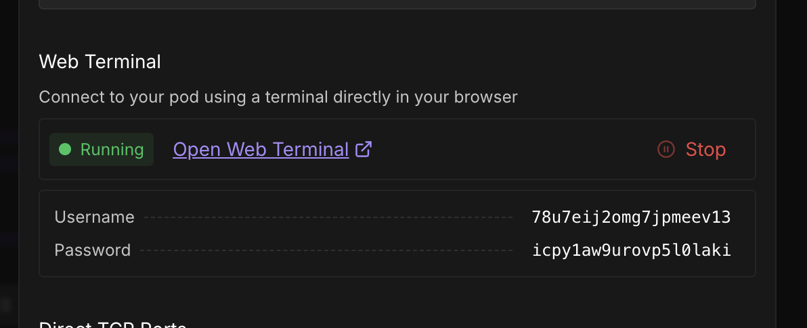
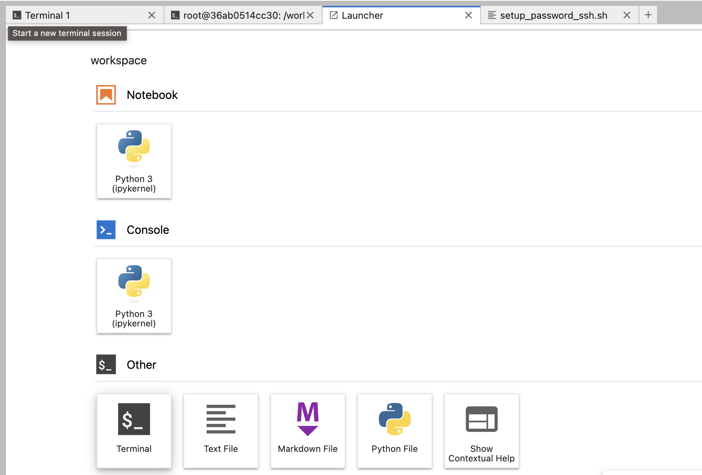
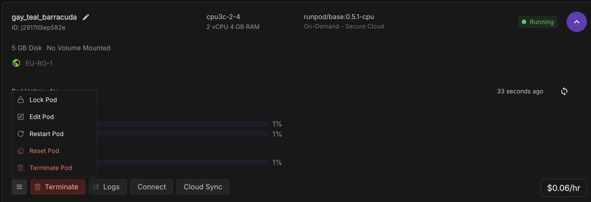
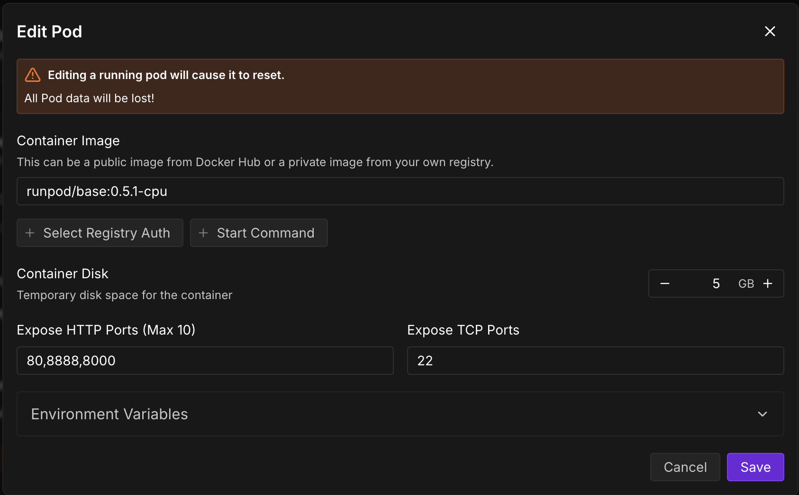
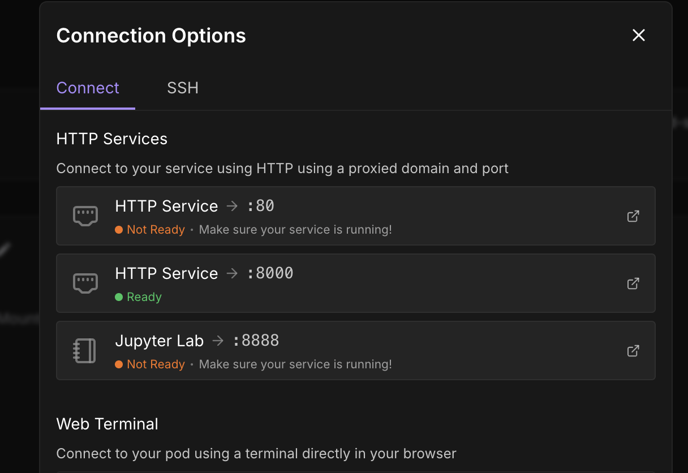
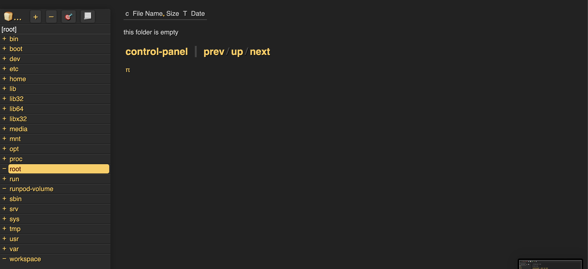
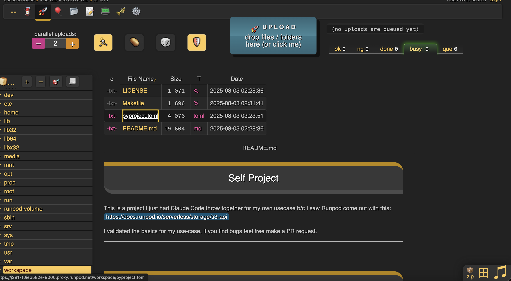

# Setting Up CopyParty on Runpod

CopyParty provides a web-based GUI that makes file management simple on Runpod instances. With its intuitive interface, you can browse directories, upload/download files, preview images and videos, and manage your pod's filesystem without complex command-line operations.

## About CopyParty

CopyParty is an open-source project created by [9001](https://github.com/9001/copyparty) that provides a portable file server with a web UI. It's perfect for managing files on cloud GPU instances where traditional file transfer methods might be cumbersome.

For a video demonstration, you can watch the [creator's YouTube tutorial](https://youtu.be/15_-hgsX2V0?si=AXArKvI79LEscpNn).

## Prerequisites

To use CopyParty on Runpod, you need:
- **Terminal access to your pod** - Either through web terminal or Jupyter Labs terminal
- An available HTTP port on your pod

### Verifying Terminal Access

You can access the terminal in two ways:

#### Option 1: Web Terminal
If you see this option when clicking "Connect" on your pod page, you have web terminal access:


#### Option 2: Jupyter Labs Terminal
If you have Jupyter Labs installed, you can access the terminal there:


## Installation Steps

### Step 1: Access Your Pod Settings

Navigate to your pod page and locate the settings:


### Step 2: Add an HTTP Port

<Warning>
**Adding a new port will restart your pod and erase any data not stored in `/workspace`**

Before proceeding, ensure all important files are saved in `/workspace` or backed up elsewhere. Any installed libraries or files outside of `/workspace` will be lost.
</Warning>

Add a dedicated HTTP port for the CopyParty interface. If port 8888 is already in use (common for Jupyter), try port 8000 or another available port.



### Step 3: Install and Run CopyParty

Open your terminal (web terminal or Jupyter terminal) and run one of the following commands:

#### Option 1: Standard Installation
Run CopyParty directly (the session will end if you close the terminal):

```bash
curl -LsSf https://astral.sh/uv/install.sh | sh && source $HOME/.local/bin/env && uv tool run copyparty -p 8000 --allow-csrf
```

Replace `-p 8000` with your chosen port number if different.

#### Option 2: Background Installation with tmux
To keep CopyParty running even after closing the terminal, use tmux:

```bash
apt-get update && apt-get install tmux -y && tmux new-session -d -s copyparty 'curl -LsSf https://astral.sh/uv/install.sh | sh && source $HOME/.local/bin/env && uv tool run copyparty -p 8000 --allow-csrf' && tmux attach -t copyparty
```

<Info>
**What is tmux?**

tmux (terminal multiplexer) is a tool that lets you run terminal sessions in the background. Think of it as a way to keep programs running even after you close your terminal window - like minimizing an app instead of closing it. This is particularly useful on RunPod where you want CopyParty to keep running even if you disconnect.

For a more in-depth tmux tutorial, check out this [comprehensive video guide](https://youtu.be/nTqu6w2wc68?si=OcI3qbh2kGH7_3fh).
</Info>

This command:
1. Installs tmux (a terminal multiplexer)
2. Creates a new tmux session named "copyparty"
3. Runs CopyParty in the background
4. Attaches you to the session to see the output

<Tip>
**Quick tmux Commands**
- To detach from tmux and leave CopyParty running: Press `Ctrl+B` then `D`
- To reattach to the session later: `tmux attach -t copyparty`
- To stop CopyParty: Reattach and press `Ctrl+C`
</Tip>

### Step 4: Access the CopyParty Interface

Once CopyParty is running, click on the port number in your RunPod dashboard:


## Using CopyParty

### File Navigation

The interface displays your file system on the left side:


### Uploading Files

Simply drag and drop files into the interface to upload them:


### Downloading Files

To download files:
1. Click on files to select them (they'll be highlighted in pink)
2. Use the buttons in the bottom right:
   - **"dl"** - Download individual files
   - **"zip"** - Download multiple files as a zip archive


## Tips and Best Practices

1. **Data Persistence**: Always store important files in `/workspace` to survive pod restarts
2. **Port Selection**: Choose a port that doesn't conflict with other services (avoid 8888 if using Jupyter)
3. **Large Files**: CopyParty handles large file transfers well, making it ideal for model weights and datasets

## Troubleshooting

### Session Ends When Terminal Closes
Use the tmux option (Option 2) to keep CopyParty running in the background

## Alternative File Transfer Methods

While CopyParty provides an excellent web-based solution, RunPod also supports:
- Direct SSH/SCP transfers (if SSH is enabled)
- Jupyter Labs file browser
- RunPodctl CLI tool
- Cloud storage integration (S3, Google Drive, etc.)

Choose the method that best fits your workflow and security requirements.

## Conclusion

CopyParty provides a simple, effective solution for file management on RunPod instances. With its drag-and-drop interface and support for large files, it's an excellent tool for managing datasets, model weights, and project files on your cloud GPU instances.