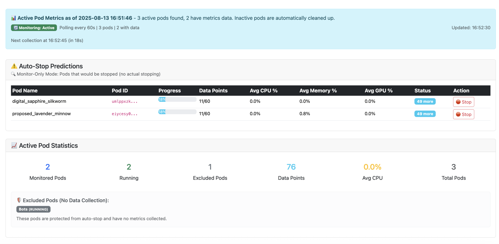

[Idle Pod Monitor](https://github.com/justinwlin/Runpod-Idle-Pod-Monitor) is a repository that helps you save money by providing a way to manage pods that are not being utilized or forgot to turn off. The repository provides either a self-contained CLI script that can be executed inside of a pod directly for self-pod idle monitoring or a runpod template for team level pod management and monitoring with a full-on UI.

## Configuration modes

The monitor operates in two modes:

### 🛑 Auto-Stop mode
Automatically **stops** (not terminates) pods when utilization falls below defined thresholds for a specified duration.
- **Saves:** GPU/CPU compute costs
- **Preserves:** Pod /workspace storage

### 📊 Monitor-only mode  
Tracks and alerts on idle pods without taking action.
- **Purpose:** Surface idle pods for manual review
- **Benefit:** Visibility into resource utilization patterns

## Quick deployment for team level monitoring

Deploy the team monitor on Runpod: [Deploy template](https://console.runpod.io/deploy?template=xe00ihiurd&ref=p1oqnqy1)

For the cheapest option, run on a CPU pod. The monitor automatically excludes itself from monitoring.

## Quick deployment for self-pod monitoring

For individual pod monitoring without external dependencies, use the self-contained CLI version that runs directly in your pod.

```bash
apt-get update && apt-get install -y tmux curl && \
curl -sSL https://raw.githubusercontent.com/justinwlin/Runpod-Idle-Pod-Monitor/refs/heads/main/self-contained/quick_install.sh -o /tmp/quick_install.sh && \
chmod +x /tmp/quick_install.sh && /tmp/quick_install.sh
```

## How it works

Define idle thresholds for your pods (e.g., ≤1% GPU, CPU, or memory usage). The monitor samples utilization every minute:

- **Below threshold:** Counter increments toward your defined duration limit
- **Above threshold:** Counter resets, monitoring continues
- **Duration reached:** Triggers auto-stop or alert based on your configuration

This ensures pods are only flagged as idle after sustained low utilization, preventing false positives from temporary dips.

## Team level monitoring feature preview

### Home dashboard

Main dashboard showing pod status, real-time monitoring, and quick actions for managing your pods*

### Configuration management  

Configure auto-stop settings, set CPU/GPU/memory thresholds

### Monitoring table

Table view of pods versus their threshold monitoring

### Performance metrics

Visualize historical usage data

