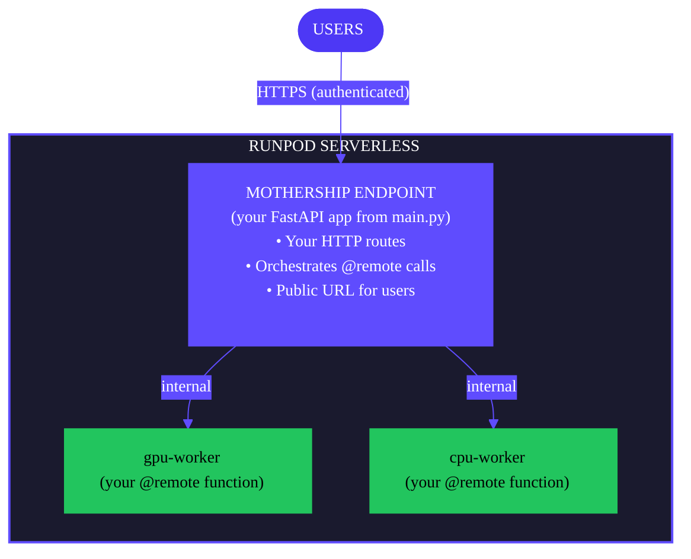

Flash provides a complete deployment workflow for taking your local development project to production. Use `flash deploy` to build and deploy your application in a single command, or use `flash build` for more control over the build process.


## Deployment workflow

A typical deployment workflow looks like this:

1. **Create a new project**: Use [`flash init`](/flash/cli/init) to create a new project.
2. **Develop locally**: Use [`flash run`](/flash/cli/run) to test your application. Any functions decorated with `@remote` will be run on Runpod Serverless workers.
3. **Preview** (optional): Use [`flash deploy --preview`](/flash/cli/deploy) to test locally with Docker.
4. **Deploy**: Use [`flash deploy`](/flash/cli/deploy) to push to Runpod Serverless.
5. **Manage**: Use [`flash env`](/flash/cli/env) and [`flash app`](/flash/cli/app) to manage your deployments.

## Deploy your application

When you're satisfied with your `@remote` functions and ready to move to production, use `flash deploy` to build and deploy your Flash application:

```bash
flash deploy
```

This command performs the following steps:

1. **Build**: Packages your code, dependencies, and manifest.
2. **Upload**: Sends the artifact to Runpod's storage.
3. **Provision**: Creates or updates Serverless endpoints.
4. **Configure**: Sets up environment variables and service discovery.
5. **Verify**: Confirms endpoints are healthy.

### Deployment architecture

After deployment, your entire application runs on Runpod Serverless:



### Deploy to an environment

Flash organizes deployments using [apps and environments](/flash/apps/apps-and-environments). Deploy to a specific environment using the `--env` flag:

```bash
# Deploy to staging
flash deploy --env staging

# Deploy to production
flash deploy --env production
```

If the specified environment doesn't exist, Flash creates it automatically.

### Post-deployment

After a successful deployment, Flash displays:

- The public URL for your application.
- Available routes from your `@remote` decorated functions.
- Instructions for authenticating requests.

```text
✓ Deployment Complete

Your mothership is deployed at:
https://api-xxxxx.runpod.net

Available Routes:
POST   /api/hello
POST   /gpu/process

All endpoints require authentication:
curl -X POST https://api-xxxxx.runpod.net/api/hello \
    -H "Authorization: Bearer $RUNPOD_API_KEY" \
    -H "Content-Type: application/json" \
    -d '{"message": "Hello"}'
```

## Preview before deploying

Test your deployment locally using Docker before pushing to production:

```bash
flash deploy --preview
```

This command:

1. Builds your project (creates the archive and manifest).
2. Creates a Docker network for inter-container communication.
3. Starts one container per resource config (mothership + workers).
4. Exposes the mothership on `localhost:8000`.

Use preview mode to:

- Validate your deployment configuration.
- Test cross-endpoint function calls.
- Debug resource provisioning issues.
- Verify the manifest structure.

Press `Ctrl+C` to stop the preview environment.

## Managing deployment size

Runpod Serverless has a **500MB deployment limit**. If your deployment exceeds this limit, use the `--exclude` flag to skip packages already included in your base worker image:

```bash
# Exclude PyTorch packages (pre-installed in GPU images)
flash deploy --exclude torch,torchvision,torchaudio
```

### Base image packages

Which packages to exclude depends on your resource configuration:

| Resource type | Base image | Pre-installed packages |
|--------------|------------|------------------------|
| GPU (`LiveServerless` with `gpus`) | PyTorch base | `torch`, `torchvision`, `torchaudio` |
| CPU (`LiveServerless` with `instanceIds`) | Python slim | None |
| Load-balanced | Same as GPU/CPU | Same as GPU/CPU |

<Tip>

Check the [worker-flash repository](https://github.com/runpod-workers/worker-flash) for current base images and pre-installed packages.

</Tip>

## Build process

When you run `flash deploy` (or `flash build`), Flash:

1. **Discovers** all `@remote` decorated functions.
2. **Groups** functions by their `resource_config`.
3. **Generates** handler files for each resource config.
4. **Creates** a `flash_manifest.json` file for service discovery.
5. **Installs** dependencies with Linux x86_64 compatibility.
6. **Packages** everything into `.flash/artifact.tar.gz`.

### Cross-platform builds

Flash automatically handles cross-platform builds. You can build on macOS, Windows, or Linux, and the resulting package will run correctly on Runpod's Linux x86_64 infrastructure.

### Build artifacts

After building, these artifacts are created in the `.flash/` directory:

| Artifact | Description |
|----------|-------------|
| `.flash/artifact.tar.gz` | Deployment package |
| `.flash/flash_manifest.json` | Service discovery configuration |
| `.flash/.build/` | Temporary build directory (removed by default) |

## Troubleshooting

### No @remote functions found

If the build process can't find your remote functions:

- Ensure functions are decorated with `@remote(resource_config=...)`.
- Check that Python files aren't excluded by `.gitignore` or `.flashignore`.
- Verify decorator syntax is correct.

### Deployment size limit exceeded

If your deployment exceeds 500MB:

```bash
# Exclude packages already in base image
flash deploy --exclude torch,torchvision,torchaudio
```

### Authentication errors

Verify your API key is set correctly:

```bash
echo $RUNPOD_API_KEY
```

If not set, add it to your `.env` file or export it:

```bash
export RUNPOD_API_KEY=your_api_key_here
```

### Import errors in remote functions

Import packages inside the remote function, not at the top of the file:

```python
@remote(resource_config=config, dependencies=["requests"])
def fetch_data(url):
    import requests  # Import here
    return requests.get(url).json()
```

## Next steps

- [Learn about apps and environments](/flash/apps/apps-and-environments) for managing deployments.
- [View the CLI reference](/flash/cli/overview) for all available commands.
- [Configure resources](/flash/resource-configuration) for your endpoints.
- [Monitor and debug](/flash/monitoring) your deployments.
