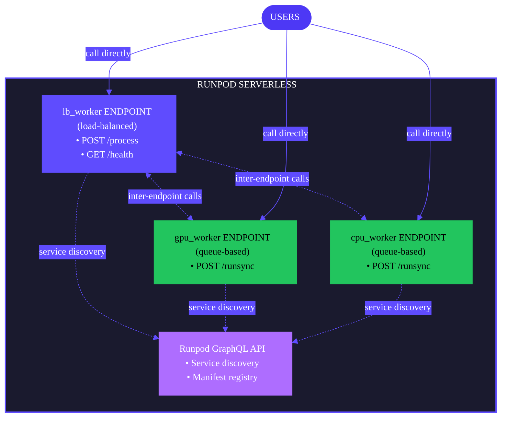

import { LoadBalancingEndpointsTooltip, QueueBasedEndpointsTooltip } from "/snippets/tooltips.jsx";

Flash provides a complete deployment workflow for taking your local development project to production. Use `flash deploy` to build and deploy your application in a single command, or use `flash build` for more control over the build process.

## Deployment workflow

A typical deployment workflow looks like this:

1. **Create a new project**: Use [`flash init`](/flash/cli/init) to create a new project.
2. **Develop locally**: Use [`flash run`](/flash/cli/run) to test your application. Any functions decorated with `@remote` will be run on Runpod Serverless workers.
3. **Preview** (optional): Use [`flash deploy --preview`](/flash/cli/deploy) to test locally with Docker.
4. **Deploy**: Use [`flash deploy`](/flash/cli/deploy) to push to Runpod Serverless.
5. **Manage**: Use [`flash env`](/flash/cli/env) and [`flash app`](/flash/cli/app) to manage your deployments.

## Deploy your application

When you're satisfied with your `@remote` functions and ready to move to production, use `flash deploy` to build and deploy your Flash application:

```bash
flash deploy
```

This command performs the following steps:

1. **Build**: Packages your code, dependencies, and manifest.
2. **Upload**: Sends the artifact to Runpod's storage.
3. **Provision**: Creates or updates Serverless endpoints.
4. **Configure**: Sets up environment variables and service discovery.
5. **Verify**: Confirms endpoints are healthy.

### Deployment architecture

Flash deploys your application as multiple independent Serverless endpoints. Each resource configuration in your worker files becomes a separate endpoint:



**How Flash deployments work:**

- **One resource config = one endpoint**: Each unique resource configuration (defined by its `name` parameter) creates a separate Serverless endpoint with its own URL.
- **Call any endpoint**: You can call whichever endpoint you need—`lb_worker` for API requests, `gpu_worker` for GPU tasks, `cpu_worker` for CPU tasks.
- **<LoadBalancingEndpointsTooltip />**: Create HTTP APIs with custom routes using `@remote(method="POST", path="/...")`.
- **<QueueBasedEndpointsTooltip />**: Run compute tasks using the automatic `/runsync` route.
- **Inter-endpoint communication**: Endpoints can call each other's functions when needed, using the Runpod GraphQL service for discovery.

### Deploy to an environment

Flash organizes deployments using [apps and environments](/flash/apps/apps-and-environments). Deploy to a specific environment using the `--env` flag:

```bash
# Deploy to staging
flash deploy --env staging

# Deploy to production
flash deploy --env production
```

If the specified environment doesn't exist, Flash creates it automatically.

### Post-deployment

After a successful deployment, Flash displays all deployed endpoints grouped by type:

```text
✓ Deployment Complete

Load-balanced endpoints:
  https://abc123xyz.api.runpod.ai  (lb_worker)
    POST   /process
    GET    /health

  Try it:
    curl -X POST https://abc123xyz.api.runpod.ai/process \
        -H "Content-Type: application/json" \
        -H "Authorization: Bearer $RUNPOD_API_KEY" \
        -d '{"input": {}}'

Queue-based endpoints:
  https://api.runpod.ai/v2/def456xyz  (gpu_worker)
  https://api.runpod.ai/v2/ghi789xyz  (cpu_worker)

  Try it:
    curl -X POST https://api.runpod.ai/v2/def456xyz/runsync \
        -H "Content-Type: application/json" \
        -H "Authorization: Bearer $RUNPOD_API_KEY" \
        -d '{"input": {}}'
```

Each endpoint is independent with its own URL and authentication.

## Understanding endpoint architecture

The relationship between resource configurations and deployed endpoints differs between load-balanced and queue-based endpoints:

### Queue-based endpoints (one function per endpoint)

For queue-based endpoints, each `@remote` function must have its own unique resource configuration:

```python
# Each function needs its own resource config
gpu_config_1 = LiveServerless(name="run-model", gpus=[GpuType.NVIDIA_A100_80GB_PCIe])
gpu_config_2 = LiveServerless(name="preprocess", gpus=[GpuType.NVIDIA_A100_80GB_PCIe])

@remote(resource_config=gpu_config_1, dependencies=["torch"])
def run_model(input: dict): ...

@remote(resource_config=gpu_config_2, dependencies=["transformers"])
def preprocess(data: dict): ...
```

This creates two separate Serverless endpoints:
- `https://api.runpod.ai/v2/abc123xyz` (run-model)
- `https://api.runpod.ai/v2/def456xyz` (preprocess)

**Calling queue-based endpoints:**

```bash
# Call run_model endpoint (synchronous):
curl -X POST https://api.runpod.ai/v2/abc123xyz/runsync \
    -H "Authorization: Bearer $RUNPOD_API_KEY" \
    -H "Content-Type: application/json" \
    -d '{"input": {"your": "data"}}'

# Or call asynchronously with /run:
curl -X POST https://api.runpod.ai/v2/abc123xyz/run \
    -H "Authorization: Bearer $RUNPOD_API_KEY" \
    -H "Content-Type: application/json" \
    -d '{"input": {"your": "data"}}'
```

<Warning>
**Important:** For deployed queue-based endpoints, you must use **one function per resource configuration**. Each function creates its own Serverless endpoint. Do not put multiple `@remote` functions with the same queue-based resource config when building Flash apps.
</Warning>

### Load-balanced endpoints (multiple routes per endpoint)

For load-balanced endpoints, you can define multiple HTTP routes on a single resource configuration:

```python
lb_config = CpuLiveLoadBalancer(name="api")

# Multiple routes on a single Serverless endpoint:
@remote(resource_config=lb_config, method="POST", path="/generate")
def generate_text(prompt: str): ...

@remote(resource_config=lb_config, method="POST", path="/translate")
def translate_text(text: str): ...

@remote(resource_config=lb_config, method="GET", path="/health")
def health_check(): ...
```

This creates:
- **One Serverless endpoint**: `https://abc123xyz.api.runpod.ai` (named "api")
- **Three HTTP routes**: `POST /generate`, `POST /translate`, `GET /health`

**Calling load-balanced endpoints:**

```bash
# Call the /generate route:
curl -X POST https://abc123xyz.api.runpod.ai/generate \
    -H "Authorization: Bearer $RUNPOD_API_KEY" \
    -H "Content-Type: application/json" \
    -d '{"prompt": "hello"}'

# Call the /health route (same endpoint URL):
curl -X GET https://abc123xyz.api.runpod.ai/health \
    -H "Authorization: Bearer $RUNPOD_API_KEY"
```

### Key takeaway

- **Queue-based**: 1 resource configuration = 1 function = 1 Serverless endpoint
- **Load-balanced**: 1 resource configuration = multiple routes = 1 Serverless endpoint

## Preview before deploying

Test your deployment locally using Docker before pushing to production using the `--preview` flag:

```bash
flash deploy --preview
```

This command:

1. Builds your project (creates the deployment artifact and manifest).
2. Creates a Docker network for inter-container communication.
3. Starts one container per resource configuration (`lb_worker`, `gpu_worker`, `cpu_worker`, etc.).
4. Exposes all endpoints for local testing.

Use preview mode to:

- Validate your deployment configuration.
- Test cross-endpoint function calls.
- Debug resource provisioning issues.
- Verify the manifest structure.

Press `Ctrl+C` to stop the preview environment.

## Managing deployment size

Runpod Serverless has a **500MB deployment limit**. If your deployment exceeds this limit, use the `--exclude` flag to skip packages already included in your base worker image:

```bash
# Exclude PyTorch packages (pre-installed in GPU images)
flash deploy --exclude torch,torchvision,torchaudio
```

### Base image packages

Which packages to exclude depends on your resource configuration:

| Resource type | Base image | Pre-installed packages |
|--------------|------------|------------------------|
| GPU (`LiveServerless` with `gpus`) | PyTorch base | `torch`, `torchvision`, `torchaudio` |
| CPU (`LiveServerless` with `instanceIds`) | Python slim | None |
| Load-balanced | Same as GPU/CPU | Same as GPU/CPU |

<Tip>

Check the [worker-flash repository](https://github.com/runpod-workers/worker-flash) for current base images and pre-installed packages.

</Tip>

## Build process

When you run `flash deploy` (or `flash build`), Flash:

1. **Discovers** all `@remote` decorated functions.
2. **Groups** functions by their `resource_config`.
3. **Generates** handler files for each resource config.
4. **Creates** a `flash_manifest.json` file for service discovery.
5. **Installs** dependencies with Linux x86_64 compatibility.
6. **Packages** everything into `.flash/artifact.tar.gz`.

### Cross-platform builds

Flash automatically handles cross-platform builds. You can build on macOS, Windows, or Linux, and the resulting package will run correctly on Runpod's Linux x86_64 infrastructure.

### Build artifacts

After building, these artifacts are created in the `.flash/` directory:

| Artifact | Description |
|----------|-------------|
| `.flash/artifact.tar.gz` | Deployment package |
| `.flash/flash_manifest.json` | Service discovery configuration |
| `.flash/.build/` | Temporary build directory (removed by default) |

## What gets deployed to Runpod

When you deploy a Flash app, you're deploying a **build artifact** (tarball) onto pre-built Flash Docker images. This architecture is similar to AWS Lambda layers: the base runtime is pre-built, and your code and dependencies are layered on top.

### The build artifact

The `.flash/artifact.tar.gz` file (max 500 MB) contains:

<Tree>
  <Tree.Folder name="artifact.tar.gz" defaultOpen>
    <Tree.File name="lb_worker.py" />
    <Tree.File name="gpu_worker.py" />
    <Tree.File name="cpu_worker.py" />
    <Tree.File name="flash_manifest.json" />
    <Tree.File name="requirements.txt" />
    <Tree.Folder name="[installed dependencies]" defaultOpen>
      <Tree.Folder name="torch" />
      <Tree.Folder name="transformers" />
      <Tree.File name="..." />
    </Tree.Folder>
  </Tree.Folder>
</Tree>

Dependencies are installed locally during the build process and bundled into the tarball. They are **not** installed at runtime on endpoints.

### The deployment manifest

The `flash_manifest.json` file is the brain of your deployment. It tells each endpoint:

- Which functions to execute.
- What Docker image to use.
- How to configure resources (GPUs, workers, scaling).
- How to route HTTP requests (for load balancer endpoints).

```json
{
  "resources": {
    "lb_worker": {
      "resource_type": "CpuLiveLoadBalancer",
      "is_load_balanced": true,
      "imageName": "runpod/flash-lb-cpu:latest",
      "workersMin": 1,
      "functions": [
        {"name": "process", "module": "lb_worker"},
        {"name": "health", "module": "lb_worker"}
      ]
    },
    "gpu_worker": {
      "resource_type": "LiveServerless",
      "imageName": "runpod/flash:latest",
      "gpuIds": "AMPERE_16",
      "workersMax": 3,
      "functions": [
        {"name": "gpu_hello", "module": "gpu_worker"}
      ]
    },
    "cpu_worker": {
      "resource_type": "CpuLiveServerless",
      "imageName": "runpod/flash-cpu:latest",
      "workersMax": 2,
      "functions": [
        {"name": "cpu_hello", "module": "cpu_worker"}
      ]
    }
  },
  "routes": {
    "lb_worker": {
      "POST /process": "process",
      "GET /health": "health"
    }
  }
}
```

### What gets created on Runpod

For each resource configuration in the manifest, Flash creates an independent Serverless endpoint. Each endpoint runs as its own service with its own URL.

**load-balanced endpoints** ([load balancer](/serverless/load-balancing/overview))

- **Purpose**: HTTP-facing services for custom API routes
- **Image**: Pre-built `runpod/flash-lb-cpu:latest` or `runpod/flash-lb:latest`
- **Use cases**: REST APIs, webhooks, public-facing services
- **Example**: `lb_worker.py` with `@remote(resource_config, method="POST", path="/process")`
- **Routes**: Custom HTTP endpoints defined in your `@remote` decorator
- **Startup process**:
  1. Container extracts your tarball
  2. Auto-generated handler imports your worker file (e.g., `lb_worker.py`)
  3. FastAPI routes are registered from `@remote` decorators
  4. Uvicorn server starts on port 8000
- **Service discovery**: Queries the state manager for cross-endpoint calls

**queue-based endpoints** (serverless compute)

- **Purpose**: Background compute for intensive `@remote` functions
- **Image**: Pre-built `runpod/flash:latest` (GPU) or `runpod/flash-cpu:latest` (CPU)
- **Use cases**: GPU inference, batch processing, heavy computation
- **Example**: `gpu_worker.py` with `@remote(resource_config)`
- **Routes**: Automatic `/runsync` endpoint for job submission
- **Startup process**:
  1. Container extracts your tarball
  2. Worker module is imported (e.g., `gpu_worker.py`)
  3. Function registry maps function names to callables
  4. Worker listens for jobs from job queue
- **Execution**: Sequential job processing with automatic retry logic
- **Service discovery**: Queries the state manager for cross-endpoint calls

### Cross-endpoint communication

When one endpoint needs to call a function on another endpoint:

1. **Manifest lookup**: Calling endpoint checks `flash_manifest.json` for function-to-resource mapping
2. **Service discovery**: Queries the state manager (Runpod GraphQL API) for target endpoint URL
3. **Direct call**: Makes HTTP request directly to target endpoint
4. **Response**: Target endpoint executes function and returns result

Each endpoint maintains its own connection to the state manager, querying for peer endpoint URLs as needed and caching results for 300 seconds to minimize API calls.

## Troubleshooting

### No @remote functions found

If the build process can't find your remote functions:

- Ensure functions are decorated with `@remote(resource_config=...)`.
- Check that Python files aren't excluded by `.gitignore` or `.flashignore`.
- Verify decorator syntax is correct.

### Deployment size limit exceeded

If your deployment exceeds 500MB:

```bash
# Exclude packages already in base image
flash deploy --exclude torch,torchvision,torchaudio
```

### Authentication errors

Verify your API key is set correctly:

```bash
echo $RUNPOD_API_KEY
```

If not set, add it to your `.env` file or export it:

```bash
export RUNPOD_API_KEY=your_api_key_here
```

### Import errors in remote functions

Import packages inside the remote function, not at the top of the file:

```python
@remote(resource_config=config, dependencies=["requests"])
def fetch_data(url):
    import requests  # Import here
    return requests.get(url).json()
```

## Next steps

- [Learn about apps and environments](/flash/apps/apps-and-environments) for managing deployments.
- [View the CLI reference](/flash/cli/overview) for all available commands.
- [Configure hardware resources](/flash/configuration/overview) for your endpoints.
- [Monitor and troubleshoot](/flash/troubleshooting) your deployments.
