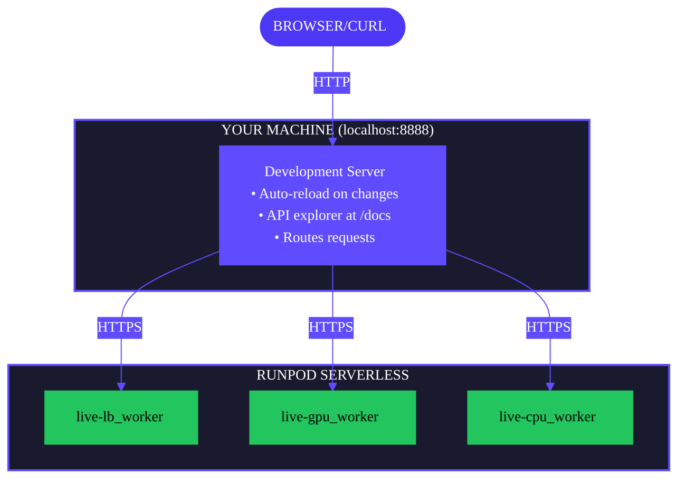

The `flash run` command starts a local development server that lets you test your Flash application before deploying to production. The development server runs locally and updates automatically as you edit files. 

When you call a `@Endpoint` function, Flash sends the latest function code to Serverless workers on Runpod, so your changes are reflected immediately.

## Start the development server

From inside your [project directory](/flash/apps/initialize-project), run:

```bash
flash run

# If using uv:
uv run flash run
```

The server starts at `http://localhost:8888` by default. Your endpoints are available immediately for testing, and `@Endpoint` functions provision Serverless endpoints on first call.

### Using a custom host and port

```bash
# Change port
flash run --port 3000

# Make accessible on network
flash run --host 0.0.0.0

# If using uv:
uv run flash run --port 3000
uv run flash run --host 0.0.0.0
```

## Test your endpoints

### Using curl

```bash
# Call a queue-based endpoint (gpu_worker.py)
curl -X POST http://localhost:8888/gpu_worker/runsync \
  -H "Content-Type: application/json" \
  -d '{"input": {"input_data": {"message": "Hello from the GPU"}}}'

# Call a load-balanced endpoint (lb_worker.py)
curl -X POST http://localhost:8888/lb_worker/process \
  -H "Content-Type: application/json" \
  -d '{"input_data": {"message": "Hello from Flash"}}'
```

<Note>
Queue-based endpoints require the `{"input": {...}}` wrapper to match the deployed endpoint behavior. The inner payload structure maps to your function's parameter names—the skeleton template uses `input_data: dict`, so the payload is `{"input_data": {...}}`. Load-balanced endpoints accept the payload directly without the `input` wrapper.
</Note>

### Using the API explorer

Open [http://localhost:8888/docs](http://localhost:8888/docs) in your browser to access the interactive Swagger UI. You can test all endpoints directly from the browser.

Flash extracts the first line of each function's docstring and displays it as the endpoint description in the API explorer. Add docstrings to your `@Endpoint` functions to make your API self-documenting:

```python
@Endpoint(name="gpu-worker", gpu=GpuGroup.ANY)
def process_data(input_data: dict) -> dict:
    """Process input data and return computed results."""
    # Function implementation
    return {"result": "processed"}
```

The docstring "Process input data and return computed results" appears in the Swagger UI, making it easier to understand what each endpoint does.

### Using Python

```python
import requests

# Call queue-based endpoint
response = requests.post(
    "http://localhost:8888/gpu_worker/runsync",
    json={"input": {"input_data": {"message": "Hello from the GPU"}}}
)
print(response.json())

# Call load-balanced endpoint
response = requests.post(
    "http://localhost:8888/lb_worker/process",
    json={"input_data": {"message": "Hello from Flash"}}
)
print(response.json())
```

## Reduce cold-start delays

The first call to a `@Endpoint` function provisions a Serverless endpoint, which takes 30-60 seconds. Use `--auto-provision` to provision all endpoints at startup:

```bash
flash run --auto-provision

# If using uv:
uv run flash run --auto-provision
```

This scans your project for `@Endpoint` functions and deploys them before the server starts accepting requests. Endpoints are cached in `.flash/resources.pkl` and reused across server restarts.

## How it works

With `flash run`, Flash starts a local development server alongside remote Serverless endpoints:



**What runs where:**

| Component | Location |
|-----------|----------|
| Development server | Your machine (localhost:8888) |
| `@Endpoint` function code | Runpod Serverless |
| Endpoint storage | Runpod Serverless |

Your code updates automatically as you edit files. Endpoints created by `flash run` are prefixed with `live-` to distinguish them from production endpoints.

## Clean up after testing

Endpoints created by `flash run` persist until you delete them. To clean up:

```bash
# List all endpoints
flash undeploy list

# Remove a specific endpoint
flash undeploy ENDPOINT_NAME

# Remove all endpoints
flash undeploy --all

# If using uv:
uv run flash undeploy list
uv run flash undeploy ENDPOINT_NAME
uv run flash undeploy --all
```

## Troubleshooting

**Port already in use**

Flash automatically selects the next available port if your specified port is in use. You'll see a message like `Port 8888 is in use, using 8889 instead.` If you need a specific port, stop the process using it or specify a different starting port with `--port`.

**Slow first request**

Use `--auto-provision` to eliminate cold-start delays:

```bash
flash run --auto-provision

# If using uv:
uv run flash run --auto-provision
```

**Authentication errors**

Run `flash login` to authenticate:

```bash
flash login

# If using uv:
uv run flash login
```

Alternatively, set `RUNPOD_API_KEY` as an environment variable or in your `.env` file:

```bash
export RUNPOD_API_KEY="your_api_key_here"
```

<Note>
Values in your `.env` file are only available locally for CLI commands. They are not passed to deployed endpoints.
</Note>

## Next steps

- [Deploy to production](/flash/apps/deploy-apps) when your app is ready.
- [Clean up endpoints](/flash/cli/undeploy) after testing.
- [View the flash run reference](/flash/cli/run) for all options.
