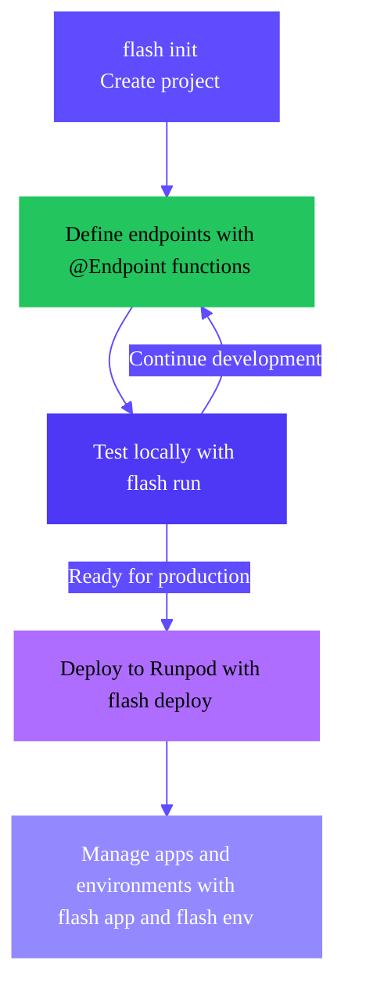
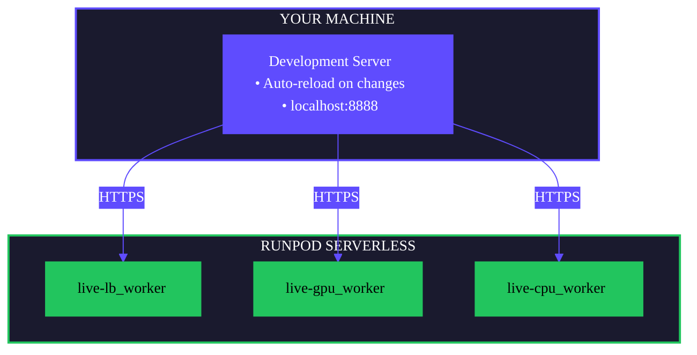
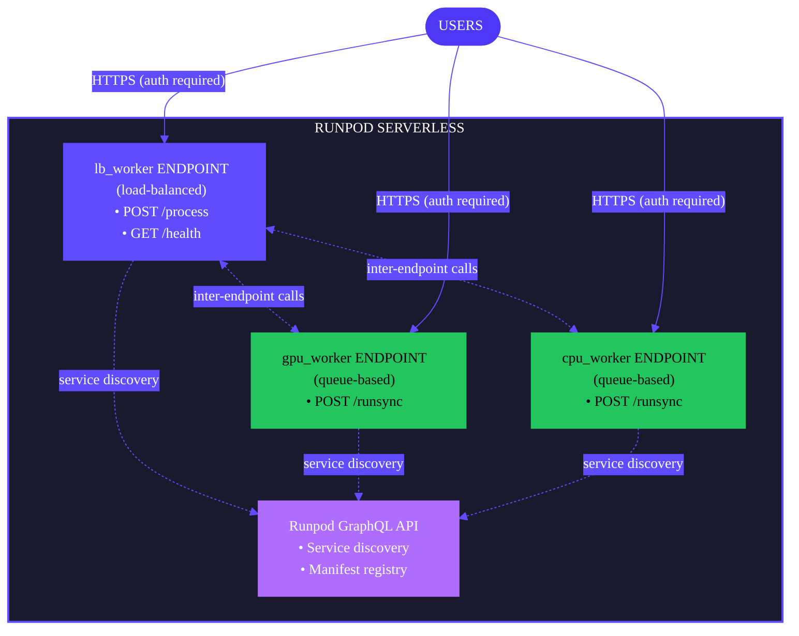

import { ServerlessTooltip } from "/snippets/tooltips.jsx";

A Flash app is a collection of <ServerlessTooltip /> endpoints deployed to Runpod. When you deploy an app, Runpod:

1. Packages your code, dependencies, and deployment manifest into a tarball (max 500 MB).
2. Uploads the tarball to Runpod.
3. Provisions independent Serverless endpoints based on your [endpoint configurations](/flash/create-endpoints).

This page explains the key concepts and processes you'll use when building Flash apps.

<Tip>
If you prefer to learn by doing, follow this tuturial to [build your first Flash app](/flash/apps/build-app).
</Tip>


## App development overview

Building a Flash application follows a clear progression from initialization to production deployment:

<div style={{ marginLeft: '6rem'}}>

</div>

<Steps>
  <Step title="Initialize">
    Use `flash init` to create a new project with example workers:

    ```bash
    flash init PROJECT_NAME
    cd PROJECT_NAME
    pip install -r requirements.txt
    ```

    This gives you a working project structure with GPU and CPU worker examples. [Learn more about project initialization](/flash/apps/initialize-project).
  </Step>

  <Step title="Develop">
    Write your application code by defining `Endpoint` functions that execute on Runpod workers:

    ```python
    from runpod_flash import Endpoint, GpuType

    @Endpoint(
        name="inference-worker",
        gpu=GpuType.NVIDIA_GEFORCE_RTX_4090,
        workers=3,
        dependencies=["torch"]
    )
    def run_inference(prompt: str) -> dict:
        import torch
        # Your inference logic here
        return {"result": "..."}
    ```

    [Learn more about endpoint functions](/flash/create-endpoints).
  </Step>

  <Step title="Test locally">
    Start a local development server to test your application:

    ```bash
    flash run
    ```

    Your app runs locally and updates automatically. When you call an `@Endpoint` function, Flash sends the latest code to Runpod workers. This hybrid architecture lets you iterate quickly without redeploying. [Learn more about local testing](/flash/apps/local-testing).
  </Step>

  <Step title="Deploy">
    When ready for production, deploy your application to Runpod Serverless:

    ```bash
    flash deploy
    ```

    Your entire application—including all worker functions—runs on Runpod infrastructure. [Learn more about deployment](/flash/apps/deploy-apps).
  </Step>

  <Step title="Manage">
    Use apps and environments to organize and manage your deployments across different stages (dev, staging, production). [Learn more about apps and environments](/flash/apps/apps-and-environments).
  </Step>
</Steps>

## Apps and environments

Flash uses a two-level organizational structure: **apps** (project containers) and **environments** (deployment stages like dev, staging, production). See [Apps and environments](/flash/apps/apps-and-environments) for complete details.

## Local vs production deployment

Flash supports two modes of operation:

### Local development (`flash run`)



**How it works:**

- Development server runs on your machine and updates automatically.
- `@Endpoint` functions deploy to Runpod endpoints (one for each endpoint configuration).
- Endpoints are prefixed with `live-` for easy identification.
- No authentication required for local testing.
- Fast iteration on application logic.

### Production deployment (`flash deploy`)



**How it works:**

- All endpoints run independently on Runpod Serverless (one for each endpoint configuration).
- Each endpoint has its own public HTTPS URL.
- API key authentication is required for all requests.
- Automatic scaling based on load.
- Production-grade reliability and performance.

### Endpoint functions vs. Serverless endpoints

Understanding the relationship between your code (endpoint functions) and deployed infrastructure (Serverless endpoints) is crucial for building Flash apps.

**Serverless endpoints** are the underlying infrastructure Flash creates on Runpod. Each unique endpoint configuration (defined by its `name` parameter) creates one Serverless endpoint with specific hardware (GPU type, worker count, etc.). Each Serverless endpoint gets its own public HTTPS URL (e.g., `https://abc123xyz.api.runpod.ai` for load-balanced or `https://api.runpod.ai/v2/abc123xyz` for queue-based).

You call these endpoints to execute your functions. The endpoint configuration type determines the behavior and HTTPS URL of the endpoint:

- **For queue-based endpoints**: You can only have one function per endpoint, which will be executed when you call `/runsync` or `/run` on the endpoint.
- **For load-balanced endpoints**: You can have multiple functions with different HTTP routes per endpoint, which will be executed when you call the endpoint with the appropriate HTTP method and path.

#### Queue-based example

Queue-based endpoints must have exactly one function defined per endpoint configuration, which will be executed when you call the `/runsync` or `/run` route on the endpoint.

```python
from runpod_flash import Endpoint, GpuType

# Each queue-based function needs its own endpoint configuration
@Endpoint(name="preprocess", gpu=GpuType.NVIDIA_A100_80GB_PCIe)
def preprocess(data): ...

@Endpoint(name="inference", gpu=GpuType.NVIDIA_A100_80GB_PCIe)
def run_model(input): ...
```

This creates two separate Serverless endpoints, each with its own public HTTPS URL and `/run` or `/runsync` route.

The URL depends on your endpoint ID, which is randomly generated when you deploy your app. For example, if your endpoint ID is `fexh32emkg3az7`, the `/runsync` URL will be `https://api.runpod.ai/v2/fexh32emkg3az7/runsync`.

#### Load-balancing example

Load-balancing endpoints can have multiple routes on a single Serverless endpoint. Use the route decorator pattern:

```python
from runpod_flash import Endpoint

# One endpoint can host multiple HTTP routes
api = Endpoint(name="api-server", cpu="cpu5c-4-8", workers=(1, 5))

@api.post("/generate")
def generate_text(prompt: str): ...

@api.get("/health")
def health_check(): ...
```

This creates one Serverless endpoint with multiple routes: `POST /generate` and `GET /health`, which will be executed when you call the endpoint with the appropriate HTTP method and path.

The final endpoint URL depends on your endpoint ID, which is randomly generated when you deploy your app, and the HTTP routes defined in your decorators. For example, if your endpoint ID is `l66m1rhm9dhbjd`, the `/generate` route will be available at `https://l66m1rhm9dhbjd.api.runpod.ai/generate`.

[Learn more about endpoint mapping](/flash/apps/customize-app#understanding-endpoint-architecture).

## Common workflows

### Simple projects (single environment)

For solo projects or simple applications:

```bash
# Initialize and develop
flash init PROJECT_NAME
cd PROJECT_NAME

# Test locally
flash run

# Deploy to production (creates 'production' environment by default)
flash deploy
```

### Team projects (multiple environments)

For team collaboration with dev, staging, and production stages:

```bash
# Create environments
flash env create dev
flash env create staging
flash env create production

# Development cycle
flash run                          # Test locally
flash deploy --env dev             # Deploy to dev for integration testing
flash deploy --env staging         # Deploy to staging for QA
flash deploy --env production      # Deploy to production after approval
```

### Feature development

For testing new features in isolation:

```bash
# Create temporary feature environment
flash env create FEATURE_NAME

# Deploy and test
flash deploy --env FEATURE_NAME

# Clean up after merging
flash env delete FEATURE_NAME
```

## Next steps

<CardGroup cols={2}>
  <Card title="Build your first app" href="/flash/apps/build-app" icon="code" horizontal>
    Create a Flash app, test it locally, and deploy it to production.
  </Card>
  <Card title="Initialize a project" href="/flash/apps/initialize-project" icon="folder-plus" horizontal>
    Create boilerplate code for a new Flash project with `flash init`.
  </Card>
  <Card title="Test locally" href="/flash/apps/local-testing" icon="flask" horizontal>
    Use `flash run` for local development and testing.
  </Card>
  <Card title="Deploy to Runpod" href="/flash/apps/deploy-apps" icon="rocket" horizontal>
    Deploy your application to production with `flash deploy`.
  </Card>
</CardGroup>
