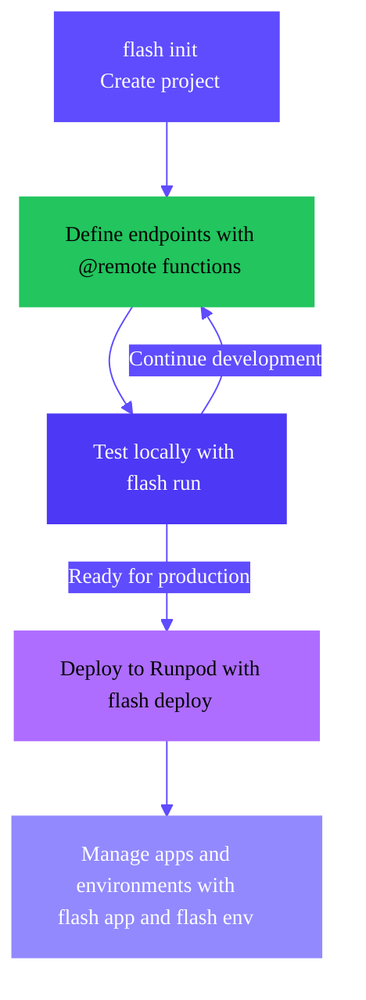
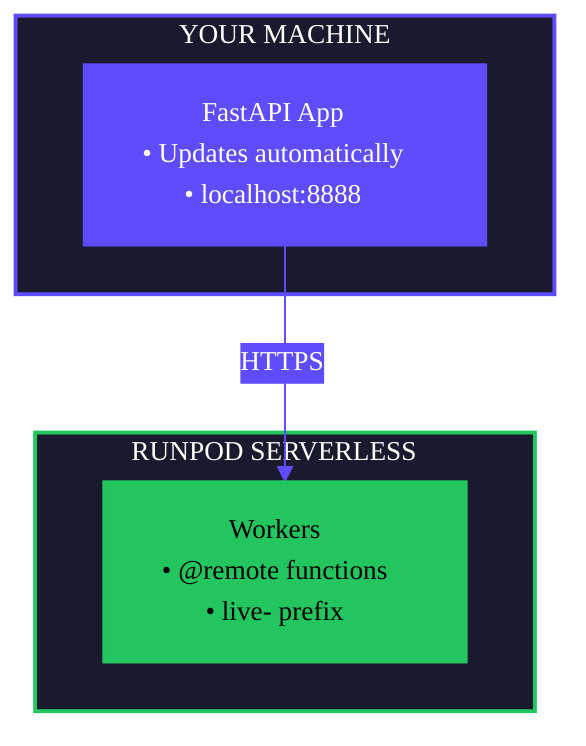
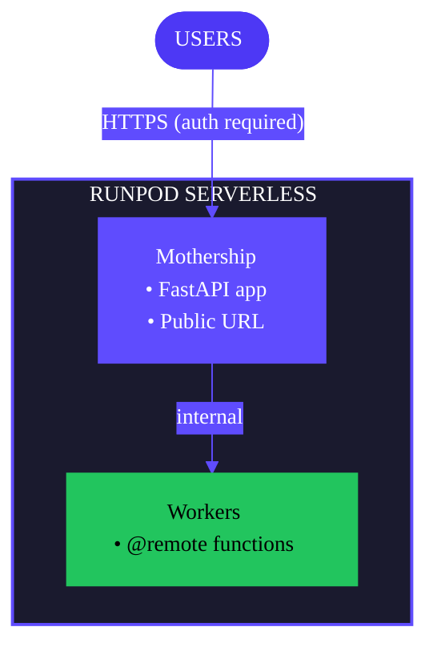

Flash provides a complete development and deployment workflow to build AI/ML applications and services using Runpod's GPU/CPU infrastructure. This page explains the key concepts and processes you'll use when building Flash apps.

<Tip>
If you prefer to learn by doing, follow this tuturial to [build your first Flash app](/flash/build-app).
</Tip>

## App development overview

Building a Flash application follows a clear progression from initialization to production deployment:

<div style={{ marginLeft: '6rem'}}>

</div>

<Steps>
  <Step title="Initialize">
    Use `flash init` to create a new project with a FastAPI server and example workers:

    ```bash
    flash init my-project
    cd my-project
    pip install -r requirements.txt
    ```

    This gives you a working project structure with GPU and CPU worker examples. [Learn more about project initialization](/flash/initialize-project).
  </Step>

  <Step title="Develop">
    Write your application code by defining `@remote` functions that execute on Runpod workers:

    ```python
    from runpod_flash import remote, LiveServerless, GpuGroup

    config = LiveServerless(
        name="inference-worker",
        gpus=[GpuGroup.ADA_24],
        workersMax=3,
    )

    @remote(resource_config=config, dependencies=["torch"])
    def run_inference(prompt: str) -> dict:
        import torch
        # Your inference logic here
        return {"result": "..."}
    ```

    [Learn more about building apps](/flash/build-app).
  </Step>

  <Step title="Test locally">
    Start a local development server to test your application:

    ```bash
    flash run
    ```

    Your FastAPI app runs locally and updates automatically, while `@remote` functions execute on real Runpod workers. This hybrid architecture lets you iterate quickly without deploying after every change. [Learn more about local testing](/flash/local-testing).
  </Step>

  <Step title="Deploy">
    When ready for production, deploy your application to Runpod Serverless:

    ```bash
    flash deploy
    ```

    Your entire application—including the FastAPI server and all worker functions—runs on Runpod infrastructure. [Learn more about deployment](/flash/deploy-apps).
  </Step>

  <Step title="Manage">
    Use apps and environments to organize and manage your deployments across different stages (dev, staging, production). [Learn more about apps and environments](/flash/apps-and-environments).
  </Step>
</Steps>

## Apps and environments

Flash uses a two-level organizational structure to manage deployments: **apps** and **environments**.

### What is a Flash app?

A **Flash app** is a logical container for all resources related to a single project. Think of it as a namespace that groups together:

- **Environments**: Different deployment stages (dev, staging, production).
- **Builds**: Versioned artifacts of your application code.
- **Configuration**: App-wide settings and metadata.

Apps are created automatically when you first run `flash deploy`, or you can create them explicitly with `flash app create`.

### What is an environment?

An **environment** is an isolated deployment stage within an app. Each environment has its own:

- **Deployed endpoints**: Serverless workers for your `@remote` functions.
- **Build version**: The specific code version running in this environment.
- **State**: Current deployment status (deploying, deployed, failed, etc.).

Environments are completely independent—deploying to `dev` has no effect on `production`. You can create and manage environments with the `flash env` command.

## Local vs production deployment

Flash supports two modes of operation:

### Local development (`flash run`)



**How it works:**
- FastAPI runs on your machine and updates automatically
- `@remote` functions run on Runpod workers
- Endpoints prefixed with `live-` for easy identification
- No authentication required for local testing
- Fast iteration on application logic

### Production deployment (`flash deploy`)



**How it works:**
- Entire application runs on Runpod Serverless
- FastAPI "mothership" endpoint orchestrates worker calls
- Public HTTPS URL with API key authentication
- Automatic scaling based on load
- Production-grade reliability and performance

## Common workflows

### Simple projects (single environment)

For solo projects or simple applications:

```bash
# Initialize and develop
flash init my-project
cd my-project

# Test locally
flash run

# Deploy to production (creates 'production' environment by default)
flash deploy
```

### Team projects (multiple environments)

For team collaboration with dev, staging, and production stages:

```bash
# Create environments
flash env create dev
flash env create staging
flash env create production

# Development cycle
flash run                          # Test locally
flash deploy --env dev             # Deploy to dev for integration testing
flash deploy --env staging         # Deploy to staging for QA
flash deploy --env production      # Deploy to production after approval
```

### Feature development

For testing new features in isolation:

```bash
# Create temporary feature environment
flash env create feature-new-model

# Deploy and test
flash deploy --env feature-new-model

# Clean up after merging
flash env delete feature-new-model
```

## Next steps

<CardGroup cols={2}>
  <Card title="Build your first app" href="/flash/build-app" icon="code">
    Create a Flash app, test it locally, and deploy it to production.
  </Card>
  <Card title="Initialize a project" href="/flash/initialize-project" icon="folder-plus">
    Create boilerplate code for a new Flash project with `flash init`.
  </Card>
  <Card title="Test locally" href="/flash/local-testing" icon="flask">
    Use `flash run` for local development and testing.
  </Card>
  <Card title="Deploy to Runpod" href="/flash/deploy-apps" icon="rocket">
    Deploy your application to production with `flash deploy`.
  </Card>
</CardGroup>
