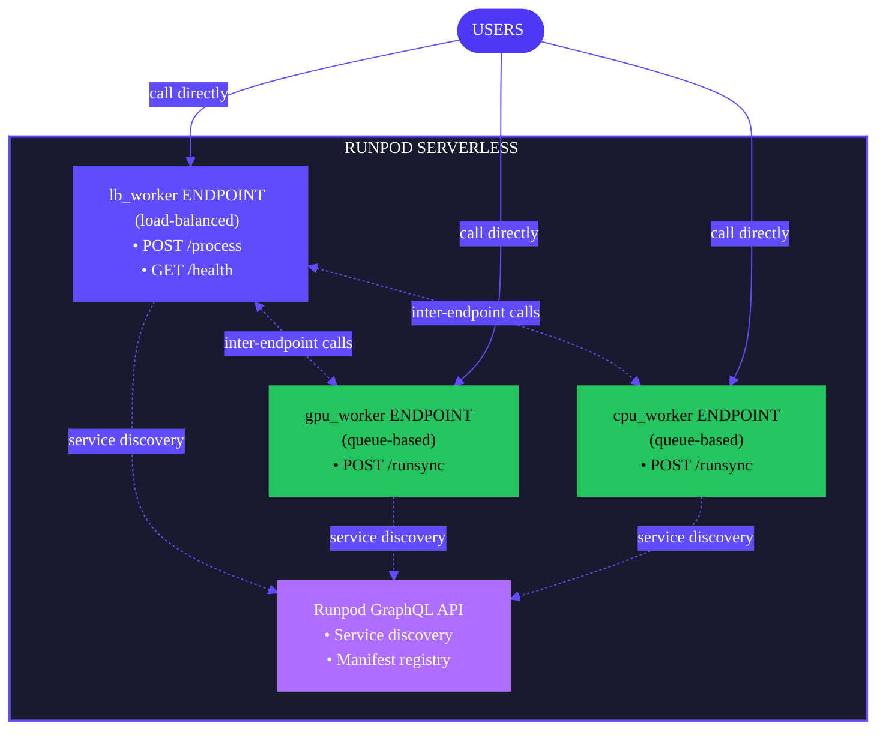

Build and deploy your Flash application to Runpod Serverless endpoints in one step. This is the primary command for getting your application running in the cloud.

```bash
flash deploy [OPTIONS]
```

## Examples

Build and deploy a Flash app from the current directory (auto-selects environment if only one exists):

```bash
flash deploy
```

Deploy to a specific environment:

```bash
flash deploy --env production
```

Deploy with additional excluded packages:

```bash
flash deploy --exclude scipy,pandas
```

Build and test locally before deploying:

```bash
flash deploy --preview
```

## Flags

<ResponseField name="--env, -e" type="string">
Target environment name (e.g., `dev`, `staging`, `production`). Auto-selected if only one exists. Creates the environment if it doesn't exist.
</ResponseField>

<ResponseField name="--app, -a" type="string">
Flash app name. Auto-detected from the current directory if not specified.
</ResponseField>

<ResponseField name="--no-deps">
Skip transitive dependencies during pip install. Useful when the base image already includes dependencies.
</ResponseField>

<ResponseField name="--exclude" type="string">
Comma-separated packages to exclude (e.g., `torch,torchvision`). Use this to stay under the 1.5GB deployment limit.
</ResponseField>

<ResponseField name="--output, -o" type="string" default="artifact.tar.gz">
Custom archive name for the build artifact.
</ResponseField>

<ResponseField name="--preview">
Build and launch a local Docker-based preview environment instead of deploying to Runpod.
</ResponseField>

<ResponseField name="--python-version" type="string">
Target Python version for worker images (3.10, 3.11, 3.12, or 3.13). Overrides per-resource `python_version` declarations and local interpreter detection.
</ResponseField>

## What happens during deployment

1. **Build phase**: Creates the deployment artifact (same as `flash build`).
2. **Environment resolution**: Detects or creates the target environment.
3. **Upload**: Sends the artifact to Runpod storage.
4. **Provisioning**: Creates or updates Serverless endpoints.
5. **Configuration**: Sets up environment variables and service discovery.

## Architecture

After deployment, your Flash app runs as independent Serverless endpoints on Runpod:

<div style={{ marginLeft: '4rem'}}>

</div>

Each resource configuration in your code creates an independent endpoint. You can call any endpoint directly based on your needs.

## App and environment management

### Automatic creation

Flash automatically creates apps and environments as needed during deployment:

- If the app doesn't exist, Flash creates it along with the target environment.
- If only the environment doesn't exist, Flash creates it within the existing app.

```bash
# Creates the app and 'staging' environment if they don't exist
flash deploy --env staging
```

### Auto-selection

When you have only one environment, it's selected automatically:

```bash
# Auto-selects the only available environment
flash deploy
```

When multiple environments exist, you must specify one:

```bash
# Required when multiple environments exist
flash deploy --env staging
```

### Default environment

If no app or environment exists and none is specified, Flash creates the app with a `production` environment by default.

## Post-deployment

After successful deployment, Flash displays all deployed endpoints:

```text
✓ Deployment Complete

Load-balanced endpoints:
  https://abc123xyz.api.runpod.ai  (lb_worker)
    POST   /process
    GET    /health

  Try it:
    curl -X POST https://abc123xyz.api.runpod.ai/process \
        -H "Content-Type: application/json" \
        -H "Authorization: Bearer $RUNPOD_API_KEY" \
        -d '{"input_data": {"message": "Hello from Flash"}}'

Queue-based endpoints:
  https://api.runpod.ai/v2/def456xyz  (gpu_worker)
  https://api.runpod.ai/v2/ghi789xyz  (cpu_worker)

  Try it:
    curl -X POST https://api.runpod.ai/v2/def456xyz/runsync \
        -H "Content-Type: application/json" \
        -H "Authorization: Bearer $RUNPOD_API_KEY" \
        -d '{"input": {"input_data": {"message": "Hello from the GPU"}}}'
```

Each endpoint is independent with its own URL and can be called directly.

### Authentication

All deployed endpoints require authentication with your Runpod API key:

```bash
export RUNPOD_API_KEY="your_key_here"

curl -X POST https://YOUR_ENDPOINT_URL/path \
    -H "Authorization: Bearer $RUNPOD_API_KEY" \
    -H "Content-Type: application/json" \
    -d '{"param": "value"}'
```

## Preview mode

Test locally before deploying:

```bash
flash deploy --preview
```

This builds your project and runs it in Docker containers locally:

- Each endpoint runs in its own container.
- All containers communicate via Docker network.
- Endpoints exposed on local ports for testing.
- Press `Ctrl+C` to stop.

## Managing deployment size

Runpod Serverless has a **1.5GB limit**. Flash automatically excludes packages that are pre-installed in the base image (`torch`, `torchvision`, `torchaudio`, `numpy`, `triton`).

If the deployment is still too large, use `--exclude` to skip additional packages:

```bash
flash deploy --exclude scipy,pandas
```

See [`flash build` - Managing deployment size](/flash/cli/build#managing-deployment-size) for more details.

## flash dev vs flash deploy

See [`flash dev`](/flash/cli/dev#flash-dev-vs-flash-deploy) for a detailed comparison of local development vs production deployment.

## Troubleshooting

### Multiple environments error

```text
Error: Multiple environments found: dev, staging, production
```

Specify the target environment:

```bash
flash deploy --env staging
```

### Deployment size limit

Base image packages are auto-excluded. If the deployment is still too large, use `--exclude` to skip additional packages:

```bash
flash deploy --exclude scipy,pandas
```

### Authentication fails

Ensure your API key is set:

```bash
echo $RUNPOD_API_KEY
export RUNPOD_API_KEY="your_key_here"
```

## Related commands

- [`flash build`](/flash/cli/build) - Build without deploying
- [`flash dev`](/flash/cli/dev) - Local development server
- [`flash env`](/flash/cli/env) - Manage environments
- [`flash app`](/flash/cli/app) - Manage applications
- [`flash undeploy`](/flash/cli/undeploy) - Remove endpoints
