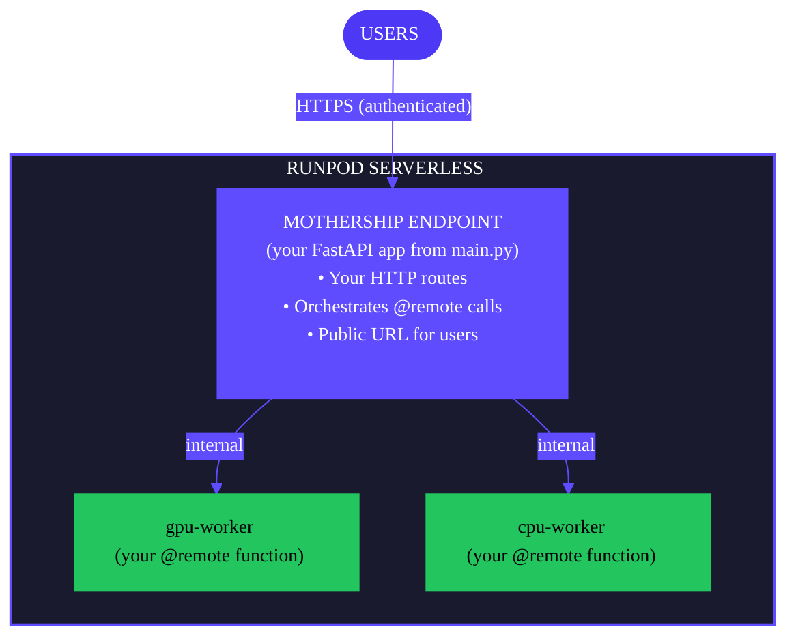

Build and deploy your Flash application to Runpod Serverless endpoints in one step. This is the primary command for getting your application running in the cloud.

```bash
flash deploy [OPTIONS]
```

## Example

Build and deploy (auto-selects environment if only one exists):

```bash
flash deploy
```

Deploy to a specific environment:

```bash
flash deploy --env production
```

Deploy with excluded packages to reduce size:

```bash
flash deploy --exclude torch,torchvision,torchaudio
```

Build and test locally before deploying:

```bash
flash deploy --preview
```

## Flags

<ResponseField name="--env, -e" type="string">
Target environment name (e.g., `dev`, `staging`, `production`). Auto-selected if only one exists. Creates the environment if it doesn't exist.
</ResponseField>

<ResponseField name="--app, -a" type="string">
Flash app name. Auto-detected from the current directory if not specified.
</ResponseField>

<ResponseField name="--no-deps">
Skip transitive dependencies during pip install. Useful when the base image already includes dependencies.
</ResponseField>

<ResponseField name="--exclude" type="string">
Comma-separated packages to exclude (e.g., `torch,torchvision`). Use this to stay under the 500MB deployment limit.
</ResponseField>

<ResponseField name="--output, -o" type="string" default="artifact.tar.gz">
Custom archive name for the build artifact.
</ResponseField>

<ResponseField name="--preview">
Build and launch a local Docker-based preview environment instead of deploying to Runpod.
</ResponseField>

<ResponseField name="--use-local-flash">
Bundle local `runpod_flash` source instead of the PyPI version. For development and testing only.
</ResponseField>

## What happens during deployment

1. **Build phase**: Creates the deployment artifact (same as `flash build`).
2. **Environment resolution**: Detects or creates the target environment.
3. **Upload**: Sends the artifact to Runpod storage.
4. **Provisioning**: Creates or updates Serverless endpoints.
5. **Configuration**: Sets up environment variables and service discovery.
6. **Verification**: Confirms endpoints are healthy.

## Architecture

After deployment, your entire application runs on Runpod Serverless:

<div style={{ marginLeft: '4rem'}}>

</div>

## Environment management

### Automatic creation

If the specified environment doesn't exist, `flash deploy` creates it:

```bash
# Creates 'staging' if it doesn't exist
flash deploy --env staging
```

### Auto-selection

When you have only one environment, it's selected automatically:

```bash
# Auto-selects the only available environment
flash deploy
```

When multiple environments exist, you must specify one:

```bash
# Required when multiple environments exist
flash deploy --env staging
```

### Default environment

If no environment exists and none is specified, Flash creates a `production` environment by default.

## Post-deployment

After successful deployment, Flash displays:

```text
✓ Deployment Complete

Your mothership is deployed at:
https://api-xxxxx.runpod.net

Available Routes:
POST   /api/hello
POST   /gpu/process

All endpoints require authentication:
curl -X POST https://api-xxxxx.runpod.net/api/hello \
    -H "Authorization: Bearer $RUNPOD_API_KEY" \
    -H "Content-Type: application/json" \
    -d '{"param": "value"}'
```

### Authentication

All deployed endpoints require authentication with your Runpod API key:

```bash
export RUNPOD_API_KEY="your_key_here"

curl -X POST https://YOUR_ENDPOINT_URL/path \
    -H "Authorization: Bearer $RUNPOD_API_KEY" \
    -H "Content-Type: application/json" \
    -d '{"param": "value"}'
```

## Preview mode

Test locally before deploying:

```bash
flash deploy --preview
```

This builds your project and runs it in Docker containers locally:

- Mothership exposed on `localhost:8000`.
- All containers communicate via Docker network.
- Press `Ctrl+C` to stop.

## Managing deployment size

Runpod Serverless has a **500MB limit**. Use `--exclude` to skip packages in the base image:

```bash
# GPU deployments (PyTorch pre-installed)
flash deploy --exclude torch,torchvision,torchaudio
```

| Resource type | Safe to exclude |
|--------------|-----------------|
| GPU | `torch`, `torchvision`, `torchaudio` |
| CPU | Do not exclude ML packages |

## flash run vs flash deploy

| Aspect | `flash run` | `flash deploy` |
|--------|-------------|----------------|
| FastAPI app runs on | Your machine | Runpod Serverless |
| `@remote` functions run on | Runpod Serverless | Runpod Serverless |
| Endpoint naming | `live-` prefix | No prefix |
| Automatic updates | Yes | No |
| Use case | Development | Production |

## Troubleshooting

### Multiple environments error

```text
Error: Multiple environments found: dev, staging, production
```

Specify the target environment:

```bash
flash deploy --env staging
```

### Deployment size limit

Use `--exclude` to reduce size:

```bash
flash deploy --exclude torch,torchvision,torchaudio
```

### Authentication fails

Ensure your API key is set:

```bash
echo $RUNPOD_API_KEY
export RUNPOD_API_KEY="your_key_here"
```

## Related commands

- [`flash build`](/flash/cli/build) - Build without deploying
- [`flash run`](/flash/cli/run) - Local development server
- [`flash env`](/flash/cli/env) - Manage environments
- [`flash app`](/flash/cli/app) - Manage applications
- [`flash undeploy`](/flash/cli/undeploy) - Remove endpoints
