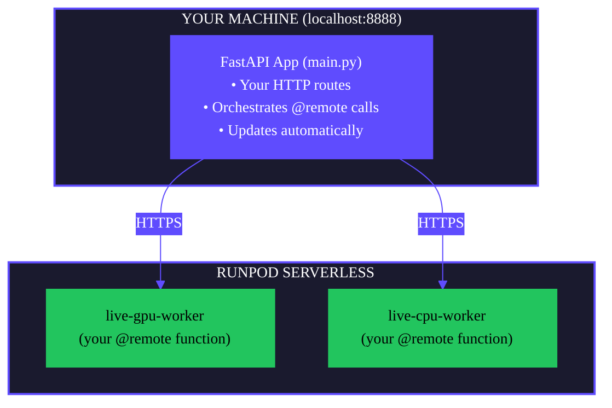

Start the Flash development server for local testing with automatic updates. Your FastAPI app runs locally while `@remote` functions execute on Runpod Serverless.

```bash
flash run [OPTIONS]
```

## Example

Start the development server with defaults:

```bash
flash run
```

Start with auto-provisioning to eliminate cold-start delays:

```bash
flash run --auto-provision
```

Start on a custom port:

```bash
flash run --port 3000
```

## Flags

<ResponseField name="--host" type="string" default="localhost">
Host address to bind the server to.
</ResponseField>

<ResponseField name="--port, -p" type="integer" default={8888}>
Port number to bind the server to.
</ResponseField>

<ResponseField name="--reload/--no-reload" default="enabled">
Enable or disable auto-reload on code changes. Enabled by default.
</ResponseField>

<ResponseField name="--auto-provision">
Auto-provision all Serverless endpoints on startup instead of lazily on first call. Eliminates cold-start delays during development.
</ResponseField>

## Architecture

With `flash run`, your system runs in a hybrid architecture:



**Key points:**

- Your FastAPI app runs locally and updates automatically for rapid iteration.
- `@remote` functions run on Runpod as Serverless endpoints.
- Endpoints are prefixed with `live-` to distinguish from production.
- Changes to local code are picked up instantly.

This is different from `flash deploy`, where everything runs on Runpod.

## Auto-provisioning

By default, endpoints are provisioned lazily on first `@remote` function call. Use `--auto-provision` to provision all endpoints at server startup:

```bash
flash run --auto-provision
```

### How it works

1. **Discovery**: Scans your app for `@remote` decorated functions.
2. **Deployment**: Deploys resources concurrently (up to 3 at a time).
3. **Confirmation**: Asks for confirmation if deploying more than 5 endpoints.
4. **Caching**: Stores deployed resources in `.runpod/resources.pkl` for reuse.
5. **Updates**: Recognizes existing endpoints and updates if configuration changed.

### Benefits

- **Zero cold start**: All endpoints ready before you test them.
- **Faster development**: No waiting for deployment on first HTTP call.
- **Resource reuse**: Cached endpoints are reused across server restarts.

### When to use

- Local development with multiple endpoints.
- Testing workflows that call multiple remote functions.
- Debugging where you want deployment separated from handler logic.

## Provisioning modes

| Mode | When endpoints are deployed |
|------|----------------------------|
| Default (lazy) | On first `@remote` function call |
| `--auto-provision` | At server startup |

## Testing your API

Once the server is running, test your endpoints:

```bash
# Health check
curl http://localhost:8888/

# Call a GPU endpoint
curl -X POST http://localhost:8888/gpu/hello \
  -H "Content-Type: application/json" \
  -d '{"message": "Hello from GPU!"}'
```

Open http://localhost:8888/docs for the interactive API explorer.

## Requirements

- `RUNPOD_API_KEY` must be set in your `.env` file or environment.
- A valid Flash project structure (created by `flash init` or manually).

## flash run vs flash deploy

| Aspect | `flash run` | `flash deploy` |
|--------|-------------|----------------|
| FastAPI app runs on | Your machine (localhost) | Runpod Serverless |
| `@remote` functions run on | Runpod Serverless | Runpod Serverless |
| Endpoint naming | `live-` prefix | No prefix |
| Automatic updates | Yes | No |
| Use case | Development | Production |

## Related commands

- [`flash init`](/flash/cli/init) - Create a new project
- [`flash deploy`](/flash/cli/deploy) - Deploy to production
- [`flash undeploy`](/flash/cli/undeploy) - Remove endpoints
