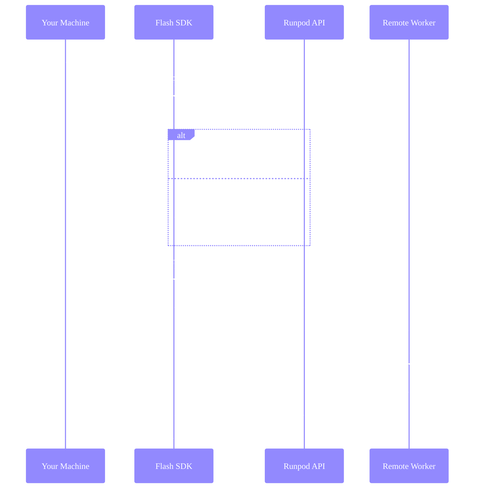

import { MachineTooltip } from "/snippets/tooltips.jsx";

Flash runs your Python functions on remote GPU/CPU workers while you maintain local control flow. This page explains what happens when you call an `@Endpoint` function.

## What runs where

The `@Endpoint` decorator marks functions for remote execution. Everything else runs locally.

<Warning>

Treat `@Endpoint` functions as self-contained units. Helper functions, classes, and variables defined outside the decorated function may not be available on the remote worker. Move all required logic inside the function body or import it from installed packages.

</Warning>

```python
import asyncio
from runpod_flash import Endpoint, GpuType

@Endpoint(name="demo", gpu=GpuType.NVIDIA_GEFORCE_RTX_4090)
def process_on_gpu(data):
    # This runs on Runpod worker
    import torch
    return {"result": "processed"}

async def main():
    # This runs on your machine
    result = await process_on_gpu({"input": "data"})
    print(result)  # This runs on your machine

if __name__ == "__main__":
    asyncio.run(main())  # This runs on your machine
```

| Code | Location |
|------|----------|
| `@Endpoint` decorator | Your machine (marks function) |
| Inside `process_on_gpu` | Runpod worker |
| Everything else | Your machine |

### Flash apps

When you build a [Flash app](/flash/apps/overview):

**Development (`flash run`)**:
- FastAPI server runs **locally**.
- `@Endpoint` functions run on **Runpod workers**.

**Production (`flash deploy`)**:
- Each endpoint configuration becomes a **separate Serverless endpoint**.
- All endpoints run on **Runpod**.

## Execution flow

Here's what happens when you call an `@Endpoint` function:



## Endpoint naming

Flash identifies endpoints by their `name` parameter:

```python
@Endpoint(
    name="inference",  # This identifies the endpoint
    gpu=GpuType.NVIDIA_A100_80GB_PCIe,
    workers=3
)
def run_inference(data): ...
```

- **Same name, same config**: Reuses the existing endpoint.
- **Same name, different config**: Updates the endpoint automatically.
- **New name**: Creates a new endpoint.

This means you can change parameters like `workers` without creating a new endpoint—Flash detects the change and updates it.

## Worker lifecycle

Workers scale up and down based on demand and your configuration.

### Worker states

| State | Description | Billing |
|-------|-------------|---------|
| **Initializing** | Downloading image, loading code | Yes |
| **Idle** | Scaled down, waiting for requests | No |
| **Running** | Processing requests | Yes |
| **Throttled** | Temporarily unable to run due to host <MachineTooltip /> resource constraints | No |
| **Outdated** | Marked for replacement after update | Yes (while processing) |
| **Unhealthy** | Crashed; auto-retries for up to 7 days | No |

### Scaling behavior

```python
@Endpoint(
    name="demo",
    gpu=GpuGroup.ANY,
    workers=(0, 5),   # (min, max) - Scale to zero when idle, up to 5 workers
    idle_timeout=60   # Seconds before running workers scale down
)
def process(data): ...
```

**Example**:
1. First job arrives → Scale to 1 worker (cold start).
2. More jobs arrive while worker busy → Scale up to max workers.
3. Jobs complete → Workers stay running for `idle_timeout` seconds before scaling down to idle.
4. No new jobs → Scale down to min workers.

## Serialization boundaries

Flash serializes your `@Endpoint` functions and their inputs to send them to remote workers. Understanding what gets serialized helps you avoid common issues.

### What gets serialized

When you call an `@Endpoint` function, Flash serializes:

- The function body (the code inside the decorated function).
- Function arguments (must be JSON-serializable or picklable).
- Return values (must be JSON-serializable).

### What does NOT get serialized

Flash does **not** automatically serialize:

- Helper functions defined outside the endpoint.
- Classes defined in your local module.
- Global variables or module-level state.
- Local imports at the top of your file.

### Making functions self-contained

Your endpoint functions should be self-contained. This means all required logic should be either:

1. **Inside the function body**
2. **Imported from installed packages**

**Correct** — logic inside the function:

```python
@Endpoint(name="processor", gpu=GpuGroup.ANY, dependencies=["numpy"])
def process(data: list) -> dict:
    import numpy as np

    # Helper function defined inside the endpoint
    def normalize(arr):
        return (arr - arr.min()) / (arr.max() - arr.min())

    result = normalize(np.array(data))
    return {"result": result.tolist()}
```

**Incorrect** — external helper won't be available:

```python
# This helper is defined outside the endpoint
def normalize(arr):
    return (arr - arr.min()) / (arr.max() - arr.min())

@Endpoint(name="processor", gpu=GpuGroup.ANY, dependencies=["numpy"])
def process(data: list) -> dict:
    import numpy as np
    result = normalize(np.array(data))  # Error: normalize not defined on worker
    return {"result": result.tolist()}
```

### Using external modules

If you need to share code across multiple endpoints, create a Python package and include it in your dependencies:

```python
@Endpoint(
    name="processor",
    gpu=GpuGroup.ANY,
    dependencies=["my-utils-package", "numpy"]  # Your package on PyPI or a git URL
)
def process(data: list) -> dict:
    import numpy as np
    from my_utils import normalize  # Now available on the worker

    result = normalize(np.array(data))
    return {"result": result.tolist()}
```

For Flash apps, you can also use local modules within your project structure. See [Build apps](/flash/apps/build-app) for details.

### Void functions

Endpoint functions don't need to return a value. Functions that return `None` (void functions) are useful for fire-and-forget tasks like logging events, sending notifications, or triggering background processes:

```python
@Endpoint(name="logger", gpu=GpuGroup.ANY)
async def log_event(event_type: str, payload: dict):
    """Logs an event without returning a result."""
    import requests
    requests.post("https://logging.example.com/events", json={
        "type": event_type,
        "payload": payload
    })
    # No return statement needed
```

When you call a void function, the awaited result is `None`:

```python
result = await log_event("user_action", {"action": "login"})
print(result)  # None
```

## Cold starts and warm starts

Understanding cold and warm starts helps you predict latency and set expectations.

### Cold start

A cold start occurs when no workers are available to handle your job, because:

- You're calling an endpoint for the first time.
- All workers have been scaled down after not processing requests for `idle_timeout` seconds.
- All running workers are busy processing requests.

**What happens during a cold start**:
1. Runpod provisions a new worker with your configured GPU/CPU.
2. The worker image starts (dependencies are pre-installed during build).
3. Your function executes.

**Typical timing**: 10-60 seconds total, depending on GPU availability and image size.

<Note>
When using `flash build` or `flash deploy`, dependencies are pre-installed in the worker image, eliminating pip installation at request time. When running standalone scripts with `@Endpoint` functions outside of a Flash app, dependencies may be installed on the worker at request time.
</Note>

### Warm start

A warm start occurs when a worker is already running and idle:

- Worker completed a previous job and is waiting for more work.
- Worker is within its `idle_timeout` period.

**What happens during a warm start**:
1. Job is routed immediately to the idle worker.
2. Your function executes.

**Typical timing**: ~1 second + your function's execution time.

### The relationship between configuration and starts

Your `workers` and `idle_timeout` settings directly affect cold start frequency:

- `workers=(0, n)`: Workers scale to zero when not processing. Every request after the `idle_timeout` period triggers a cold start.
- `workers=(1, n)`: At least one worker stays ready. First concurrent request is warm, additional requests may cold start.
- Higher `idle_timeout`: Workers stay running longer before scaling down, reducing cold starts for sporadic traffic.

See [configuration best practices](/flash/configuration/best-practices) for specific recommendations based on your workload.
