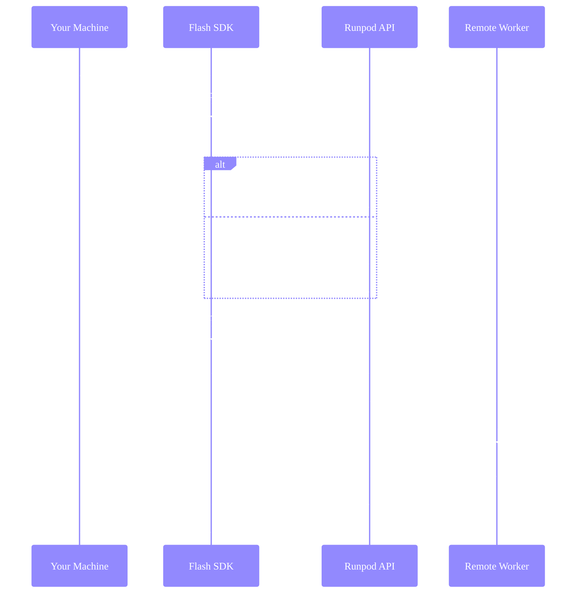

import { MachineTooltip } from "/snippets/tooltips.jsx";

Flash runs your Python functions on remote GPU/CPU workers while you maintain local control flow. This page explains what happens when you call a `@remote` function.

## What runs where

The `@remote` decorator marks functions for remote execution. Everything else runs locally.

```python
import asyncio
from runpod_flash import remote, LiveServerless, GpuGroup

config = LiveServerless(name="demo", gpus=[GpuGroup.ADA_24])

@remote(resource_config=config)
def process_on_gpu(data):
    # This runs on Runpod worker
    import torch
    return {"result": "processed"}

async def main():
    # This runs on your machine
    result = await process_on_gpu({"input": "data"})
    print(result)  # This runs on your machine

if __name__ == "__main__":
    asyncio.run(main())  # This runs on your machine
```

| Code | Location |
|------|----------|
| `@remote` decorator | Your machine (marks function) |
| Inside `process_on_gpu` | Runpod worker |
| Everything else | Your machine |

### Flash apps

When you build a [Flash app](/flash/apps/overview):

**Development (`flash run`)**:
- FastAPI server runs **locally**.
- `@remote` functions run on **Runpod workers**.

**Production (`flash deploy`)**:
- Each resource configuration becomes a **separate Serverless endpoint**.
- All endpoints run on **Runpod**.

## Execution flow

Here's what happens when you call a `@remote` function:



## Endpoint naming

Flash identifies endpoints by their `name` parameter:

```python
config = LiveServerless(
    name="inference",  # This identifies the endpoint
    gpus=[GpuGroup.AMPERE_80],
    workersMax=3
)
```

- **Same name, same config**: Reuses the existing endpoint.
- **Same name, different config**: Updates the endpoint automatically.
- **New name**: Creates a new endpoint.

This means you can change parameters like `workersMax` without creating a new endpoint—Flash detects the change and updates it.

## Worker lifecycle

Workers scale up and down based on demand and your configuration.

### Worker states

**Initializing**: The worker is starting up and downloading dependencies.

**Idle**: The worker is ready but not processing requests.

**Running**: The worker actively processes requests.

**Throttled**: The worker is temporarily unable to run due to host <MachineTooltip /> resource constraints.

**Outdated**: The system marks the worker for replacement after endpoint updates. It continues processing current jobs during rolling updates (10% of max workers at a time).

**Unhealthy**: The worker has crashed due to Docker image issues, incorrect start commands, or machine problems. The system automatically retries with exponential backoff for up to 7 days.

### Scaling behavior

```python
config = LiveServerless(
    workersMin=0,   # No workers when idle (scale to zero)
    workersMax=5,   # Maximum concurrent workers
    idleTimeout=10  # Minutes before idle workers scale down
)
```

**Example**:
1. First job arrives → Scale to 1 worker (cold start).
2. More jobs arrive while worker busy → Scale up to `workersMax`.
3. Jobs complete → Workers stay idle for `idleTimeout`.
4. No new jobs → Scale down to `workersMin`.

## Cold starts and warm starts

Understanding cold and warm starts helps you predict latency and set expectations.

### Cold start

A cold start occurs when no workers are available to handle your job:

- You're calling an endpoint for the first time.
- All workers scaled down after being idle beyond `idleTimeout`.
- All active workers are busy and a new one must spin up.

**What happens during a cold start**:
1. Runpod provisions a new worker with your configured GPU/CPU.
2. The worker image starts (dependencies are pre-installed during build).
3. Your function executes.

**Typical timing**: 10-60 seconds total, depending on GPU availability and image size. Since dependencies are pre-installed in the worker image during `flash build` or `flash deploy`, there's no pip installation at request time.

### Warm start

A warm start occurs when a worker is already running and idle:

- Worker completed a previous job and is waiting for more work.
- Worker is within its `idleTimeout` period.

**What happens during a warm start**:
1. Job is routed immediately to the idle worker.
2. Your function executes.

**Typical timing**: ~1 second + your function's execution time.

### The relationship between configuration and starts

Your `workersMin` and `idleTimeout` settings directly affect cold start frequency:

- `workersMin=0`: Workers scale to zero when idle. Every request after idle period triggers a cold start.
- `workersMin=1`: At least one worker stays ready. First concurrent request is warm, additional requests may cold start.
- Higher `idleTimeout`: Workers stay idle longer before scaling down, reducing cold starts for sporadic traffic.

See [configuration best practices](/flash/configuration/best-practices) for specific recommendations based on your workload.
