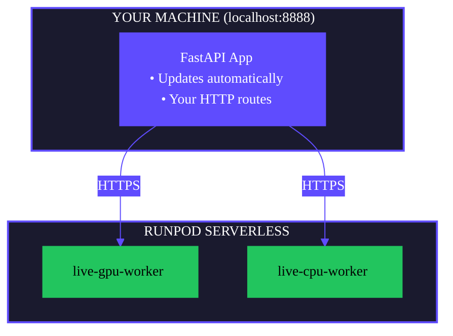

The `flash run` command starts a local development server that lets you test your Flash application before deploying to production. Your FastAPI app runs locally with automatic reloading, while `@remote` functions execute on Runpod Serverless workers.

Use `flash run` when you want to:

- Iterate quickly on your API logic with automatic reloading.
- Test `@remote` functions against real GPU/CPU workers.
- Debug request/response handling before deployment.
- Develop new endpoints without deploying after every change.

## Start the development server

From inside your [project directory](/flash/initialize-project), run:

```bash
flash run
```

The server starts at `http://localhost:8888` by default. Your FastAPI routes are available immediately, and `@remote` functions provision Serverless endpoints on first call.

### Custom host and port

```bash
# Change port
flash run --port 3000

# Make accessible on network
flash run --host 0.0.0.0
```

## Test your endpoints

### Using curl

```bash
curl -X POST http://localhost:8888/gpu/hello \
  -H "Content-Type: application/json" \
  -d '{"name": "Flash"}'
```

### Using the API explorer

Open [http://localhost:8888/docs](http://localhost:8888/docs) in your browser to access the interactive Swagger UI. You can test all endpoints directly from the browser.

### Using Python

```python
import requests

response = requests.post(
    "http://localhost:8888/gpu/hello",
    json={"name": "Flash"}
)
print(response.json())
```

## Reduce cold-start delays

The first call to a `@remote` function provisions a Serverless endpoint, which takes 30-60 seconds. Use `--auto-provision` to provision all endpoints at startup:

```bash
flash run --auto-provision
```

This scans your project for `@remote` functions and deploys them before the server starts accepting requests. Endpoints are cached in `.runpod/resources.pkl` and reused across server restarts.

## How it works

With `flash run`, your system runs in a hybrid architecture:



**What runs where:**

| Component | Location | Automatic updates |
|-----------|----------|------------|
| FastAPI app (`main.py`) | Your machine | Yes |
| HTTP routes | Your machine | Yes |
| `@remote` functions | Runpod Serverless | No |

Endpoints created by `flash run` are prefixed with `live-` to distinguish them from production endpoints.

## Development workflow

A typical development cycle looks like this:

1. Start the server: `flash run`
2. Make changes to your code.
3. The server reloads automatically.
4. Test your changes via curl or the API explorer.
5. Repeat until ready to deploy.

When you're done, use `flash undeploy` to clean up the `live-` endpoints created during development.

## Differences from production

| Aspect | `flash run` | `flash deploy` |
|--------|-------------|----------------|
| FastAPI app runs on | Your machine | Runpod Serverless |
| Endpoint naming | `live-` prefix | No prefix |
| Automatic updates | Yes | No |
| Authentication | Not required | Required |

## Clean up after testing

Endpoints created by `flash run` persist until you delete them. To clean up:

```bash
# List all endpoints
flash undeploy list

# Remove a specific endpoint
flash undeploy live-YOUR_ENDPOINT_NAME

# Remove all endpoints
flash undeploy --all
```

## Troubleshooting

**Port already in use**

```bash
flash run --port 3000
```

**Slow first request**

Use `--auto-provision` to eliminate cold-start delays:

```bash
flash run --auto-provision
```

**Authentication errors**

Ensure `RUNPOD_API_KEY` is set in your `.env` file or environment:

```bash
export RUNPOD_API_KEY=your_api_key_here
```

## Next steps

- [Deploy to production](/flash/deploy-apps) when your app is ready.
- [Clean up endpoints](/flash/cli/undeploy) after testing.
- [View the flash run reference](/flash/cli/run) for all options.
