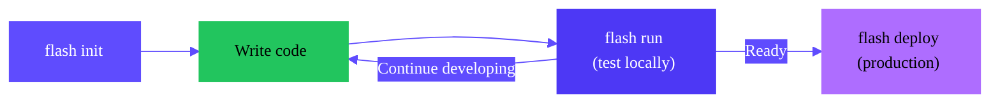

<Note>
Flash is currently in beta. [Join our Discord](https://discord.gg/cUpRmau42V) to provide feedback and get support.
</Note>

Flash is a Python SDK for developing and deploying AI workflows on [Runpod Serverless](/serverless/overview). You write Python functions locally, and Flash handles infrastructure management, GPU/CPU provisioning, dependency installation, and data transfer automatically.

<CardGroup>
  <Card title="Quickstart" href="/flash/quickstart" icon="bolt">
    Write a standalone Flash script for instant access to Runpod infrastructure.
  </Card>
  <Card title="Build an app" href="/flash/apps/build-app" icon="code">
    Create a Flash app with a FastAPI server and deploy it on Runpod to serve production endpoints.
  </Card>
</CardGroup>

## Why use Flash?

**Flash is the easiest and fastest way to test and deploy AI/ML workloads on Runpod.** Whether you're prototyping a new model or deploying a production API, Flash handles the infrastructure complexity so you can focus on your code.

When you run a `@remote` function, Flash:
- Automatically provisions resources on Runpod's infrastructure.
- Installs your dependencies automatically.
- Runs your function on a remote GPU/CPU.
- Returns the result to your local environment.

You can specify the exact GPU hardware you need, from RTX 4090s to A100 80GB GPUs, for AI inference, training, and other compute-intensive tasks. Functions scale automatically based on demand and can run in parallel across multiple resources.

Flash uses [Runpod's Serverless pricing](/serverless/pricing) with per-second billing. You're only charged for actual compute time; there are no costs when your code isn't running.

## Install Flash

<Note>
Flash requires Python 3.10 or higher.
</Note>

Create a Python virtual environment and use `pip` to install Flash:

```bash
python3 -m venv venv
source venv/bin/activate
pip install runpod-flash
```

In your project directory, create a `.env` file and add your Runpod API key, replacing `YOUR_API_KEY` with your actual API key:

```bash
touch .env && echo "RUNPOD_API_KEY=YOUR_API_KEY" > .env
```

## Core concepts

### Remote functions

The `@remote` decorator marks functions for execution on Runpod's infrastructure. Code inside the decorated function runs remotely on a Serverless worker, while code outside the function runs locally on your machine.

```python
@remote(resource_config=config, dependencies=["pandas"])
def process_data(data):
    # This code runs remotely on Runpod
    import pandas as pd
    df = pd.DataFrame(data)
    return df.describe().to_dict()

async def main():
    # This code runs locally
    result = await process_data(my_data)
```

### Resource configuration

Flash provides fine-grained control over hardware allocation through configuration objects. You can configure GPU types, worker counts, idle timeouts, environment variables, and more.

```python
from runpod_flash import remote, LiveServerless, GpuGroup

gpu_config = LiveServerless(
    name="ml-inference",
    gpus=[GpuGroup.AMPERE_80],  # A100 80GB
    workersMax=5
)
```

[View the complete configuration reference](/flash/resource-configuration).

### Dependency management

Specify Python packages in the decorator, and Flash installs them automatically on the remote worker:

```python
@remote(
    resource_config=gpu_config,
    dependencies=["transformers==4.36.0", "torch", "pillow"]
)
def generate_image(prompt):
    # Import inside the function
    from transformers import pipeline
    # ...
```

Imports should be placed inside the function body because they need to happen on the remote worker, not in your local environment.

### Parallel execution

Run multiple remote functions concurrently using Python's async capabilities:

```python
results = await asyncio.gather(
    process_item(item1),
    process_item(item2),
    process_item(item3)
)
```

## Development workflows

Flash supports two main methods for running workloads on Runpod: standalone scripts and Flash apps.


### Standalone scripts

This is the fastest way to get started with Flash. Just write a Python script with `@remote` decorated functions and run it locally with `python script.py`.

```python
import asyncio
from runpod_flash import remote, LiveServerless, GpuGroup

config = LiveServerless(
    name="gpu-inference",
    gpus=[GpuGroup.ADA_24],
)

@remote(resource_config=config, dependencies=["torch"])
def process_on_gpu(data):
    import torch
    # Your GPU workload here
    return {"result": "processed"}

async def main():
    result = await process_on_gpu({"input": "data"})
    print(result)

if __name__ == "__main__":
    asyncio.run(main())
```

Run the script locally, and Flash executes the `@remote` function on Runpod's infrastructure:

```bash
python my_script.py
```

**Use this approach for:**
- Quick prototypes and experiments.
- Batch processing jobs.
- One-off data processing tasks.
- Local development and testing.

[Follow the quickstart](/flash/quickstart) to create your first Flash script.

### Flash apps

Build FastAPI applications with HTTP endpoints that run on Runpod Serverless. Flash apps provide a complete development and deployment workflow with local testing and production deployment.

```python
# main.py
from fastapi import FastAPI
from runpod_flash import remote, LiveServerless, GpuGroup

app = FastAPI()

config = LiveServerless(
    name="api-worker",
    gpus=[GpuGroup.ADA_24],
)

@remote(resource_config=config, dependencies=["torch"])
def inference(prompt: str):
    import torch
    # Your inference logic
    return {"output": "result"}

@app.post("/inference")
async def inference_endpoint(prompt: str):
    result = await inference(prompt)
    return result
```

Develop and test locally with automatic updates:

```bash
flash run
```

Deploy to production when ready:

```bash
flash deploy
```

**Use this approach for:**

- Production HTTP APIs.
- Persistent endpoints.
- Long-running services.
- Team collaboration with staging/production environments.

[Follow this tutorial](/flash/apps/build-app) to build your first Flash app.


### Flash apps

1. **Initialize**: Create a project with `flash init`
2. **Develop**: Write your FastAPI app with `@remote` functions
3. **Test locally**: Run `flash run` to test with automatic updates
4. **Deploy**: Run `flash deploy` to push to production

This workflow is ideal for production APIs and services that need persistent endpoints.



[Learn more about the Flash app workflow](/flash/apps/overview).


## CLI commands

Flash provides CLI commands for managing Flash apps:

| Command | Description |
|---------|-------------|
| [`flash init`](/flash/cli/init) | Create a new Flash app project |
| [`flash run`](/flash/cli/run) | Start the local development server |
| [`flash build`](/flash/cli/build) | Build a deployment artifact |
| [`flash deploy`](/flash/cli/deploy) | Build and deploy to Runpod |
| [`flash env`](/flash/cli/env) | Manage deployment environments |
| [`flash app`](/flash/cli/app) | Manage Flash applications |
| [`flash undeploy`](/flash/cli/undeploy) | Remove deployed endpoints |

<Note>
CLI commands are primarily for Flash apps. Standalone scripts don't require the CLI—just run them with `python`.
</Note>

See the [CLI reference](/flash/cli/overview) for detailed documentation on each command.

## Use cases

Flash is well-suited for a range of AI and data processing workloads:

- **Multi-modal AI pipelines**: Orchestrate unified workflows combining text, image, and audio models with GPU acceleration.
- **Distributed model training**: Scale training operations across multiple GPU workers for faster model development.
- **AI research experimentation**: Rapidly prototype and test complex model combinations without infrastructure overhead.
- **Production inference systems**: Deploy multi-stage inference pipelines for real-world applications.
- **Data processing workflows**: Process large datasets using CPU workers for general computation and GPU workers for accelerated tasks.
- **Hybrid GPU/CPU workflows**: Optimize cost and performance by combining CPU preprocessing with GPU inference.

## Limitations

- Serverless deployments using Flash are currently restricted to the `EU-RO-1` datacenter.
- Be aware of your account's maximum worker capacity limits. Flash can rapidly scale workers across multiple endpoints, and you may hit capacity constraints. Contact [Runpod support](https://www.runpod.io/contact) to increase your account's capacity allocation if needed.

## Next steps

<CardGroup cols={2}>
  <Card title="Quickstart" href="/flash/quickstart" icon="bolt">
    Write your first standalone script with Flash
  </Card>
  <Card title="Build an app" href="/flash/apps/build-app" icon="code">
    Create a FastAPI app with Flash
  </Card>
  <Card title="Configuration reference" href="/flash/resource-configuration" icon="sliders">
    Complete reference for resource configuration
  </Card>
  <Card title="CLI reference" href="/flash/cli/overview" icon="terminal">
    Learn about Flash CLI commands
  </Card>
</CardGroup>


## Getting help

Join the [Runpod community on Discord](https://discord.gg/cUpRmau42V) for support and discussion.
