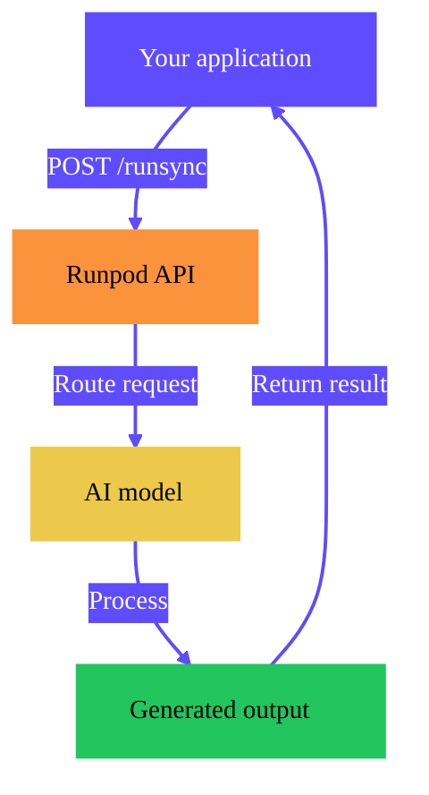

<Frame alt="Public Endpoints homepage">
  
</Frame>

Runpod Public Endpoints provide instant access to state-of-the-art AI models through simple API calls. Generate images, videos, audio, and text without deploying infrastructure or managing GPU resources.

<Tip>
Public Endpoints are pre-deployed models hosted by Runpod. If you want to deploy your own models or custom code, use [Runpod Serverless](/serverless/overview).
</Tip>

## Why use Public Endpoints?

- **No deployment required.** Start generating immediately with a single API call. No containers, GPUs, or infrastructure to configure.
- **Production-ready models.** Access optimized versions of Flux, Whisper, Qwen, and other popular models, tuned for performance.
- **Pay per use.** Pay only for what you generate, with transparent per-megapixel, per-second, or per-token pricing.
- **Simple integration.** Standard REST API with OpenAI-compatible endpoints for LLMs. Works with any HTTP client or SDK.

## When to use Public Endpoints

Public Endpoints are ideal when you want to use popular AI models without managing infrastructure. Choose Public Endpoints when:

- **You need quick access to standard models.** Generate images with Flux, transcribe audio with Whisper, or chat with Qwen without setup.
- **You want predictable pricing.** Pay-per-output pricing makes costs easy to estimate and budget.
- **You're prototyping or building MVPs.** Test ideas quickly before committing to custom infrastructure.

Consider [Runpod Serverless](/serverless/overview) instead if you need custom models, specialized preprocessing, or full control over your inference environment.

## Get started

<CardGroup cols={2}>
  <Card title="Quickstart" href="/hub/public-endpoints-quickstart" icon="bolt" iconType="solid">
    Generate your first image in under 5 minutes.
  </Card>
  <Card title="Make API requests" href="/hub/public-endpoints-requests" icon="code" iconType="solid">
    Use the playground and REST API.
  </Card>
  <Card title="Vercel AI SDK" href="/hub/public-endpoints-ai-sdk" icon="js" iconType="solid">
    Integrate with JavaScript and TypeScript projects.
  </Card>
  <Card title="Model reference" href="/hub/public-endpoint-reference" icon="book" iconType="solid">
    Browse available models and their parameters.
  </Card>
</CardGroup>

## How it works

When you call a Public Endpoint, Runpod routes your request to a pre-deployed model running on optimized GPU infrastructure. The model processes your input and returns the result.

Public Endpoints support two request modes:

- **Synchronous (`/runsync`)**: Wait for the result and receive it in the response. Best for quick generations.
- **Asynchronous (`/run`)**: Receive a job ID immediately and poll for results. Best for longer generations or batch processing.

For JavaScript and TypeScript projects, the [`@runpod/ai-sdk-provider`](/hub/public-endpoints-ai-sdk) package integrates Public Endpoints with the Vercel AI SDK, providing a streamlined interface for text generation, streaming, and image generation.

## Available model types

Public Endpoints offer models across four categories:

| Type | Models | Use cases |
|------|--------|-----------|
| **Image** | Flux Dev, Flux Schnell, Qwen Image, Seedream | Text-to-image generation, image editing |
| **Video** | WAN 2.5, Kling, Seedance, SORA 2 | Image-to-video, text-to-video generation |
| **Audio** | Whisper V3, Minimax Speech | Speech-to-text transcription, text-to-speech |
| **Text** | Qwen3 32B, IBM Granite | Chat, code generation, text completion |

For a complete list of models with endpoint URLs and parameters, see the [model reference](/hub/public-endpoint-reference).

## Pricing

Public Endpoints use transparent, usage-based pricing:

| Model type | Example | Price |
|------------|---------|-------|
| Image generation | Flux Dev | $0.02 per megapixel |
| Image generation | Flux Schnell | $0.0024 per megapixel |
| Video generation | WAN 2.5 | $0.50 per 5 seconds |
| Audio transcription | Whisper V3 | $0.05 per 1000 characters |
| Text generation | Qwen3 32B | $0.01 per 1000 tokens |

<Note>
Pricing is calculated based on actual output. You will not be charged for failed generations.
</Note>

**Example cost calculations for image generation:**

- 512x512 image (0.26 MP) with Flux Dev: ~$0.005
- 1024x1024 image (1.05 MP) with Flux Dev: ~$0.021
- 1024x1024 image (1.05 MP) with Flux Schnell: ~$0.0025

For complete pricing information, see the [model reference](/hub/public-endpoint-reference).

## Next steps

- [Quickstart](/hub/public-endpoints-quickstart): Generate your first image in under 5 minutes.
- [Make API requests](/hub/public-endpoints-requests): Use the playground and REST API.
- [Vercel AI SDK](/hub/public-endpoints-ai-sdk): Integrate with JavaScript and TypeScript projects.
- [Model reference](/hub/public-endpoint-reference): View all available models and their parameters.
