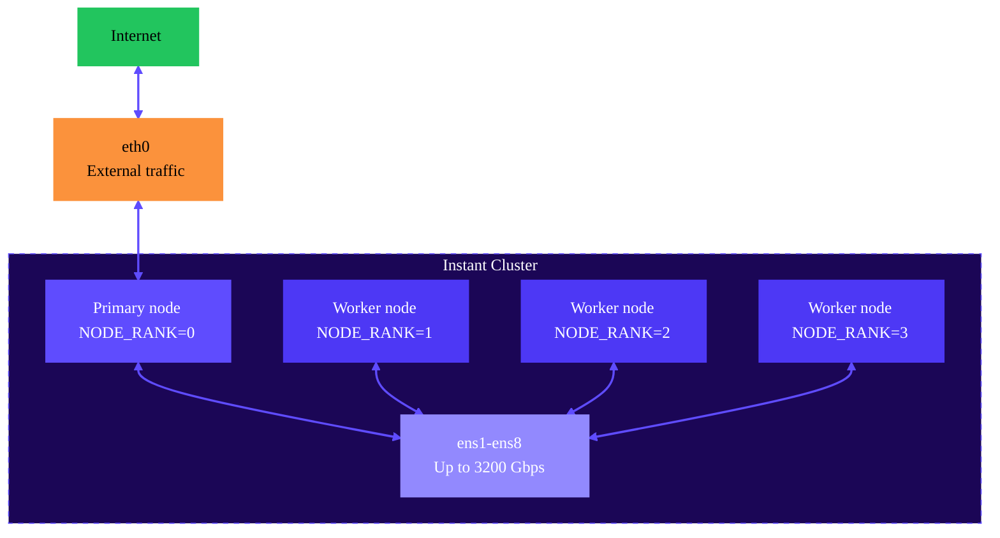

import { DataCenterTooltip, PyTorchTooltip, TrainingTooltip, InferenceTooltip, SlurmTooltip, TensorFlowTooltip } from "/snippets/tooltips.jsx";

Runpod Instant Clusters provide fully managed compute clusters with high-performance networking for distributed workloads. Deploy multi-node <TrainingTooltip /> jobs or large-scale AI <InferenceTooltip /> without managing infrastructure, networking, or cluster configuration.

## Why use Instant Clusters?

- **Scale beyond single machines.** Train models too large for one GPU, or accelerate training by distributing across multiple nodes.
- **High-speed networking included.** Clusters include 1600-3200 Gbps networking between nodes, enabling efficient gradient synchronization and data movement.
- **Zero configuration.** Clusters come pre-configured with static IPs, environment variables, and framework support. Start training immediately.
- **On-demand availability.** Deploy clusters in minutes and pay only for what you use. Scale up for intensive jobs, then release resources.

## When to use Instant Clusters

Instant Clusters offer distributed computing power beyond the capabilities of single-machine setups. Consider using Instant Clusters for:

- **Multi-GPU language model training.** Accelerate training of models like Llama or GPT across multiple GPUs.
- **Large-scale computer vision projects.** Process massive imagery datasets for autonomous vehicles or medical analysis.
- **Scientific simulations.** Run climate, molecular dynamics, or physics simulations that require massive parallel processing.
- **Real-time AI inference.** Deploy production AI models that demand multiple GPUs for fast output.
- **Batch processing pipelines.** Create systems for large-scale data processing, including video rendering and genomics.

## Get started

Choose the deployment guide that matches your preferred framework and use case:

<CardGroup>
  <Card title="Deploy a Slurm cluster" href="/instant-clusters/slurm-clusters" icon="splotch" iconType="solid">
    Set up a managed Slurm cluster for high-performance computing workloads. Slurm provides job scheduling, resource allocation, and queue management for research environments and batch processing workflows.
  </Card>
  <Card title="Deploy a PyTorch distributed training cluster" href="/instant-clusters/pytorch" icon="fire" iconType="solid">
    Set up multi-node PyTorch training for deep learning models. This tutorial covers distributed data parallel training, gradient synchronization, and performance optimization techniques.
  </Card>
  <Card title="Deploy an Axolotl fine-tuning cluster" href="/instant-clusters/axolotl" icon="screwdriver" iconType="solid">
    Use Axolotl's framework for fine-tuning large language models across multiple GPUs. This approach simplifies customizing pre-trained models like Llama or Mistral with built-in training optimizations.
  </Card>
  <Card title="Deploy an unmanaged Slurm cluster" href="/instant-clusters/slurm" icon="splotch" iconType="solid">
    For advanced users who need full control over Slurm configuration. This option provides a basic Slurm installation that you can customize for specialized workloads.
  </Card>
</CardGroup>

You can also follow this [video tutorial](https://www.youtube.com/watch?v=k_5rwWyxo5s?si=r3lZclHcoY3HJYyg) to learn how to deploy Kimi K2 using Instant Clusters.

<iframe
  className="w-full aspect-video rounded-xl"
  src="https://www.youtube.com/embed/6T3IgOxGubU?si=Dkdcba8O2rficZNo"
  title="Introduction to Instant Clusters"
  frameBorder="0"
  allow="fullscreen; accelerometer; autoplay; clipboard-write; encrypted-media; gyroscope; picture-in-picture"
  allowFullScreen
></iframe>

## How it works

When you deploy an Instant Cluster, Runpod provisions multiple GPU nodes within the same <DataCenterTooltip /> and connects them with high-speed networking. One node is designated as the primary node, and all nodes receive pre-configured environment variables for distributed communication.

The high-speed network interfaces (`ens1`-`ens8`) handle inter-node communication for distributed training frameworks like <PyTorchTooltip />, <TensorFlowTooltip />, and <SlurmTooltip />. The `eth0` interface on the primary node handles external traffic like downloading models or datasets.

For more details on environment variables and network configuration, see the [configuration reference](/instant-clusters/configuration).

## Supported hardware

| GPU | Network speed | Nodes |
| --- | ------------- | ----- |
| B200 | 3200 Gbps | 2-8 nodes (16-64 GPUs) |
| H200 | 3200 Gbps | 2-8 nodes (16-64 GPUs) |
| H100 | 3200 Gbps | 2-8 nodes (16-64 GPUs) |
| A100 | 1600 Gbps | 2-8 nodes (16-64 GPUs) |

For clusters larger than 8 nodes (up to 512 GPUs), [contact our sales team](https://ecykq.share.hsforms.com/2MZdZATC3Rb62Dgci7knjbA).

## Pricing

Instant Cluster pricing is based on the GPU type and the number of nodes in your cluster. For current pricing, see the [Instant Clusters pricing page](https://www.runpod.io/pricing).

<Note>
All accounts have a default spending limit. To deploy a larger cluster, submit a support ticket at [help@runpod.io](mailto:help@runpod.io).
</Note>

## Next steps

- [Configuration reference](/instant-clusters/reference): Learn about environment variables, network interfaces, and NCCL configuration.
- [Deploy a Slurm cluster](/instant-clusters/slurm-clusters): Set up job scheduling for HPC workloads.
- [Deploy a PyTorch cluster](/instant-clusters/pytorch): Get started with distributed deep learning.

<Tip>
Runpod offers custom Instant Cluster pricing plans for large scale and enterprise workloads. If you're interested in learning more, [contact our sales team](https://ecykq.share.hsforms.com/2MZdZATC3Rb62Dgci7knjbA).
</Tip>
