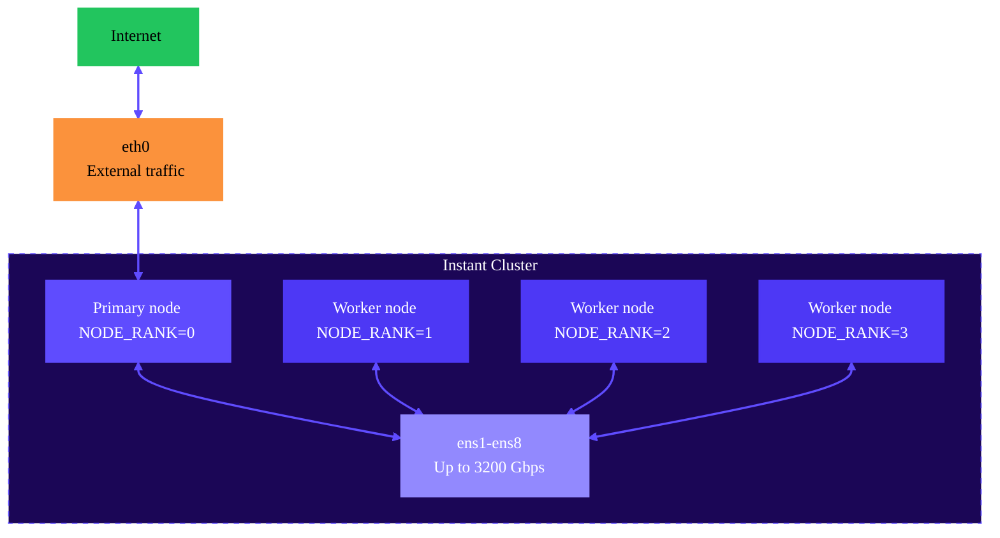

import { DataCenterTooltip, PyTorchTooltip, TrainingTooltip, InferenceTooltip, SlurmTooltip, TensorFlowTooltip } from "/snippets/tooltips.jsx";

Instant Clusters provide fully managed multi-node compute with high-performance networking for distributed workloads. Deploy <TrainingTooltip /> jobs or large-scale <InferenceTooltip /> without managing infrastructure, networking, or cluster configuration.

- **Scale beyond single machines**: Train models too large for one GPU, or accelerate training across multiple nodes.
- **High-speed networking**: 1600-3200 Gbps between nodes for efficient gradient synchronization and data movement.
- **Zero configuration**: Pre-configured static IPs, environment variables, and framework support.
- **On-demand**: Deploy in minutes, pay only for what you use.

## Get started

<CardGroup cols={3}>
  <Card title="Deploy a Slurm cluster" href="/instant-clusters/slurm-clusters" icon="splotch" horizontal>
    Managed Slurm for HPC workloads.
  </Card>
  <Card title="PyTorch distributed training" href="/instant-clusters/pytorch" icon="fire" horizontal>
    Multi-node PyTorch for deep learning.
  </Card>
  <Card title="Axolotl fine-tuning" href="/instant-clusters/axolotl" icon="screwdriver" horizontal>
    Fine-tune LLMs across multiple GPUs.
  </Card>
</CardGroup>

## How it works

Runpod provisions multiple GPU nodes in the same <DataCenterTooltip /> connected with high-speed networking. One node is designated primary (`NODE_RANK=0`), and all nodes receive pre-configured environment variables for distributed communication.

```mermaid
%%{init: {'theme':'base', 'themeVariables': { 'primaryColor':'#9289FE','primaryTextColor':'#fff','primaryBorderColor':'#9289FE','lineColor':'#5F4CFE','secondaryColor':'#AE6DFF','tertiaryColor':'#FCB1FF','edgeLabelBackground':'#5F4CFE', 'fontSize':'15px','fontFamily':'font-inter'}}}%%

flowchart TD
    internet["Internet"]
    eth0["eth0<br/>External traffic"]

    internet <--> eth0
    eth0 <--> primary

    subgraph cluster["Instant Cluster"]
        primary["Primary node<br/>NODE_RANK=0"]
        node1["Worker node<br/>NODE_RANK=1"]
        node2["Worker node<br/>NODE_RANK=2"]
        node3["Worker node<br/>NODE_RANK=3"]
        ens["ens1-ens8<br/>Up to 3200 Gbps"]

        primary <--> ens
        node1 <--> ens
        node2 <--> ens
        node3 <--> ens
    end

    style primary fill:#5F4CFE,stroke:#5F4CFE,color:#FFFFFF,stroke-width:2px
    style node1 fill:#4D38F5,stroke:#4D38F5,color:#FFFFFF,stroke-width:2px
    style node2 fill:#4D38F5,stroke:#4D38F5,color:#FFFFFF,stroke-width:2px
    style node3 fill:#4D38F5,stroke:#4D38F5,color:#FFFFFF,stroke-width:2px
    style internet fill:#22C55E,stroke:#22C55E,color:#000000,stroke-width:2px
    style eth0 fill:#fb923c,stroke:#fb923c,color:#000000,stroke-width:2px
    style ens fill:#9289FE,stroke:#9289FE,color:#FFFFFF,stroke-width:2px
    style cluster fill:#1B0656,stroke:#5F4CFE,color:#FFFFFF,stroke-dasharray: 5 5

    linkStyle default stroke-width:2px,stroke:#5F4CFE
```

The high-speed interfaces (`ens1`-`ens8`) handle inter-node communication for <PyTorchTooltip />, <TensorFlowTooltip />, and <SlurmTooltip />. The `eth0` interface on the primary node handles external traffic. See the [configuration reference](/instant-clusters/configuration) for environment variables and network details.

## Supported hardware

| GPU | Network speed | Nodes |
| --- | ------------- | ----- |
| B200 | 3200 Gbps | 2-8 nodes (16-64 GPUs) |
| H200 | 3200 Gbps | 2-8 nodes (16-64 GPUs) |
| H100 | 3200 Gbps | 2-8 nodes (16-64 GPUs) |
| A100 | 1600 Gbps | 2-8 nodes (16-64 GPUs) |

For clusters larger than 8 nodes (up to 512 GPUs), [contact our sales team](https://ecykq.share.hsforms.com/2MZdZATC3Rb62Dgci7knjbA).

## Pricing

Pricing is based on GPU type and number of nodes. See [Instant Clusters pricing](https://www.runpod.io/pricing) for current rates.

Custom pricing is available for enterprise workloads. [Contact our sales team](https://ecykq.share.hsforms.com/2MZdZATC3Rb62Dgci7knjbA) for details.

<Note>
All accounts have a default spending limit. To deploy larger clusters, contact [help@runpod.io](mailto:help@runpod.io).
</Note>
