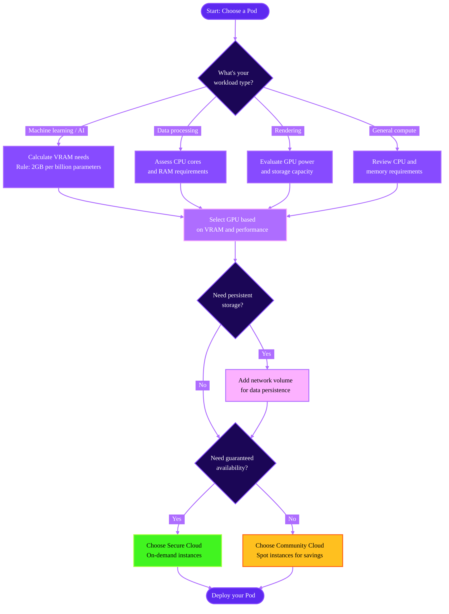

Selecting the appropriate Pod configuration is a crucial step in maximizing performance and efficiency for your specific workloads. This guide will help you understand the key factors to consider when choosing a Pod that meets your requirements.

## Understanding your workload needs

Before selecting a Pod, take time to analyze your specific project requirements. Different applications have varying demands for computing resources:

- Machine learning models require sufficient VRAM and powerful GPUs.
- Data processing tasks benefit from higher CPU core counts and RAM.
- Rendering workloads need both strong GPU capabilities and adequate storage.

For machine learning models, check the model's documentation on platforms like Hugging Face or review the `config.json` file to understand its resource requirements.

## Resource assessment tools

There are several online tools that can help you estimate your resource requirements:

- [Hugging Face's Model Memory Usage Calculator](https://huggingface.co/spaces/hf-accelerate/model-memory-usage) provides memory estimates for transformer models.
- [Vokturz's Can it run LLM calculator](https://huggingface.co/spaces/Vokturz/can-it-run-llm) helps determine if your hardware can run specific language models.
- [Alexander Smirnov's VRAM Estimator](https://vram.asmirnov.xyz) offers GPU memory requirement approximations.

## Key factors to consider

### GPU selection

The GPU is the cornerstone of computational performance for many workloads. When selecting your GPU, consider the architecture that best suits your software requirements. NVIDIA GPUs with CUDA support are essential for most machine learning frameworks, while some applications might perform better on specific GPU generations. Evaluate both the raw computing power (CUDA cores, tensor cores) and the memory bandwidth to ensure optimal performance for your specific tasks.

For machine learning inference, a mid-range GPU might be sufficient, while training large models requires more powerful options. Check framework-specific recommendations, as PyTorch, TensorFlow, and other frameworks may perform differently across GPU types.

For a full list of available GPUs, see [GPU types](/references/gpu-types).

### VRAM requirements

VRAM (video RAM) is the dedicated memory on your GPU that stores data being processed. Insufficient VRAM can severely limit your ability to work with large models or datasets.

For machine learning models, VRAM requirements increase with model size, batch size, and input dimensions. When working with LLMs, a general guideline is to **allocate approximately 2GB of VRAM per billion parameters**. For example, running a 13-billion parameter model efficiently would require around 26GB of VRAM. Following this guideline helps ensure smooth model operation and prevents out-of-memory errors.

### Storage configuration

Your storage configuration affects both data access speeds and your ability to maintain persistent workspaces. Runpod offers both temporary and persistent [storage options](/pods/storage/types).

When determining your storage needs, account for raw data size, intermediate files generated during processing, and space for output results. For data-intensive workloads, prioritize both capacity and speed to avoid bottlenecks.

## Balancing performance and cost

When selecting a Pod, consider these strategies for balancing performance and cost:

1. Use right-sized resources for your workload. For development and testing, a smaller Pod configuration may be sufficient, while production workloads might require more powerful options.

2. Take advantage of spot instances for non-critical or fault-tolerant workloads to reduce costs. For consistent availability needs, on-demand or reserved Pods provide greater reliability.

3. For extended usage, explore Runpod's [savings plans](/pods/pricing#savings-plans) to optimize your spending while ensuring access to the resources you need.

## Next steps

Once you've determined your resource requirements, you can learn how to:

- [Deploy a Pod](/get-started).
- [Manage your Pods](/pods/manage-pods).
- [Connect to a Pod](/pods/connect-to-a-pod).

Remember that you can always deploy a new Pod if you requirements evolve. Start with a configuration that meets your immediate needs, then scale up or down based on actual usage patterns and performance metrics.
