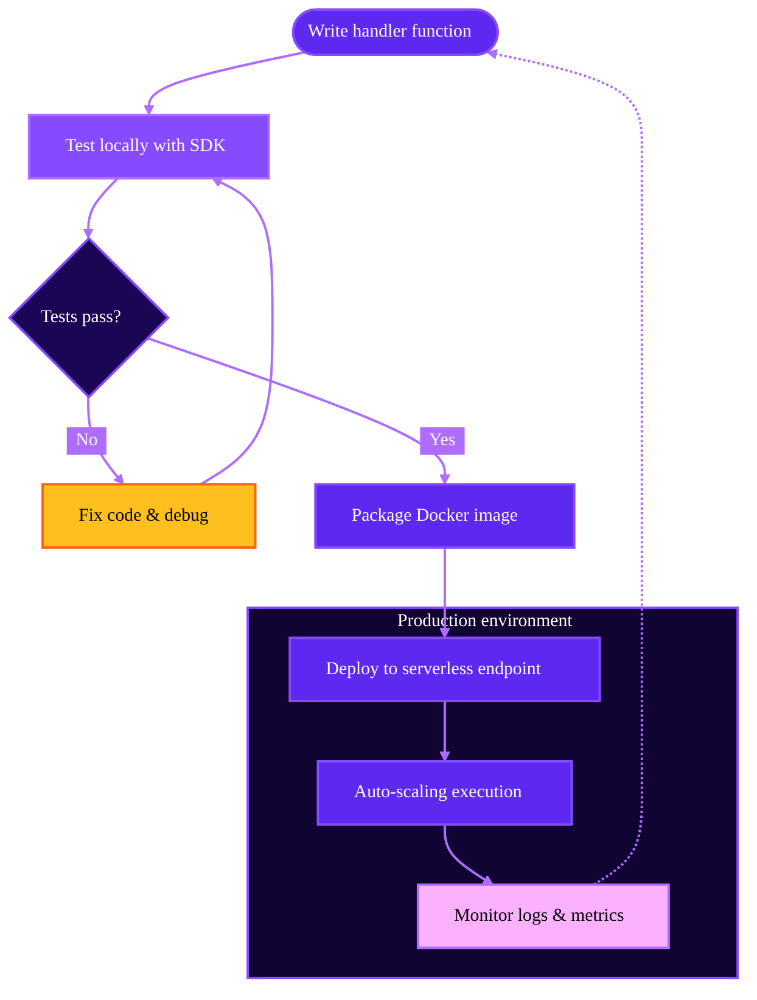

When developing for Runpod Serverless, you'll typically start by writing handler functions, test them locally, and then deploy to production. This guide introduces the development workflow and tools that help you build, test, and deploy Serverless workers effectively.

## Development lifecycle

The typical workflow starts with writing your handler function. Your handler receives an event object with input data and returns a response. Once you have a handler function, test it locally using the Runpod SDK's testing environment. You can test with inline JSON inputs, use a local API server, or simulate concurrency, all without actually deploying your code and incurring charges.

When your handler is working correctly, package it into a Docker image and deploy it to a Serverless endpoint. Your worker will auto-scale based on demand. Once deployed, use logs, metrics, and SSH access to troubleshoot issues and optimize performance in production.

<Tip>
For faster iteration and debugging of GPU-intensive applications, you can develop on a Pod first before deploying to Serverless. This "Pod-first" workflow gives you direct access to the GPU environment with tools like Jupyter Notebooks and SSH, letting you iterate faster than deploying repeatedly to Serverless. Learn more in [Pod-first development](/serverless/development/dual-mode-worker).
</Tip>

## Development features

### Local testing environment

The Runpod SDK provides a comprehensive local testing environment:

- **Basic testing**: Run your handler with inline JSON or test files.
- **Local API server**: Simulate HTTP requests to your Serverless endpoint.
- **Concurrency testing**: Test how your handler performs under parallel execution.
- **Debug mode**: Enable detailed logging and troubleshooting output.

Learn more in [Local testing](/serverless/development/local-testing).

### SDK utilities

The Runpod SDK includes helper functions to make your handlers more robust:

- **Input validation**: Validate request data against a schema.
- **Cleanup utilities**: Automatically remove temporary files after processing.

Learn more in [SDK utilities](/serverless/development/sdk-utilities).

### Pod-first development

For faster iteration and debugging of GPU-intensive applications, develop on a Pod first, then deploy the same Docker image to Serverless. This workflow provides:

- Interactive development with Jupyter Notebooks.
- Direct SSH access to the GPU environment.
- Faster iteration compared to deploying repeatedly to Serverless.

Learn more in [Pod-first development](/serverless/development/dual-mode-worker).

### Debugging and observability

Runpod provides several tools for debugging and monitoring:

- **Logs**: View real-time and historical logs from your workers.
- **Metrics**: Monitor execution time, delay time, and resource usage.
- **SSH access**: Connect directly to running workers for live debugging.

Learn more in [Logs](/serverless/development/logs) and [SSH access](/serverless/development/ssh-into-workers).

## Environment variables

Use environment variables to configure your workers without hardcoding credentials or settings in your code. Environment variables are set in the Runpod console and are available to your handler at runtime.

Learn more in [Environment variables](/serverless/development/environment-variables).

## Benchmarking and optimization

Optimize your workers for performance and cost:

- **Benchmark response times**: Measure cold start and execution time.
- **Error handling**: Implement robust error handling in your handler.

Learn more in [Benchmarking and optimization](/serverless/development/optimization).

## Next steps

Start by learning how to test your handler locally:

- [Local testing](/serverless/development/local-testing)
- [SDK utilities](/serverless/development/sdk-utilities)
- [Pod-first development](/serverless/development/pod-first-development)
