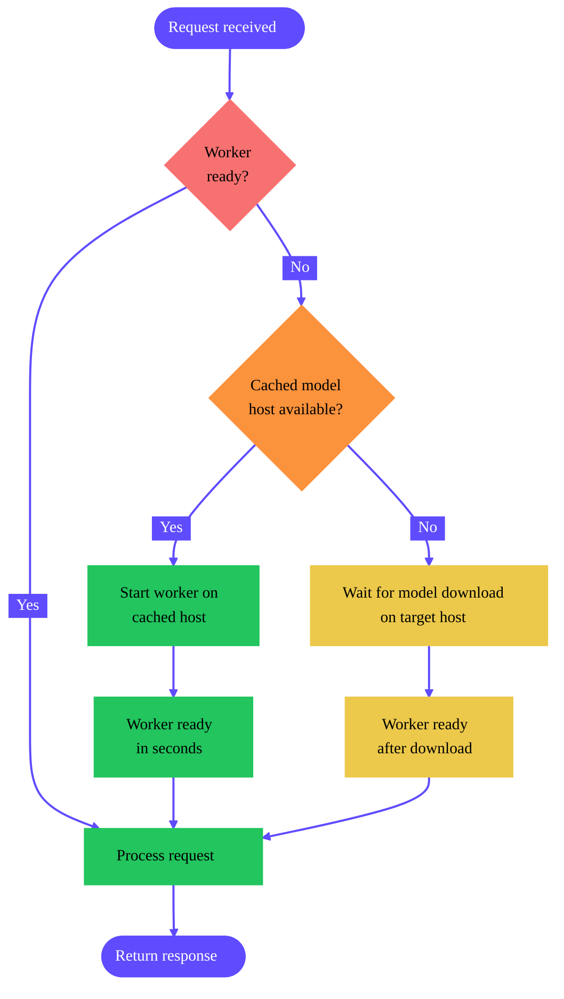

import { MachineTooltip, MachinesTooltip, ColdStartTooltip, WorkersTooltip, HandlerFunctionTooltip } from "/snippets/tooltips.jsx";

<Tip>
For a step-by-step example showing how to integrate cached models with custom workers, see [Deploy a cached model](/tutorials/serverless/model-caching-text).
</Tip>

Enabling cached models on your endpoints can reduce <ColdStartTooltip /> times and dramatically reduce the cost for loading large models.

## Why use cached models?

- **Faster cold starts:** A "cold start" refers to the delay between when a request is received by an endpoint with no running workers and when a worker is fully "warmed up" and ready to handle the request. Using cached models can reduce cold start times to just a few seconds, even for large models.
- **Reduced costs:** You aren't billed for worker time while your model is being downloaded. This is especially impactful for large models that can take several minutes to load.
- **Accelerated deployment:** You can deploy cached models instantly without waiting for external downloads or transfers.
- **Smaller container images:** By decoupling models from your container image, you can create smaller, more focused images that contain only your application logic.
- **Shared across workers:** Multiple <WorkersTooltip /> running on the same host <MachineTooltip /> can reference the same cached model, eliminating redundant downloads and saving disk space.

## Cached model compatibility

Cached models work with any model hosted on Hugging Face, including:

- **Public models:** Any publicly available model on Hugging Face.
- **Gated models:** Models that require you to accept terms (provide a Hugging Face access token).
- **Private models:** Private models your Hugging Face token has access to.

<Tip>

Cached models aren't suitable if your model is private and not hosted on Hugging Face. In that case, [bake it into your Docker image](/serverless/workers/deploy#including-models-and-external-files) instead.

</Tip>

## How it works

When you select a cached model for your endpoint, Runpod automatically tries to start your workers on hosts that already contain the selected model.

If no cached host <MachinesTooltip /> are available, the system delays starting your workers until the model is downloaded onto the machine where your workers will run, ensuring you still won't be charged for the download time.

<div style={{ marginLeft: '4rem'}}>

</div>

## Enable cached models

Follow these steps to select and add a cached model to your endpoint:

<Steps>
  <Step title="Create a new endpoint">
    Navigate to the [Serverless section](https://www.console.runpod.io/serverless) of the console and click **New Endpoint**.
  </Step>
  <Step title="Configure the model">
    In the **Endpoint Configuration** step, scroll down to **Model** and add the link or path for the model you want to use.
    
    For example, `Qwen/qwen3-32b-awq`.

    <Frame alt="Cached model setting">
      
    </Frame>

  </Step>
  <Step title="Add an access token (if needed)">
    If you're using a gated model, you'll need to enter a [Hugging Face access token](https://huggingface.co/docs/hub/en/security-tokens).
  </Step>
  <Step title="Deploy the endpoint">
    Complete your endpoint configuration and click **Deploy Endpoint** .
  </Step>
</Steps>

You can add a cached model to an existing endpoint by selecting **Manage → Edit Endpoint** in the endpoint details page and updating the **Model** field.

Once it's deployed, your workers will all have access to the cached model for inference.

## Using cached models in your workers

When using [vLLM workers](/serverless/vllm/overview) or other official Runpod worker images, you can usually just set the **Model** field as shown above (or use the `MODEL_NAME` environment variable), and your workers will automatically use the cached model for inference.

To use cached models with [custom workers](/serverless/workers/custom-worker), you'll need to manually locate the cached model path and integrate it into your worker code.

### Where cached models are stored

Cached models are available to your workers at `/runpod-volume/huggingface-cache/hub/` following Hugging Face cache conventions. The directory structure replaces forward slashes (`/`) from the original model name with double dashes (`--`), and includes a version hash subdirectory.

<Note>
While cached models use the same mount path as network volumes (`/runpod-volume/`), the model loaded from the cache will load significantly faster than the same model loaded from a network volume.
</Note>

For example, here is how the model `gensyn/qwen2.5-0.5b-instruct` would be stored:

<Tree>
  <Tree.Folder name="runpod-volume" defaultOpen>
    <Tree.Folder name="huggingface-cache" defaultOpen>
      <Tree.Folder name="hub" defaultOpen>
        <Tree.Folder name="models--gensyn--qwen2.5-0.5b-instruct" defaultOpen>
          <Tree.Folder name="refs" defaultOpen>
            <Tree.File name="main" comment="Contains the commit hash of the 'main' branch" />
          </Tree.Folder>
          <Tree.Folder name="snapshots" defaultOpen>
            <Tree.Folder name="abcdef1234567890..." comment="Actual model files, named by commit hash" />
          </Tree.Folder>
        </Tree.Folder>
      </Tree.Folder>
    </Tree.Folder>
  </Tree.Folder>
</Tree>

### Programmatically locate cached models

To dynamically locate cached models without hardcoding paths, you can add this helper function to your <HandlerFunctionTooltip /> to scan the cache directory for the model you want to use:

```python handler.py
import os

CACHE_DIR = "/runpod-volume/huggingface-cache/hub"

def find_model_path(model_name):
    """
    Find the path to a cached model.
    
    Args:
        model_name: The model name from Hugging Face
        (e.g., 'Qwen/Qwen2.5-0.5B-Instruct')
    
    Returns:
        The full path to the cached model, or None if not found
    """
    # Convert model name format: "Org/Model" -> "models--Org--Model"
    cache_name = model_name.replace("/", "--")
    snapshots_dir = os.path.join(CACHE_DIR, f"models--{cache_name}", "snapshots")
    
    # Check if the model exists in cache
    if os.path.exists(snapshots_dir):
        snapshots = os.listdir(snapshots_dir)
        if snapshots:
            # Return the path to the first (usually only) snapshot
            return os.path.join(snapshots_dir, snapshots[0])
    
    return None

# Example usage
model_path = find_model_path("Qwen/Qwen2.5-0.5B-Instruct")
if model_path:
    print(f"Model found at: {model_path}")
else:
    print("Model not found in cache")
```

### Custom worker examples

The following sample applications demonstrate how you can integrate cached models into your custom workers:

- [Cached models + LLMs](https://github.com/runpod-workers/model-store-cache-example): A custom worker that uses cached models to serve LLMs.

## Current limitations

- Each endpoint is currently limited to one cached model at a time.
- If a Hugging Face repository contains multiple quantization versions of a model (for example, 4-bit AWQ and 8-bit GPTQ versions), the system currently downloads all quantization versions. The ability to select specific quantizations will be available in a future update.
