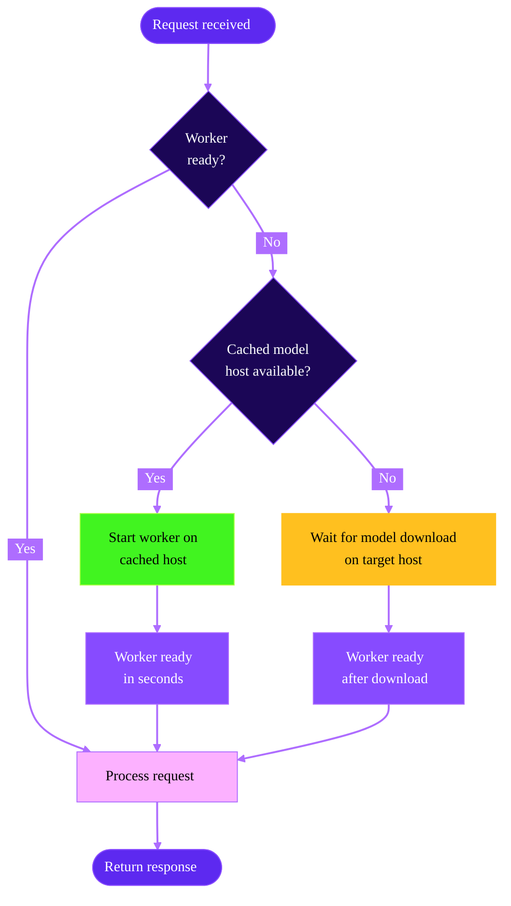

<Note>
Cached models are currently in beta. [Join our Discord](https://discord.gg/runpod) if you'd like to provide feedback.
</Note>

Enabling cached models on your Serverless endpoint can reduce [cold start times](/serverless/overview#cold-starts) to just a few seconds and dramatically reduce the cost for loading large models.

## Why use cached models?

- **Faster cold starts:** A "cold start" refers to the delay between when a request is received by an endpoint with no running workers and when a worker is fully "warmed up" and ready to handle the request. Using cached models can reduce cold start times to just a few seconds, even for large models.
- **Reduced costs:** You aren't billed for worker time while your model is being downloaded. This is especially impactful for large models that can take several minutes to load.
- **Accelerated deployment:** You can deploy cached models instantly without waiting for external downloads or transfers.
- **Smaller container images:** By decoupling models from your container image, you can create smaller, more focused images that contain only your application logic.
- **Persistent across worker resets:** If a worker goes idle and is reset, the cached model doesn't need to be redownloaded. The model remains available on the host machine, allowing the worker to restart quickly.
- **Concurrent downloads:** Model's are downloaded concurrently with Docker image pulls, reducing overall startup time compared to waiting for the worker to start before beginning the download.
- **Shared across workers:** Multiple workers running on the same host machine can reference the same cached model, eliminating redundant downloads and saving disk space.

## Best practices for model deployment

When deploying models on Serverless endpoints, follow this order of preference:

1. **Use cached models:** If your model is available on Hugging Face (public or gated), this is the recommended approach. Cached models provide the fastest cold starts, eliminate download costs, and persist across worker restarts.

2. **Bake the model into your Docker image:** If your model is private and not available on Hugging Face, embed it directly in you workers' container image. This ensures the model is always available, but it increases image size and build time.

3. **Use network storage:** Network volumes provide persistent storage, but models loaded from network storage are slower than cached or baked models. Use this option only when the above approaches don't fit your needs.

## When to use cached models

Cached models work with any model hosted on Hugging Face, including:

- **Public models:** Any publicly available model on Hugging Face.
- **Gated models:** Models that require you to accept terms (provide a Hugging Face access token).
- **Private models:** Private models your Hugging Face token has access to.

<Tip>

Cached models aren't suitable if your model is private and not hosted on Hugging Face. In that case, bake it into your Docker image instead.

</Tip>

## How it works

When you select a cached model for your endpoint, Runpod automatically tries to start your workers on hosts that already contain the selected model.

If no cached host machines are available, the system delays starting your workers until the model is downloaded onto the machine where your workers will run, ensuring you still won't be charged for the download time.

<div style={{ marginLeft: '4rem'}}>

</div>

## Where models are stored

Cached models are stored in a Runpod-managed Docker volume mounted at `/runpod-volume/huggingface-cache/hub/`. The model cache is automatically managed and persists across requests on the same worker.

<Note>
While cached models use the same mount path as network volumes (`/runpod-volume/`), the model loaded from the cache will load significantly faster than the same model loaded from a network volume.
</Note>

## Accessing cached models in your application

Models are cached on your workers at `/runpod-volume/huggingface-cache/hub/` following Hugging Face cache conventions. The directory structure replaces forward slashes (`/`) from the original model name with double dashes (`--`), and includes a version hash subdirectory.

The path structure follows this pattern:

```
/runpod-volume/huggingface-cache/hub/models--HF_ORGANIZATION--MODEL_NAME/snapshots/VERSION_HASH/
```

For example, the model `gensyn/qwen2.5-0.5b-instruct` would be stored at:

```
/runpod-volume/huggingface-cache/hub/models--gensyn--qwen2.5-0.5b-instruct/snapshots/317b7eb96312eda0c431d1dab1af958a308cb35e/
```

If your application requires specific paths, configure it to scan `/runpod-volume/huggingface-cache/hub/` for models.

## Current limitations

If a Hugging Face repository contains multiple quantization versions of a model (for example, 4-bit AWQ and 8-bit GPTQ versions), the system currently downloads all quantization versions. The ability to select specific quantizations will be available in a future update.

## Enabling cached models

<Frame alt="Cached model setting">
  
</Frame>

Follow these steps to select and add a cached model to your Serverless endpoint:

<Steps>
  <Step title="Create a new endpoint">
    Navigate to the [Serverless section](https://www.console.runpod.io/serverless) of the console and click **New Endpoint**.
  </Step>
  <Step title="Configure the model">
    In the **Endpoint Configuration** step, scroll down to **Model (optional)** and add the link for the model you want to use.
    
    For example, `https://huggingface.co/Qwen/Qwen3-Next-80B-A3B-Instruct`.

  </Step>
  <Step title="Add an access token (if needed)">
    If you're using a gated model, you'll need to enter a [Hugging Face access token](https://huggingface.co/docs/hub/en/security-tokens).
  </Step>
  <Step title="Deploy the endpoint">
    Complete your endpoint configuration and click **Deploy Endpoint** .
  </Step>
</Steps>

You can add a cached model to an existing endpoint by selecting **Manage → Edit Endpoint** in the endpoint details page and updating the **Model (optional)** field.
