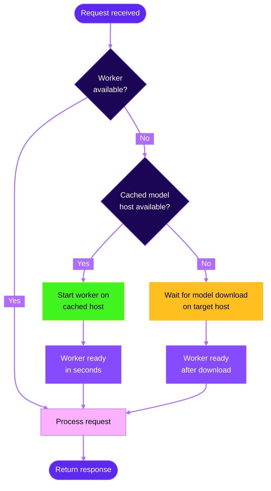

<Note>
Cached models are currently in beta. [Join our Discord](https://discord.gg/runpod) if you'd like to provide feedback.
</Note>

Enabling cached models on your Serverless endpoint can reduce [cold start times](/serverless/overview#cold-starts) to just a few seconds and dramatically reduce the cost for loading large models.

## Why use cached models?

- **Faster cold starts:** A "cold start" refers to the delay between when a request is received by an endpoint with no running workers and when a worker is fully "warmed up" and ready to handle the request. Using cached models can reduce cold start times to just a few seconds, even for large models.
- **Reduced costs:** You aren't billed for worker time while your model is being downloaded. This is especially impactful for large models that can take several minutes to load.
- **Accelerated deployment:** You can deploy cached models instantly without waiting for external downloads or transfers.
- **Smaller container images:** By decoupling models from your container image, you can create smaller, more focused images that contain only your application logic.

## How it works

When you select a cached model for your endpoint, Runpod automatically tries to start your workers on hosts that already contain the selected model.

If no cached host machines are available, the system delays starting your workers until the model is downloaded onto the machine where your workers will run, ensuring you still won't be charged for the download time.

## Enabling cached models

Follow these steps to select and add a cached model to your Serverless endpoint:

<Steps>
  <Step title="Create a new endpoint">
    Navigate to the [Serverless section](https://www.console.runpod.io/serverless) of the console and click **New Endpoint**.
  </Step>
  <Step title="Configure the model">
    In the **Endpoint Configuration** step, scroll down to **Model (optional)** and add the link for the model you want to use.
    
    For example, `https://huggingface.co/Qwen/Qwen3-Next-80B-A3B-Instruct`.

  </Step>
  <Step title="Add an access token (if needed)">
    If you're using a gated model, you'll need to enter a [Hugging Face access token](https://huggingface.co/docs/hub/en/security-tokens).
  </Step>
  <Step title="Deploy the endpoint">
    Complete your endpoint configuration and click **Deploy Endpoint** .
  </Step>
</Steps>

You can add a cached model to an existing endpoint by selecting **Manage → Edit Endpoint** in the endpoint details page and updating the **Model (optional)** field.