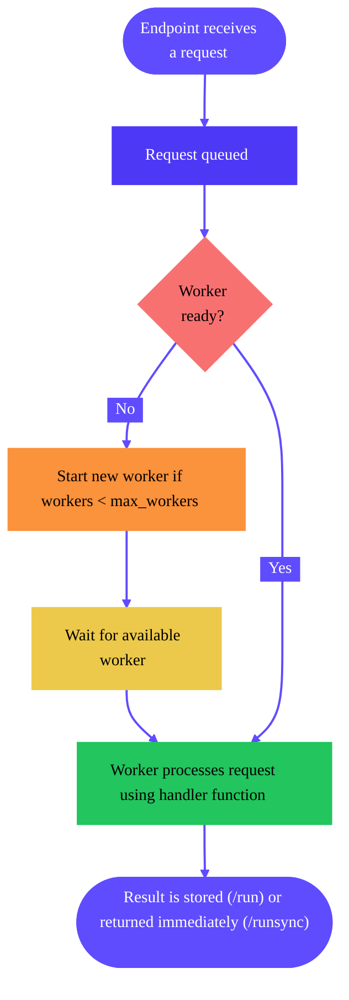
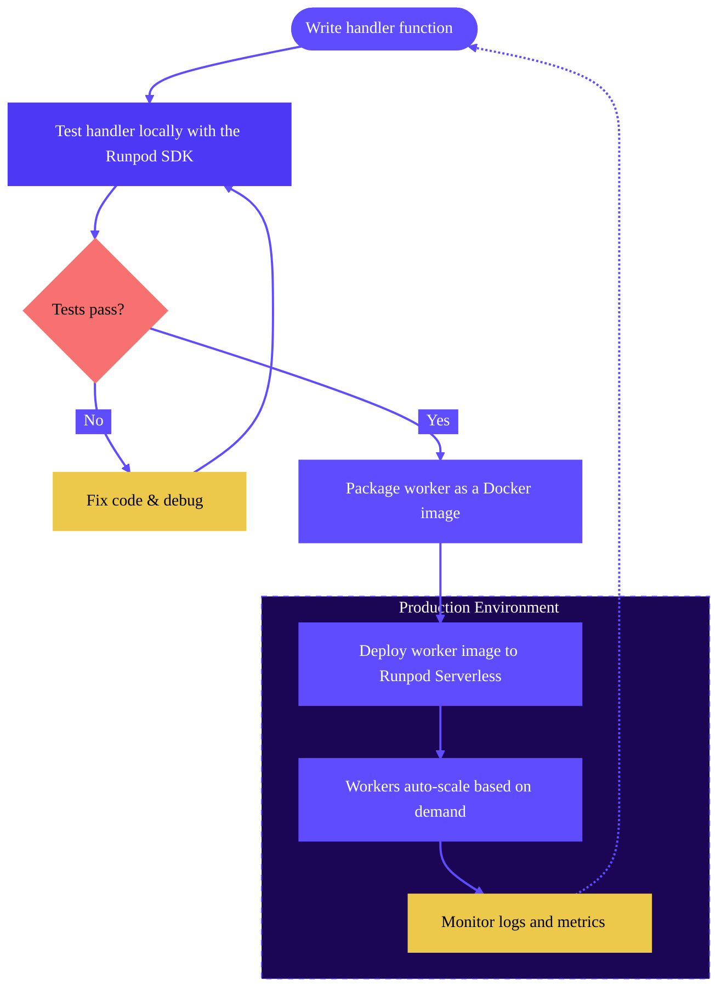

import { EndpointTooltip, WorkersTooltip, WorkerTooltip, HandlerFunctionTooltip, RequestTooltip, PodTooltip, RunpodHubTooltip, PublicEndpointTooltip, JobTooltip, LoadBalancingEndpointTooltip, QueueBasedEndpointsTooltip } from "/snippets/tooltips.jsx";

Runpod Serverless is a cloud computing platform that lets you run AI models and compute-intensive workloads without managing servers. You only pay for the actual compute time you use, with no idle costs when your application isn't processing requests.

## Why use Serverless?

* Focus on your code, not infrastructure: Deploy your applications without worrying about server management, scaling, or maintenance.
* GPU-powered computing: Access powerful GPUs for AI inference, training, and other compute-intensive tasks.
* Automatic scaling: Your application scales automatically based on demand, from zero to hundreds of <WorkersTooltip />.
* Cost efficiency: Pay only for what you use, with per-second billing and no costs when idle.
* Fast deployment: Get your code running in the cloud in minutes with minimal configuration.

## Get started

To get started with Serverless, follow one of the following guides to deploy your first <EndpointTooltip />.

<CardGroup>
    <Card title="Quickstart" href="/serverless/workers/custom-worker" icon="bolt" iconType="solid">
        Write a handler function, build a worker image, create an endpoint, and send your first request.
    </Card>
    <Card title="Deploy a pre-configured endpoint" href="/tutorials/serverless/run-your-first" icon="image" iconType="solid">
        Deploy a Stable Diffusion endpoint to generate images at scale.
    </Card>
</CardGroup>

You can also watch the following video for a quick overview of the endpoint deployment process:

<iframe
  className="w-full aspect-video rounded-xl"
  src="https://www.youtube.com/embed/5jHMLDZ4_O4"
  title="Runpod Serverless Made Simple - Introduction To Serverless Functions and Workers"
  frameBorder="0"
  allow="fullscreen; accelerometer; autoplay; clipboard-write; encrypted-media; gyroscope; picture-in-picture"
  allowFullScreen
></iframe>

## Concepts


### [Endpoints](/serverless/endpoints/overview)

The access point for your Serverless application. Endpoints provide a URL where users or applications can send requests to run your code. Each endpoint can be configured with different compute resources, scaling settings, and other parameters to suit your specific needs.

### [Workers](/serverless/workers/overview)

The container instances that execute your code when requests arrive at your endpoint. Runpod automatically manages worker lifecycle, starting them when needed and stopping them when idle to optimize resource usage.

### [Handler functions](/serverless/workers/handler-functions)

The core of your Serverless application. These functions define how a worker processes incoming requests and returns results. They follow a simple pattern:

```Python
import runpod  # Required

def handler(event):
    # Extract input data from the request
    input_data = event["input"]
    
    # Process the input (replace this with your own code)
    result = process_data(input_data)
    
    # Return the result
    return result

runpod.serverless.start({"handler": handler})  # Required
```

<Note>
Handler functions are only used for <QueueBasedEndpointsTooltip /> (i.e. traditional endpoints). If you're using a <LoadBalancingEndpointTooltip />, the request structure and endpoints will depend on how you define your HTTP servers.
</Note>

### [Requests](/serverless/endpoints/send-requests)

An HTTP request that you send to an endpoint, which can include parameters, payloads, and headers that define what the endpoint should process. For example, you can send a `POST` request to submit a <JobTooltip />, or a `GET` request to check status of a job, retrieve results, or check endpoint health.

When a user/client sends a request to your endpoint:

1. If no workers are active, Runpod automatically starts one (cold start).
2. The request is queued until a worker is available.
3. A worker processes the request using your handler function.
4. The result is returned to the user/client after they call `/status` (or automatically if you used `/runsync`).
5. Workers remain active for a period to handle additional requests.
6. Idle workers eventually shut down if no new requests arrive.

<div style={{ marginLeft: '4rem'}}>

</div>


### Cold starts

 A "cold start" refers to the time between when an endpoint with no running workers receives a request, and when a worker is fully "warmed up" and ready to handle the request. This generally involves starting the container, loading models into GPU memory, and initializing runtime environments. Larger models take longer to load into memory, increasing cold start time, and request response time by extension. 

Minimizing cold starts is key to creating a responsive and cost-effective endpoint. You can reduce cold starts by using [cached models](/serverless/endpoints/model-caching), enabling [FlashBoot](/serverless/endpoints/endpoint-configurations#flashboot), setting [active worker counts](/serverless/endpoints/endpoint-configurations#active-min-workers) above zero.

### [Load balancing endpoints](/serverless/load-balancing/overview)

These endpoints route incoming traffic directly to available workers, distributing requests across the worker pool. Unlike traditional <QueueBasedEndpointsTooltip />, they provide no queuing mechanism for request backlog.

When using load balancing endpoints, you can define your own custom API endpoints without a handler function, using any HTTP framework of your choice (like FastAPI or Flask).

## Development workflow

Here's a typical Serverless development workflow: 

1. [Write a handler function](/serverless/workers/handler-functions) to process API requests.
2. [Test it locally](/serverless/development/local-testing) using the Runpod SDK.
3. [Create a Dockerfile](/serverless/workers/create-dockerfile) to package the handler function and all its dependencies.
4. [Build and push](/serverless/workers/deploy) the worker image to Docker Hub (or another container registry).
    - ... or [deploy directly from a GitHub repository](/serverless/workers/github-integration).
5. Deploy the worker image to a [Serverless endpoint](/serverless/endpoints/overview).
6. [Monitor logs](/serverless/development/logs), debug running workers [with SSH](/serverless/development/ssh-into-workers).
7. Adjust your [endpoint settings](/serverless/endpoints/endpoint-configurations) to [optimize performance and cost](/serverless/development/optimization).
8. To update your endpoint logic, go back to step 1 and repeat the process.

<div style={{ marginLeft: '4rem'}}>

</div>

<Tip>
For faster iteration and debugging of GPU-intensive applications, you can develop on a <PodTooltip /> first before deploying to Serverless. This "Pod-first" workflow gives you direct access to the GPU environment with tools like Jupyter Notebooks and SSH, letting you iterate faster than deploying repeatedly to Serverless. Learn more in [Pod-first development](/serverless/development/dual-mode-worker).
</Tip>

## Rapid deployment options

If you don't want to start from scratch and [build a custom worker](/serverless/workers/custom-worker), Runpod offers several ways to rapidly deploy and test pre-configured AI models, without writing your own handler function:

### Fork a worker repository

**Best for**: Creating a custom worker using an existing repository.

Runpod maintains a collection of [worker repositories](https://github.com/runpod-workers) on GitHub that you can use as a starting point:

* [worker-basic](https://github.com/runpod-workers/worker-basic): A minimal repository with essential functionality.
* [worker-template](https://github.com/runpod-workers/worker-template): A more comprehensive repository with additional features
* [Model-specific repositories](https://github.com/runpod-workers#worker-collection): Specialized repositories for common AI tasks (image generation, audio processing, etc.)

After you fork a worker you can learn how to:

1. Customize the [handler function](/serverless/workers/handler-functions) to add your own logic.
2. [Test the handler function](/serverless/development/local-testing) locally.
3. Deploy it to an endpoint using [Docker Hub](/serverless/workers/deploy) or [GitHub](/serverless/workers/github-integration).

[Browse worker repositories →](https://github.com/runpod-workers)

### Deploy a vLLM worker

**Best for**: Deploying and serving large language models (LLMs) efficiently.

vLLM workers are specifically optimized for running LLMs:

* Support for any [Hugging Face model](https://huggingface.co/models).
* Optimized for LLM inference.
* Simple configuration via [environment variables](/serverless/vllm/environment-variables).
* High-performance inference with vLLM's PagedAttention and continuous batching.

[Deploy a vLLM worker →](/serverless/vllm/get-started)

<Warning>
vLLM workers may require significant configuration (using environment variables) depending on the model you are deploying. Consult the README for your model on Hugging Face and the [vLLM documentation](https://docs.vllm.ai/en/latest/usage/) for more details.
</Warning>


### Deploy a repo from the Runpod Hub

**Best for**: Instantly deploying preconfigured AI models.

You can deploy a Serverless endpoint from a repo in the <RunpodHubTooltip /> in seconds:

1. Navigate to the [Hub page](https://www.console.runpod.io/hub) in the Runpod console.
2. Browse the collection and select a repo that matches your needs.
3. Review the repo details, including hardware requirements and available configuration options to ensure compatibility with your use case.
4. Click the **Deploy** button in the top-right of the repo page. You can also use the dropdown menu to deploy an older version.
5. Click **Create Endpoint**

[Deploy a repo from the Runpod Hub →](https://www.console.runpod.io/hub)

### Use Public Endpoints

**Best for**: Deploying and serving pre-configured AI models quickly.

Runpod maintains a collection of <PublicEndpointTooltip />s that you can use to integrate pre-configured AI models into your applications quickly, without writing your own <HandlerFunctionTooltip /> or deploying workers.

[Browse Public Endpoints →](https://console.runpod.io/hub?tabSelected=public_endpoints)

## Next steps

Ready to get started with Runpod Serverless?

* [Build your first worker.](/serverless/workers/custom-worker)
* [Learn more about endpoints.](/serverless/endpoints/overview)
* [Learn more about workers.](/serverless/workers/overview)
* [Learn how to build handler functions.](/serverless/workers/handler-functions)
* [Deploy large language models in minutes with vLLM.](/serverless/vllm/overview)
* [Review storage options for your endpoints.](/serverless/storage/overview)
* [Learn how to send requests to your endpoints.](/serverless/endpoints/send-requests)
