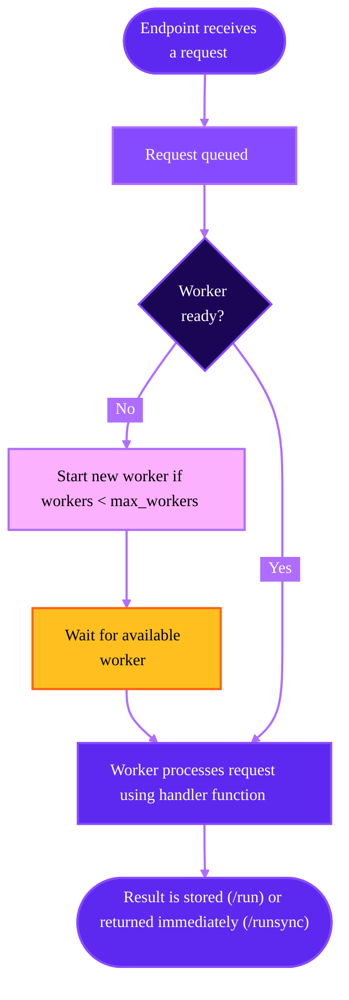

Runpod Serverless is a cloud computing platform that lets you run AI models and compute-intensive workloads without managing servers. You only pay for the actual compute time you use, with no idle costs when your application isn't processing requests.

<iframe
  className="w-full aspect-video rounded-xl"
  src="https://www.youtube.com/embed/5jHMLDZ4_O4"
  title="Runpod Serverless Made Simple - Introduction To Serverless Functions and Workers"
  frameBorder="0"
  allow="fullscreen; accelerometer; autoplay; clipboard-write; encrypted-media; gyroscope; picture-in-picture"
  allowFullScreen
></iframe>

## Why use Serverless?

* Focus on your code, not infrastructure: Deploy your applications without worrying about server management, scaling, or maintenance.
* GPU-powered computing: Access powerful GPUs for AI inference, training, and other compute-intensive tasks.
* Automatic scaling: Your application scales automatically based on demand, from zero to hundreds of workers.
* Cost efficiency: Pay only for what you use, with per-second billing and no costs when idle.
* Fast deployment: Get your code running in the cloud in minutes with minimal configuration.

## Concepts

### [Endpoints](/serverless/endpoints/overview)

The access point for your Serverless application. Endpoints provide a URL where users or applications can send requests to run your code. Each endpoint can be configured with different compute resources, scaling settings, and other parameters to suit your specific needs.

### [Workers](/serverless/workers/overview)

The container instances that execute your code when requests arrive at your endpoint. Runpod automatically manages worker lifecycle, starting them when needed and stopping them when idle to optimize resource usage.

### [Handler functions](/serverless/workers/handler-functions)

The core of your Serverless application. These functions define how a worker processes incoming requests and returns results. They follow a simple pattern:

```Python
import runpod  # Required

def handler(event):
    # Extract input data from the request
    input_data = event["input"]
    
    # Process the input (replace this with your own code)
    result = process_data(input_data)
    
    # Return the result
    return result

runpod.serverless.start({"handler": handler})  # Required
```

### [Requests](/serverless/endpoints/send-requests)

An HTTP request that you send to an endpoint, which can include parameters, payloads, and headers that define what the endpoint should process. For example, you can send a `POST` request to submit a job, or a `GET` request to check status of a job, retrieve results, or check endpoint health.

When a user/client sends a request to your endpoint:

1. If no workers are active, Runpod automatically starts one (cold start).
2. The request is queued until a worker is available.
3. A worker processes the request using your handler function.
4. The result is returned to the user/client after they call `/status` (or automatically if you used `/runsync`).
5. Workers remain active for a period to handle additional requests.
6. Idle workers eventually shut down if no new requests arrive.

<div style={{ marginLeft: '4rem'}}>

</div>


### Cold starts

 A "cold start" refers to the time between when an endpoint with no running workers receives a request, and when a worker is fully "warmed up" and ready to handle the request. This generally involves starting the container, loading models into GPU memory, and initializing runtime environments. Larger models take longer to load into memory, increasing cold start time, and request response time by extension. 

Minimizing cold starts is key to creating a responsive and cost-effective endpoint. You can reduce cold starts by using [cached models](/serverless/endpoints/model-caching), enabling [FlashBoot](/serverless/endpoints/endpoint-configurations#flashboot), setting [active worker counts](/serverless/endpoints/endpoint-configurations#active-min-workers) above zero.

### [Load balancing endpoints](/serverless/load-balancing/overview)

These endpoints route incoming traffic directly to available workers, distributing requests across the worker pool. Unlike traditional queue-based endpoints, they provide no queuing mechanism for request backlog.

When using load balancing endpoints, you can define your own custom API endpoints without a handler function, using any HTTP framework of your choice (like FastAPI or Flask).

## Deployment options

Runpod Serverless offers several ways to deploy your workloads, each designed for different use cases.

### Runpod Hub

**Best for**: Instantly deploying preconfigured AI models.

You can deploy a Serverless endpoint from a repo in the [Runpod Hub](/hub/overview) in seconds:

1. Navigate to the [Hub page](https://www.console.runpod.io/hub) in the Runpod console.
2. Browse the collection and select a repo that matches your needs.
3. Review the repo details, including hardware requirements and available configuration options to ensure compatibility with your use case.
4. Click the **Deploy** button in the top-right of the repo page. You can also use the dropdown menu to deploy an older version.
5. Click **Create Endpoint**

[Deploy a repo from the Runpod Hub →](https://www.console.runpod.io/hub)

### Deploy a vLLM worker

**Best for**: Deploying and serving large language models (LLMs) with minimal configuration.

vLLM workers are specifically optimized for running LLMs:

* Support for any [Hugging Face model](https://huggingface.co/models).
* Optimized for LLM inference.
* Simple configuration via environment variables.
* High-performance serving with vLLM.

[Deploy a vLLM worker →](/serverless/vllm/get-started)

### Fork a worker template

**Best for**: Creating a custom worker using an existing template.

Runpod maintains a collection of [worker templates](https://github.com/runpod-workers) on GitHub that you can use as a starting point:

* [worker-basic](https://github.com/runpod-workers/worker-basic): A minimal template with essential functionality.
* [worker-template](https://github.com/runpod-workers/worker-template): A more comprehensive template with additional features
* [Model-specific templates](https://github.com/runpod-workers#worker-collection): Specialized templates for common AI tasks (image generation, audio processing, etc.)

After you fork a worker you can learn how to:

1. [Test your worker](/serverless/development/local-testing) locally.
2. Customize it with your own [handler function](/serverless/workers/handler-functions).
3. Deploy it to an endpoint using [Docker](/serverless/workers/deploy) or [GitHub](/serverless/workers/github-integration).

[Browse worker templates →](https://github.com/runpod-workers)

### Build a custom worker

**Best for**: Running custom code or specialized AI workloads.

Creating a custom workers give you complete control over your application:

* Write your own Python code.
* Package it in a Docker container.
* Allows full flexibility for any use case.
* Create custom processing logic.

[Build your first custom worker →](/serverless/workers/custom-worker)

## Best practices for model deployment

When deploying models on Serverless endpoints, follow this order of preference:

1. [Use cached models](/serverless/endpoints/model-caching): If your model is available on Hugging Face (public or gated), this is the recommended approach. Cached models provide the fastest cold starts, eliminate download costs, and persist across worker restarts.

2. [Bake the model into your Docker image](/serverless/workers/deploy#including-models-and-external-files): If your model is private and not available on Hugging Face, embed it directly in you workers' container image using `COPY` or `RUN wget`. This ensures the model is always available, but it increases image size and build time.

3. [Use network volumes](/serverless/storage/network-volumes): You can use network volumes to store models and other files that need to persist between workers. Models loaded from network storage are slower than cached or baked models, so you should only use this option when the preceeding approaches don't fit your needs.

## Development lifecycle

When developing for Serverless applications, you'll typically start by writing a handler function, testing it locally, and then deploying it to production. To learn more about testing, error handling, monitoring, and optimizing your Serverless applications, see [Serverless development](/serverless/development/overview).

## Next steps

Ready to get started with Runpod Serverless?

* [Build your first worker.](/serverless/workers/custom-worker)
* [Learn more about endpoints.](/serverless/endpoints/overview)
* [Learn more about workers.](/serverless/workers/overview)
* [Learn how to build handler functions.](/serverless/workers/handler-functions)
* [Deploy large language models in minutes with vLLM.](/serverless/vllm/overview)
* [Review storage options for your endpoints.](/serverless/storage/overview)
* [Learn how to send requests to your endpoints.](/serverless/endpoints/send-requests)
