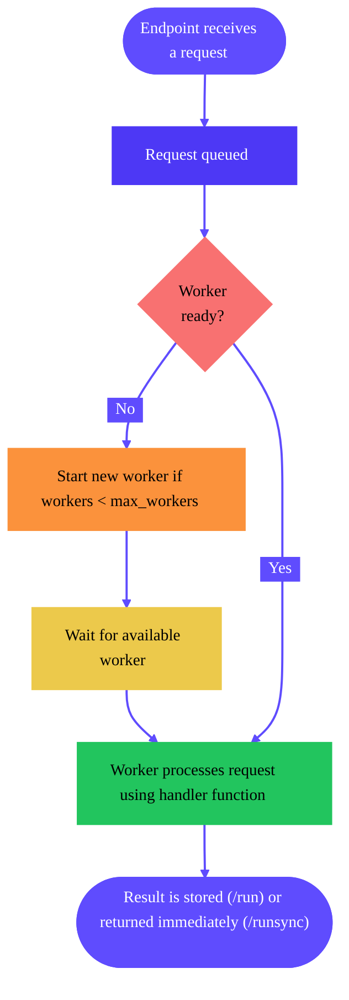
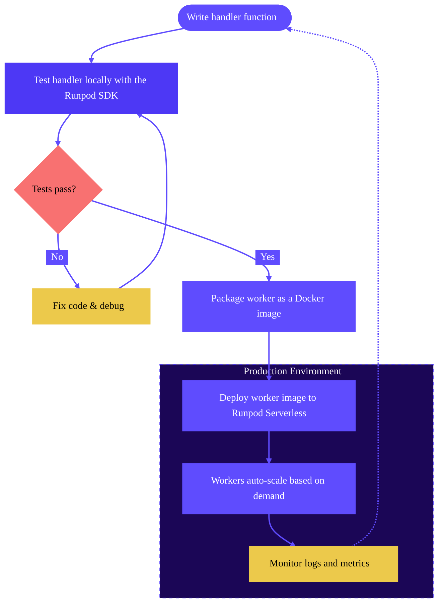

import { WorkersTooltip, HandlerFunctionTooltip, PodTooltip, RunpodHubTooltip, PublicEndpointTooltip, JobTooltip, LoadBalancingEndpointTooltip, QueueBasedEndpointsTooltip, InferenceTooltip, TrainingTooltip } from "/snippets/tooltips.jsx";

<div className="overview-page-wrapper" />

Runpod Serverless is a cloud computing platform that lets you serve AI models for <InferenceTooltip /> and run other compute-intensive workloads without managing servers. You only pay for the actual compute time you use, with no idle costs when your application isn't processing requests.

## Get started

<CardGroup cols={3}>
    <Card title="Quickstart" href="/serverless/workers/custom-worker" icon="bolt" horizontal>
        Write a handler function, build a worker image, create an endpoint, and send your first request.
    </Card>
    <Card title="Generate images with ComfyUI" href="/tutorials/serverless/comfyui" icon="image" horizontal>
        Deploy a ComfyUI worker and generate images using JSON workflows.
    </Card>
    <Card title="Fork a worker repository" href="https://github.com/runpod-workers" icon="code-fork" horizontal>
    Use Runpod's worker templates on GitHub as a starting point.
  </Card>
</CardGroup>

## Concepts

### [Endpoints](/serverless/endpoints/overview)

The access point for your Serverless application. Endpoints provide a URL where users or applications can send requests to run your code. Each endpoint can be configured with different compute resources, scaling settings, and other parameters to suit your specific needs.

### [Workers](/serverless/workers/overview)

The container instances that execute your code when requests arrive at your endpoint. Each worker runs your custom Docker container with your application code and dependencies. Runpod automatically manages worker lifecycle, starting them when needed and stopping them when idle to optimize resource usage.

### [Handler functions](/serverless/workers/handler-functions)

The core of your Serverless application. These functions define how a worker processes incoming requests and returns results. They follow a simple pattern:

```Python
import runpod  # Required

def handler(event):
    # Extract input data from the request
    input_data = event["input"]
    
    # Process the input (replace this with your own code)
    result = process_data(input_data)
    
    # Return the result
    return result

runpod.serverless.start({"handler": handler})  # Required
```

<Note>
Handler functions are only used for <QueueBasedEndpointsTooltip /> (i.e. traditional endpoints). If you're using a <LoadBalancingEndpointTooltip />, the request structure and endpoints will depend on how you define your HTTP servers.
</Note>

### [Requests](/serverless/endpoints/send-requests)

An HTTP request that you send to an endpoint, which can include parameters, payloads, and headers that define what the endpoint should process. For example, you can send a `POST` request to submit a <JobTooltip />, or a `GET` request to check status of a job, retrieve results, or check endpoint health.

When a user/client sends a request to your endpoint:

1. If no workers are active, Runpod automatically starts one (cold start).
2. The request is queued until a worker is available.
3. A worker processes the request using your handler function.
4. The result is returned to the user/client after they call `/status` (or automatically if you used `/runsync`).
5. Workers remain active for a period to handle additional requests.
6. Idle workers eventually shut down if no new requests arrive.

<div style={{ marginLeft: '8rem'}}>

```mermaid
%%{init: {'theme':'base', 'themeVariables': { 'primaryColor':'#9289FE','primaryTextColor':'#fff','primaryBorderColor':'#9289FE','lineColor':'#5F4CFE','secondaryColor':'#AE6DFF','tertiaryColor':'#FCB1FF','edgeLabelBackground':'#5F4CFE', 'fontSize':'15px','fontFamily':'font-inter'}}}%%

flowchart TD
    Start([Endpoint receives<br/>a request]) --> Queue[Request queued]
    
    Queue --> CheckActive{Worker<br/>ready?}
    
    CheckActive -->|"&nbsp;&nbsp;No&nbsp;&nbsp;"| ColdStart[Start new worker if<br/> workers < max_workers]

    ColdStart --> WaitWorker[Wait for available<br/>worker]
    
    WaitWorker --> Process[Worker processes request<br/>using handler function]
    
    CheckActive -->|"&nbsp;&nbsp;Yes&nbsp;&nbsp;"| Process
    
    Process --> End(["Result is stored (/run) or returned immediately (/runsync)"])
    
    style Start fill:#5F4CFE,stroke:#5F4CFE,color:#FFFFFF,stroke-width:2px
    style Queue fill:#4D38F5,stroke:#4D38F5,color:#FFFFFF,stroke-width:2px
    
    style CheckActive fill:#f87171,stroke:#f87171,color:#000000,stroke-width:2px
    style ColdStart fill:#fb923c,stroke:#fb923c,color:#000000,stroke-width:2px
    style WaitWorker fill:#ecc94b,stroke:#ecc94b,color:#000000,stroke-width:2px

    style Process fill:#22C55E,stroke:#22C55E,color:#000000,stroke-width:2px
    style End fill:#5F4CFE,stroke:#5F4CFE,color:#FFFFFF,stroke-width:2px

    linkStyle default stroke-width:2px
```
</div>


### Cold starts

 A "cold start" refers to the time between when an endpoint with no running workers receives a request, and when a worker is fully "warmed up" and ready to handle the request. This generally involves starting the container, loading models into GPU memory, and initializing runtime environments. Larger models take longer to load into memory, increasing cold start time, and request response time by extension. 

Minimizing cold start times is key to creating a responsive and cost-effective endpoint. You can reduce cold starts by using [cached models](/serverless/endpoints/model-caching), enabling [FlashBoot](/serverless/endpoints/endpoint-configurations#flashboot), setting [active worker counts](/serverless/endpoints/endpoint-configurations#active-min-workers) above zero.

### [Load balancing endpoints](/serverless/load-balancing/overview)

These endpoints route incoming traffic directly to available workers, distributing requests across the worker pool. Unlike <QueueBasedEndpointsTooltip />, they provide no queuing mechanism for request backlog.

When using load balancing endpoints, you can define your own custom API endpoints without a handler function, using any HTTP framework of your choice (like FastAPI or Flask).

## Development workflow

Here's a typical Serverless development workflow: 

1. [Write a handler function](/serverless/workers/handler-functions) to process API requests.
2. [Test it locally](/serverless/development/local-testing) using the Runpod SDK.
3. [Create a Dockerfile](/serverless/workers/create-dockerfile) to package the handler function and all its dependencies.
4. [Build and push](/serverless/workers/deploy) the worker image to Docker Hub (or another container registry).
    - ... or [deploy directly from a GitHub repository](/serverless/workers/github-integration).
5. Deploy the worker image to a [Serverless endpoint](/serverless/endpoints/overview).
6. [Monitor logs](/serverless/development/logs), debug running workers [with SSH](/serverless/development/ssh-into-workers).
7. Adjust your [endpoint settings](/serverless/endpoints/endpoint-configurations) to [optimize performance and cost](/serverless/development/optimization).
8. To update your endpoint logic, go back to step 1 and repeat the process.

<div style={{ marginLeft: '6rem'}}>

```mermaid
%%{init: {'theme':'base', 'themeVariables': { 'primaryColor':'#9289FE','primaryTextColor':'#fff','primaryBorderColor':'#9289FE','lineColor':'#5F4CFE','secondaryColor':'#AE6DFF','tertiaryColor':'#FCB1FF','edgeLabelBackground':'#5F4CFE', 'fontSize':'15px','fontFamily':'font-inter'}}}%%

flowchart TD
    Start([Write handler function]) --> Test[Test handler locally with the Runpod SDK]
    
    Test --> Check{Tests pass?}
    
    Check -->|"&nbsp;&nbsp;No&nbsp;&nbsp;"| Fix[Fix code & debug]
    
    Fix --> Test
    
    Check -->|"&nbsp;&nbsp;Yes&nbsp;&nbsp;"| Package[Package worker as a Docker image]
    
    Package --> Deploy[Deploy worker image to Runpod Serverless]
    
    subgraph Production [Production Environment]
        Deploy --> Running[Workers auto-scale based on demand]
        Running --> Monitor[Monitor logs and metrics]
    end
    
    Monitor -.-> Start

    %% Applied Color Logic from Diagram 2
    style Start fill:#5F4CFE,stroke:#5F4CFE,color:#FFFFFF,stroke-width:2px
    style Test fill:#4D38F5,stroke:#4D38F5,color:#FFFFFF,stroke-width:2px
    
    style Check fill:#f87171,stroke:#f87171,color:#000000,stroke-width:2px
    style Fix fill:#ecc94b,stroke:#ecc94b,color:#000000,stroke-width:2px
    
    style Package fill:#5F4CFE,stroke:#5F4CFE,color:#FFFFFF,stroke-width:2px
    style Deploy fill:#5F4CFE,stroke:#5F4CFE,color:#FFFFFF,stroke-width:2px
    style Running fill:#5F4CFE,stroke:#5F4CFE,color:#FFFFFF,stroke-width:2px
    style Monitor fill:#ecc94b,stroke:#ecc94b,color:#000000,stroke-width:2px
    
    %% Subgraph Styling
    style Production fill:#1B0656,stroke:#5F4CFE,color:#FFFFFF,stroke-dasharray: 5 5

    linkStyle default stroke-width:2px,stroke:#5F4CFE
```
</div>