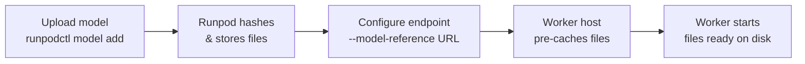

<Note>
  Model Repo is currently in beta and is available on Mac and Linux only. Windows support is coming soon.
</Note>

Model Repo is a private model storage service built into Runpod. Upload your model files once, and Runpod caches them directly on your Serverless worker hosts so they are ready before the worker starts — no external download required at cold start time.

## How it works

1. Upload your model files using `runpodctl model add`.
2. Runpod computes a content hash and stores the files in private, secure storage.
3. Reference the model using the URL `https://local/{user-id}/{model-name}:{hash}` when configuring your endpoint.
4. When a worker starts, Runpod pre-caches the model files on the host before the container boots.
5. Your handler reads the model from a local path inside the container.

## What you can upload

Model Repo accepts any file format — PyTorch checkpoints, GGUF, safetensors, ONNX, or any format your worker needs. There is no type checking.

- **Max file size:** 5TB per file
- **Retention:** Files are retained indefinitely
- **Total storage limit:** Still being finalized

## Model Repo vs network volumes

**Use Model Repo when:**
- You have fixed, versioned model weights and want faster cold starts without external downloads
- You need version control over exactly which checkpoint is deployed
- Your endpoint spans multiple datacenters — Model Repo works across all DCs, while a network volume is tied to one

**Use a network volume when:**
- Workers need shared read/write access during a run (e.g., checkpoints, fine-tuning outputs)
- Your files change frequently and all workers need to see updates immediately
- You need many concurrent workers accessing the same files simultaneously

## Your data

Your models are stored in private, secure storage and are isolated to your Runpod account — no other users can access or list your models. Runpod does not access, analyze, or use your model files for any purpose.

For encryption details, certifications, and compliance information, see [Security](/serverless/storage/modelrepo/security).

## Getting started

See [Model Repo testing](/serverless/storage/modelrepo/testing) for a step-by-step guide to uploading a model and deploying it to a Serverless endpoint.
