This tutorial shows you how to build a REST API using Flash load-balanced endpoints. You'll create a multi-route API that handles text processing, demonstrates both CPU and GPU endpoints, and deploys to production.

## What you'll learn

In this tutorial you'll learn how to:

- Create load-balanced endpoints with the `Endpoint` class
- Define multiple routes on a single endpoint with `.get()`, `.post()`, and other HTTP method decorators
- Add GPU-accelerated routes for ML inference
- Test your API locally with `flash run`
- Deploy your API to production with `flash deploy`
- Call your deployed endpoints with proper authentication

## Requirements

- You've [created a Runpod account](/get-started/manage-accounts)
- You've [created a Runpod API key](/get-started/api-keys)
- You've installed [Python 3.10 or higher](https://www.python.org/downloads/)
- You've completed the [Flash quickstart](/flash/quickstart) or are familiar with Flash basics

## What you'll build

By the end of this tutorial, you'll have a working REST API that:

- Accepts text input via `POST /analyze`
- Returns system health via `GET /health`
- Provides API information via `GET /info`
- Runs GPU-accelerated sentiment analysis via `POST /sentiment` (optional GPU route)
- Deploys to Runpod Serverless with proper authentication

## Step 1: Set up your project

Create a new directory for your project and set up a Python virtual environment:

```bash
mkdir flash-api
cd flash-api
```

Install Flash using [uv](https://docs.astral.sh/uv/):

```bash
uv venv
source .venv/bin/activate
uv pip install runpod-flash
```

Set your API key in the environment:

```bash
export RUNPOD_API_KEY=YOUR_API_KEY

# Or create a .env file
echo "RUNPOD_API_KEY=YOUR_API_KEY" > .env
```

Replace `YOUR_API_KEY` with your actual Runpod API key.

## Step 2: Create the API server file

Create a new file called `api.py`:

```bash
touch api.py
```

## Step 3: Define the load-balanced endpoint

Add the following code to `api.py`:

```python
from runpod_flash import Endpoint

# CPU load-balanced endpoint for general API routes
api = Endpoint(
    name="text-api",
    cpu="cpu5c-4-8",   # 4 vCPU, 8GB RAM
    workers=(0, 3),    # Scale from 0 to 3 workers
    idle_timeout=600   # Keep workers active for 10 minutes
)
```

This configuration creates a CPU load-balanced endpoint that can handle multiple HTTP routes.

<Note>
**Worker Quota Considerations**: The `workers` setting determines the maximum number of concurrent workers. Standard Runpod accounts have a total quota of 30 workers across all endpoints. If you have other endpoints running, you may need to reduce `workers` to `(0, 1)`. Check your quota in the [Runpod console](https://www.runpod.io/console/serverless).
</Note>

## Step 4: Add API routes

Add three routes to your API - health check, info, and text analysis:

```python
@api.get("/health")
async def health_check() -> dict:
    """Health check endpoint for monitoring."""
    return {
        "status": "healthy",
        "service": "text-api",
        "version": "1.0.0"
    }

@api.get("/info")
async def get_info() -> dict:
    """API information endpoint."""
    return {
        "name": "Text Analysis API",
        "version": "1.0.0",
        "endpoints": [
            {"method": "GET", "path": "/health", "description": "Health check"},
            {"method": "GET", "path": "/info", "description": "API information"},
            {"method": "POST", "path": "/analyze", "description": "Analyze text"}
        ]
    }

@api.post("/analyze")
async def analyze_text(text: str) -> dict:
    """Analyze text and return statistics."""
    words = text.split()
    word_count = len(words)
    char_count = len(text)
    avg_word_length = sum(len(word) for word in words) / word_count if word_count > 0 else 0

    return {
        "text": text,
        "statistics": {
            "word_count": word_count,
            "character_count": char_count,
            "average_word_length": round(avg_word_length, 2),
            "sentence_count": text.count('.') + text.count('!') + text.count('?')
        }
    }
```

All three routes share the same `api` endpoint, meaning they deploy to a single Serverless endpoint.

## Step 5: Add a GPU-accelerated route (optional)

For GPU-accelerated sentiment analysis, add a separate endpoint:

```python
from runpod_flash import Endpoint, GpuGroup

# GPU endpoint for ML inference
gpu_api = Endpoint(
    name="gpu-sentiment",
    gpu=GpuGroup.ANY,   # Use any available GPU for better availability
    workers=(0, 1),     # Scale from 0 to 1 worker
    idle_timeout=300,  # 5 minutes
    dependencies=["transformers", "torch"]
)

@gpu_api.post("/sentiment")
async def analyze_sentiment(text: str) -> dict:
    """Analyze sentiment using a pretrained model."""
    from transformers import pipeline
    import torch

    # Load sentiment analysis pipeline
    device = 0 if torch.cuda.is_available() else -1
    sentiment_analyzer = pipeline(
        "sentiment-analysis",
        model="distilbert-base-uncased-finetuned-sst-2-english",
        device=device
    )

    # Analyze sentiment
    result = sentiment_analyzer(text)[0]

    return {
        "text": text,
        "sentiment": {
            "label": result["label"],
            "score": round(result["score"], 4)
        },
        "device": "GPU" if torch.cuda.is_available() else "CPU"
    }
```

This creates a second endpoint specifically for GPU-accelerated tasks.

<Note>
The sentiment analysis route uses a separate GPU endpoint because it requires different hardware than the CPU routes. This is a common pattern: use CPU endpoints for lightweight API logic and GPU endpoints for ML inference.

**GPU Availability**: Using `GpuGroup.ANY` provides better availability than specific GPU types like `GpuGroup.ADA_24`. First requests to GPU endpoints may take 3-10 minutes due to:
- GPU provisioning (depends on current availability)
- Dependency installation (transformers, torch)
- Model downloads (distilbert is ~250MB)

During high demand periods, GPU provisioning may take longer. Check [GPU availability](https://www.runpod.io/console/serverless) in the console.
</Note>

## Step 6: Add the main execution block

Add the following at the end of `api.py` to enable local testing:

```python
import asyncio

async def main():
    """Test the API locally."""
    print("Testing Text Analysis API\n")

    # Test health check
    print("1. Testing health check...")
    health = await health_check()
    print(f"   Result: {health}\n")

    # Test info endpoint
    print("2. Testing info endpoint...")
    info = await get_info()
    print(f"   Result: {info}\n")

    # Test text analysis
    print("3. Testing text analysis...")
    sample_text = "Flash makes it easy to build REST APIs with GPU acceleration."
    analysis = await analyze_text(sample_text)
    print(f"   Result: {analysis}\n")

    # Test sentiment analysis (if GPU route is defined)
    print("4. Testing sentiment analysis...")
    try:
        sentiment = await analyze_sentiment(sample_text)
        print(f"   Result: {sentiment}\n")
    except ModuleNotFoundError as e:
        print(f"   Skipped (dependencies not installed locally): {e}")
        print(f"   Note: This will work when deployed to Flash with dependencies=['transformers', 'torch']\n")

if __name__ == "__main__":
    asyncio.run(main())
```

## Step 7: Test locally

Run your script to test the API locally:

```bash
python api.py
```

You should see output similar to:

```text
Testing Text Analysis API

1. Testing health check...
   Result: {'status': 'healthy', 'service': 'text-api', 'version': '1.0.0'}

2. Testing info endpoint...
   Result: {'name': 'Text Analysis API', 'version': '1.0.0', 'endpoints': [...]}

3. Testing text analysis...
   Result: {'text': '...', 'statistics': {'word_count': 11, ...}}

4. Testing sentiment analysis...
   Skipped (dependencies not installed locally): No module named 'transformers'
   Note: This will work when deployed to Flash with dependencies=['transformers', 'torch']
```

The first three endpoints will run locally. The sentiment endpoint will be skipped unless you install transformers and torch locally, but it will work when deployed to Flash.

<Note>
**Local Testing Limitations**: The GPU sentiment endpoint requires `transformers` and `torch` to be installed locally for testing. For full testing of all endpoints including GPU routes, use `flash run` (covered in Step 9) instead of direct Python execution.
</Note>

## Step 8: Build a Flash app for production

To deploy your API to production, create a Flash app:

```bash
flash init api-project
cd api-project
```

This creates a project structure with separate worker files. Now, split your API code into the appropriate worker files:

### Create `lb_worker.py` (CPU routes):

Replace the contents of `lb_worker.py` with:

```python
from runpod_flash import Endpoint

# CPU load-balanced endpoint for general API routes
api = Endpoint(
    name="text-api",
    cpu="cpu5c-4-8",   # 4 vCPU, 8GB RAM
    workers=(0, 3),    # Scale from 0 to 3 workers
    idle_timeout=600   # Keep workers active for 10 minutes
)

@api.get("/health")
async def health_check() -> dict:
    """Health check endpoint for monitoring."""
    return {
        "status": "healthy",
        "service": "text-api",
        "version": "1.0.0"
    }

@api.get("/info")
async def get_info() -> dict:
    """API information endpoint."""
    return {
        "name": "Text Analysis API",
        "version": "1.0.0",
        "endpoints": [
            {"method": "GET", "path": "/health", "description": "Health check"},
            {"method": "GET", "path": "/info", "description": "API information"},
            {"method": "POST", "path": "/analyze", "description": "Analyze text"}
        ]
    }

@api.post("/analyze")
async def analyze_text(text: str) -> dict:
    """Analyze text and return statistics."""
    words = text.split()
    word_count = len(words)
    char_count = len(text)
    avg_word_length = sum(len(word) for word in words) / word_count if word_count > 0 else 0

    return {
        "text": text,
        "statistics": {
            "word_count": word_count,
            "character_count": char_count,
            "average_word_length": round(avg_word_length, 2),
            "sentence_count": text.count('.') + text.count('!') + text.count('?')
        }
    }
```

### Create `gpu_worker.py` (GPU route):

If you added the GPU sentiment route, replace the contents of `gpu_worker.py` with:

```python
from runpod_flash import Endpoint, GpuGroup

# GPU endpoint for ML inference
gpu_api = Endpoint(
    name="gpu-sentiment",
    gpu=GpuGroup.ANY,   # Use any available GPU for better availability
    workers=(0, 1),     # Scale from 0 to 1 worker
    idle_timeout=300,  # 5 minutes
    dependencies=["transformers", "torch"]
)

@gpu_api.post("/sentiment")
async def analyze_sentiment(text: str) -> dict:
    """Analyze sentiment using a pretrained model."""
    from transformers import pipeline
    import torch

    # Load sentiment analysis pipeline
    device = 0 if torch.cuda.is_available() else -1
    sentiment_analyzer = pipeline(
        "sentiment-analysis",
        model="distilbert-base-uncased-finetuned-sst-2-english",
        device=device
    )

    # Analyze sentiment
    result = sentiment_analyzer(text)[0]

    return {
        "text": text,
        "sentiment": {
            "label": result["label"],
            "score": round(result["score"], 4)
        },
        "device": "GPU" if torch.cuda.is_available() else "CPU"
    }
```

### Configure environment:

```bash
cp .env.example .env
echo "RUNPOD_API_KEY=YOUR_API_KEY" > .env
```

Replace `YOUR_API_KEY` with your actual Runpod API key.

## Step 9: Test with the development server

Start the Flash development server:

```bash
flash run
```

You'll see output showing all available endpoints:

```text
Flash Dev Server  localhost:8888

┏━━━━━━━━━━━━━━━━━━━━━━━━━━━━━┳━━━━━━━━━━━━━━━━━━━━━━━━━━━━━━━━━━━━━━━━━┳━━━━━━┓
┃ Local path                  ┃ Description                             ┃ Type ┃
┡━━━━━━━━━━━━━━━━━━━━━━━━━━━━━╇━━━━━━━━━━━━━━━━━━━━━━━━━━━━━━━━━━━━━━━━━╇━━━━━━┩
│ GET  /lb_worker/health      │ Health check endpoint for monitoring.   │ LB   │
│ GET  /lb_worker/info        │ API information endpoint.               │ LB   │
│ POST  /lb_worker/analyze    │ Analyze text and return statistics.     │ LB   │
│ POST  /gpu_worker/sentiment │ Analyze sentiment using a pretrained    │ LB   │
│                             │ model.                                  │      │
└─────────────────────────────┴─────────────────────────────────────────┴──────┘
```

<Note>
**Development Server Path Prefixes**: The `flash run` dev server adds worker file prefixes to routes (e.g., `/lb_worker/health`, `/gpu_worker/sentiment`). When deployed to production, endpoints use the paths as defined in the route decorators (e.g., `/health`, `/sentiment`) without the prefixes.
</Note>

Open http://localhost:8888/docs in your browser to see the interactive API documentation. You can test all your routes directly in the Swagger UI.

Test with curl:

```bash
# Test health check
curl -X GET http://localhost:8888/lb_worker/health

# Test text analysis
curl -X POST http://localhost:8888/lb_worker/analyze \
    -H "Content-Type: application/json" \
    -d '{"text": "Flash makes building APIs easy"}'

# Test sentiment analysis (if you added the GPU route)
# Note: First request may take 1-3 minutes for GPU provisioning and model download
curl -X POST http://localhost:8888/gpu_worker/sentiment \
    -H "Content-Type: application/json" \
    -d '{"text": "I love using Flash for my APIs"}'
```

Expected responses:

```json
// Health check
{
  "status": "healthy",
  "service": "text-api",
  "version": "1.0.0"
}

// Text analysis
{
  "text": "Flash makes building APIs easy",
  "statistics": {
    "word_count": 5,
    "character_count": 30,
    "average_word_length": 5.2,
    "sentence_count": 0
  }
}

// Sentiment analysis
{
  "text": "I love using Flash for my APIs",
  "sentiment": {
    "label": "POSITIVE",
    "score": 0.9998
  },
  "device": "GPU"
}
```

<Warning>
**GPU Cold Starts**: The first request to a GPU endpoint may take 3-10 minutes due to GPU provisioning, dependency installation, and model downloads. During high demand periods, provisioning may take longer. Subsequent requests will be much faster. The default timeout is 60 seconds, which may be too short for the first request. If you encounter timeout errors, wait and retry - the GPU may still be initializing.
</Warning>

## Step 10: Deploy to production

When you're ready to deploy, use `flash deploy`:

```bash
flash deploy
```

After deployment, Flash displays your endpoint URLs:

```text
✓ Deployment Complete

Load-balanced endpoints:
  https://api-abc123.runpod.net  (text-api)
    GET    /health
    GET    /info
    POST   /analyze

  https://api-def456.runpod.net  (gpu-sentiment)
    POST   /sentiment
```

## Step 11: Call your deployed API

Call your production endpoints with authentication:

```bash
# Health check
curl -X GET https://api-abc123.runpod.net/health \
    -H "Authorization: Bearer $RUNPOD_API_KEY"

# Text analysis
curl -X POST https://api-abc123.runpod.net/analyze \
    -H "Authorization: Bearer $RUNPOD_API_KEY" \
    -H "Content-Type: application/json" \
    -d '{"text": "Flash makes building APIs easy and fast"}'

# GPU sentiment analysis
curl -X POST https://api-def456.runpod.net/sentiment \
    -H "Authorization: Bearer $RUNPOD_API_KEY" \
    -H "Content-Type: application/json" \
    -d '{"text": "I love using Flash for my APIs"}'
```

Expected response:

```json
{
  "text": "I love using Flash for my APIs",
  "sentiment": {
    "label": "POSITIVE",
    "score": 0.9998
  },
  "device": "GPU"
}
```

<Note>
**Production Path Note**: In production, the endpoints use the exact paths defined in your route decorators (e.g., `/health`, `/sentiment`), without the worker file prefixes used in `flash run`.
</Note>

## Understanding the deployment architecture

Your deployed API creates two independent Serverless endpoints:

```mermaid
%%{init: {'theme':'base', 'themeVariables': { 'primaryColor':'#9289FE','primaryTextColor':'#fff','primaryBorderColor':'#9289FE','lineColor':'#5F4CFE','secondaryColor':'#AE6DFF','tertiaryColor':'#FCB1FF','edgeLabelBackground':'#5F4CFE', 'fontSize':'14px','fontFamily':'font-inter'}}}%%

flowchart TB
    Client([Client])

    subgraph Runpod [RUNPOD SERVERLESS]
        CPU[text-api endpoint<br/>CPU load balancer<br/>GET /health<br/>GET /info<br/>POST /analyze]
        GPU[gpu-sentiment endpoint<br/>GPU load balancer<br/>POST /sentiment]
    end

    Client -->|HTTPS + Auth| CPU
    Client -->|HTTPS + Auth| GPU

    style Runpod fill:#1a1a2e,stroke:#5F4CFE,stroke-width:2px
    style Client fill:#4D38F5,stroke:#4D38F5,color:#fff
    style CPU fill:#5F4CFE,stroke:#5F4CFE,color:#fff
    style GPU fill:#22C55E,stroke:#22C55E,color:#000
```



**Key points:**
- **CPU endpoint** (`text-api`) handles three routes on one Serverless endpoint
- **GPU endpoint** (`gpu-sentiment`) handles GPU inference on a separate endpoint
- Both endpoints scale independently based on load
- All requests require authentication with your API key

## Troubleshooting

### Worker quota exceeded

**Issue**: `Max workers across all endpoints must not exceed your workers quota (30)`

**Solution**:
1. Check your current worker usage in the [Runpod console](https://www.runpod.io/console/serverless)
2. Reduce `workers` in your configuration:
   ```python
   api = Endpoint(
       name="text-api",
       cpu="cpu5c-4-8",
       workers=(0, 1)  # Reduce this value
   )
   ```
3. Clean up unused endpoints before deploying new ones

### GPU endpoint timeout

**Issue**: Request times out after 60 seconds on first GPU endpoint call

**Solutions**:
1. This is normal for the first request - GPU provisioning takes time
2. Wait 1-3 minutes and try again
3. Use `GpuGroup.ANY` instead of specific GPU types for better availability
4. Consider using CPU for development testing:
   ```python
   # For testing without GPU
   api = Endpoint(name="sentiment-cpu", cpu="cpu5c-4-8")
   ```

### Port already in use

**Issue**: `ERROR: [Errno 48] Address already in use` when running `flash run`

**Solutions**:
```bash
# Use a different port
flash run --port 8889

# Or kill the process using port 8888
lsof -ti:8888 | xargs kill -9
```

### Import errors in sentiment analysis

**Issue**: `ModuleNotFoundError: No module named 'transformers'`

**Solution**: Ensure dependencies are specified on the endpoint:

```python
gpu_api = Endpoint(
    name="gpu-sentiment",
    gpu=GpuGroup.ANY,
    dependencies=["transformers", "torch"]  # Must include these
)
```

For local testing, install dependencies manually:
```bash
pip install transformers torch
```

### Endpoint stays in queue

**Issue**: GPU sentiment route stays in `IN_QUEUE` status

**Solutions**:
1. Check [GPU availability](https://www.runpod.io/console/serverless) in console
2. Use flexible GPU selection:
   ```python
   gpu=GpuGroup.ANY  # Use any available GPU
   ```
3. Increase worker quota if at limit

## Next steps

Now that you've built a REST API with Flash, you can:

### Add more routes

Expand your API with additional functionality:

```python
@api.post("/summarize")
async def summarize_text(text: str, max_length: int = 100) -> dict:
    """Summarize long text."""
    # Summarization logic
    return {"summary": text[:max_length]}

@api.post("/translate")
async def translate_text(text: str, target_lang: str) -> dict:
    """Translate text to another language."""
    # Translation logic
    return {"translated": text, "target": target_lang}
```

### Add authentication middleware

Implement custom authentication for your API:

```python
@api.post("/protected")
async def protected_route(text: str, api_key: str) -> dict:
    """Route with custom authentication."""
    if api_key != "your-secret-key":
        return {"error": "Unauthorized"}, 401
    return {"data": "protected content"}
```

### Monitor your API

- Track endpoint health in the [Runpod console](https://www.runpod.io/console/serverless)
- Monitor request counts and error rates
- Adjust `workers` based on traffic patterns

### Use multiple environments

Deploy to different environments for testing:

```bash
flash deploy --env dev        # Development
flash deploy --env staging    # Staging
flash deploy --env production # Production
```

## Related resources

- [Configuration reference](/flash/configuration/parameters)
- [Endpoint functions guide](/flash/endpoint-functions)
- [Deploy Flash apps](/flash/apps/deploy-apps)
- [Managing endpoints](/flash/managing-endpoints)
