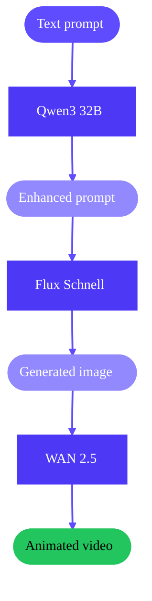

This tutorial shows you how to build a complete text-to-video pipeline by chaining three Runpod [Public Endpoints](/public-endpoints/overview) together. You'll take a simple text idea and transform it into an animated video, all with a single Python script.

<Frame alt="Cool cat image generated by the Public Endpoints text-to-video pipeline">
  
</Frame>

## What you'll build

The pipeline takes a basic prompt like "a cat wearing sunglasses" and:

1. Uses [Qwen3 32B](/public-endpoints/models/qwen3-32b) to enhance the prompt into a detailed image description.
2. Uses [Flux Schnell](/public-endpoints/models/flux-schnell) to generate an image from the enhanced prompt.
3. Uses [WAN 2.5](/public-endpoints/models/wan-2-5) to animate the image into a 5-second video.

<div style={{ margin: '0 auto', maxWidth: '300px' }}>

</div>

## Requirements

- A [Runpod account](/get-started/manage-accounts) with at least \$1 in credits
- A [Runpod API key](/get-started/api-keys)
- Python 3.8 or later

## Estimated cost

| Step | Model | Cost |
|------|-------|------|
| Prompt enhancement | Qwen3 32B | ~\$0.01 |
| Image generation | Flux Schnell | ~\$0.003 |
| Video generation | WAN 2.5 | ~\$0.25 |
| **Total** | | **~\$0.26** |

## Step 1: Set up your project

Create a new directory for your project with a virtual environment.

```bash
mkdir text-to-video && cd text-to-video
python3 -m venv venv
source venv/bin/activate  # On Windows: venv\Scripts\activate
pip install requests
```

Create a new file called `pipeline.py` and add the following imports and configuration:

```python
import requests
import time
import os
import re

# Configuration
API_KEY = os.environ.get("RUNPOD_API_KEY")
BASE_URL = "https://api.runpod.ai/v2"

# Endpoint IDs
QWEN_ENDPOINT = "qwen3-32b-awq"
FLUX_ENDPOINT = "black-forest-labs-flux-1-schnell"
WAN_ENDPOINT = "wan-2-5"

def get_headers():
    return {
        "Authorization": f"Bearer {API_KEY}",
        "Content-Type": "application/json",
    }
```

## Step 2: Enhance the prompt with Qwen3 32B

The first step uses Qwen3 32B to transform a simple idea into a detailed, image-generation-optimized prompt. This significantly improves the quality of the generated image.

Add the following function to your script:

```python
import re


def enhance_prompt(simple_prompt):
    """Use Qwen3 32B to enhance a simple prompt into a detailed image description."""
    print(f"Enhancing prompt: {simple_prompt}")

    response = requests.post(
        f"{BASE_URL}/{QWEN_ENDPOINT}/openai/v1/chat/completions",
        headers=get_headers(),
        json={
            "model": "Qwen/Qwen3-32B-AWQ",
            "messages": [
                {
                    "role": "system",
                    "content": "You are an expert at writing prompts for AI image generation. "
                    "Transform the user's simple idea into a detailed, vivid image description. "
                    "Include details about lighting, style, composition, and atmosphere. "
                    "Keep the description under 100 words. Output only the enhanced prompt, "
                    "nothing else. Do not include any thinking or explanation.",
                },
                {"role": "user", "content": simple_prompt},
            ],
            "max_tokens": 200,
            "temperature": 0.7,
        },
    )

    result = response.json()
    enhanced = result["choices"][0]["message"]["content"].strip()

    # Remove any <think>...</think> blocks (some models include reasoning)
    enhanced = re.sub(r"<think>.*?</think>", "", enhanced, flags=re.DOTALL).strip()
    # Also handle unclosed <think> tags
    enhanced = re.sub(r"<think>.*", "", enhanced, flags=re.DOTALL).strip()

    print(f"Enhanced prompt: {enhanced}")
    return enhanced
```

This function:
- Sends the simple prompt to Qwen3 32B using the OpenAI-compatible API
- Uses a system prompt that instructs the model to act as an image prompt expert
- Strips any reasoning tags from the output
- Returns the enhanced, detailed prompt

## Step 3: Add a polling helper

Image and video generation can take time, so you'll use asynchronous requests with polling. Add this helper function:

```python
def poll_for_completion(endpoint, job_id, timeout=300):
    """Poll an async job until completion."""
    start_time = time.time()
    while time.time() - start_time < timeout:
        status_response = requests.get(
            f"{BASE_URL}/{endpoint}/status/{job_id}",
            headers=get_headers(),
        )
        status = status_response.json()

        if status["status"] == "COMPLETED":
            return status
        elif status["status"] == "FAILED":
            raise Exception(f"Job failed: {status}")
        else:
            print(f"  Status: {status['status']}, waiting...")
            time.sleep(5)

    raise Exception(f"Job timed out after {timeout} seconds")
```

## Step 4: Generate an image with Flux Schnell

Next, use Flux Schnell to generate an image from the enhanced prompt. Flux Schnell is optimized for speed.

```python
def generate_image(prompt):
    """Use Flux Schnell to generate an image from the prompt."""
    print("Generating image with Flux Schnell...")

    # Submit async job
    response = requests.post(
        f"{BASE_URL}/{FLUX_ENDPOINT}/run",
        headers=get_headers(),
        json={
            "input": {
                "prompt": prompt,
                "width": 1024,
                "height": 1024,
                "num_inference_steps": 4,
            }
        },
    )

    result = response.json()
    job_id = result["id"]
    print(f"  Job submitted: {job_id}")

    # Poll for completion
    status = poll_for_completion(FLUX_ENDPOINT, job_id)
    image_url = status["output"]["image_url"]
    print(f"  Image URL: {image_url}")
    return image_url
```

This function:
- Submits an asynchronous job to Flux Schnell
- Polls until the job completes
- Uses a 1024x1024 resolution (optimal for video generation)
- Returns the URL of the generated image

## Step 5: Animate the image with WAN 2.5

Now animate the static image into a video using WAN 2.5.

```python
def generate_video(image_url, prompt):
    """Use WAN 2.5 to animate the image into a video."""
    print("Generating video with WAN 2.5...")

    # Submit the job
    response = requests.post(
        f"{BASE_URL}/{WAN_ENDPOINT}/run",
        headers=get_headers(),
        json={
            "input": {
                "image": image_url,
                "prompt": prompt,
                "duration": 5,
                "size": "1280*720",
            }
        },
    )

    result = response.json()
    job_id = result["id"]
    print(f"  Job submitted: {job_id}")

    # Poll for completion (video takes longer, so increase timeout)
    status = poll_for_completion(WAN_ENDPOINT, job_id, timeout=600)
    video_url = status["output"]["result"]
    print(f"  Video URL: {video_url}")
    return video_url
```

This function:
- Submits an asynchronous job to WAN 2.5
- Uses the polling helper with a longer timeout (video generation takes longer)
- Returns the URL of the generated video

## Step 6: Download the output

Add a helper function to download the final video:

```python
def download_file(url, filename):
    """Download a file from a URL."""
    print(f"Downloading to {filename}...")
    response = requests.get(url)
    with open(filename, "wb") as f:
        f.write(response.content)
    print(f"Saved: {filename}")
```

## Step 7: Put it all together

Add the main function that chains all the steps together:

```python
def main():
    # Your simple prompt
    simple_prompt = "a cat wearing sunglasses"

    # Step 1: Enhance the prompt
    enhanced_prompt = enhance_prompt(simple_prompt)

    # Step 2: Generate the image
    image_url = generate_image(enhanced_prompt)

    # Step 3: Generate the video
    video_url = generate_video(image_url, enhanced_prompt)

    # Step 4: Download the results
    download_file(image_url, "output_image.png")
    download_file(video_url, "output_video.mp4")

    print("\nPipeline complete!")
    print(f"Original prompt: {simple_prompt}")
    print(f"Enhanced prompt: {enhanced_prompt}")
    print(f"Image: output_image.png")
    print(f"Video: output_video.mp4")


if __name__ == "__main__":
    if not API_KEY:
        print("Error: Set RUNPOD_API_KEY environment variable")
        exit(1)
    main()
```

## Full code

Here's the complete script:

```python
import requests
import time
import os
import re

# Configuration
API_KEY = os.environ.get("RUNPOD_API_KEY")
BASE_URL = "https://api.runpod.ai/v2"

# Endpoint IDs
QWEN_ENDPOINT = "qwen3-32b-awq"
FLUX_ENDPOINT = "black-forest-labs-flux-1-schnell"
WAN_ENDPOINT = "wan-2-5"


def get_headers():
    return {
        "Authorization": f"Bearer {API_KEY}",
        "Content-Type": "application/json",
    }


def poll_for_completion(endpoint, job_id, timeout=300):
    """Poll an async job until completion."""
    start_time = time.time()
    while time.time() - start_time < timeout:
        status_response = requests.get(
            f"{BASE_URL}/{endpoint}/status/{job_id}",
            headers=get_headers(),
        )
        status = status_response.json()

        if status["status"] == "COMPLETED":
            return status
        elif status["status"] == "FAILED":
            raise Exception(f"Job failed: {status}")
        else:
            print(f"  Status: {status['status']}, waiting...")
            time.sleep(5)

    raise Exception(f"Job timed out after {timeout} seconds")


def enhance_prompt(simple_prompt):
    """Use Qwen3 32B to enhance a simple prompt into a detailed image description."""
    print(f"Enhancing prompt: {simple_prompt}")

    response = requests.post(
        f"{BASE_URL}/{QWEN_ENDPOINT}/openai/v1/chat/completions",
        headers=get_headers(),
        json={
            "model": "Qwen/Qwen3-32B-AWQ",
            "messages": [
                {
                    "role": "system",
                    "content": "You are an expert at writing prompts for AI image generation. "
                    "Transform the user's simple idea into a detailed, vivid image description. "
                    "Include details about lighting, style, composition, and atmosphere. "
                    "Keep the description under 100 words. Output only the enhanced prompt, "
                    "nothing else. Do not include any thinking or explanation.",
                },
                {"role": "user", "content": simple_prompt},
            ],
            "max_tokens": 200,
            "temperature": 0.7,
        },
    )

    result = response.json()
    enhanced = result["choices"][0]["message"]["content"].strip()

    # Remove any <think>...</think> blocks (some models include reasoning)
    enhanced = re.sub(r"<think>.*?</think>", "", enhanced, flags=re.DOTALL).strip()
    # Also handle unclosed <think> tags
    enhanced = re.sub(r"<think>.*", "", enhanced, flags=re.DOTALL).strip()

    print(f"Enhanced prompt: {enhanced}")
    return enhanced


def generate_image(prompt):
    """Use Flux Schnell to generate an image from the prompt."""
    print("Generating image with Flux Schnell...")

    # Submit async job
    response = requests.post(
        f"{BASE_URL}/{FLUX_ENDPOINT}/run",
        headers=get_headers(),
        json={
            "input": {
                "prompt": prompt,
                "width": 1024,
                "height": 1024,
                "num_inference_steps": 4,
            }
        },
    )

    result = response.json()
    job_id = result["id"]
    print(f"  Job submitted: {job_id}")

    # Poll for completion
    status = poll_for_completion(FLUX_ENDPOINT, job_id)
    image_url = status["output"]["image_url"]
    print(f"  Image URL: {image_url}")
    return image_url


def generate_video(image_url, prompt):
    """Use WAN 2.5 to animate the image into a video."""
    print("Generating video with WAN 2.5...")

    # Submit the job
    response = requests.post(
        f"{BASE_URL}/{WAN_ENDPOINT}/run",
        headers=get_headers(),
        json={
            "input": {
                "image": image_url,
                "prompt": prompt,
                "duration": 5,
                "size": "1280*720",
            }
        },
    )

    result = response.json()
    job_id = result["id"]
    print(f"  Job submitted: {job_id}")

    # Poll for completion (video takes longer, so increase timeout)
    status = poll_for_completion(WAN_ENDPOINT, job_id, timeout=600)
    video_url = status["output"]["result"]
    print(f"  Video URL: {video_url}")
    return video_url


def download_file(url, filename):
    """Download a file from a URL."""
    print(f"Downloading to {filename}...")
    response = requests.get(url)
    with open(filename, "wb") as f:
        f.write(response.content)
    print(f"Saved: {filename}")


def main():
    # Your simple prompt
    simple_prompt = "a cat wearing sunglasses"

    # Step 1: Enhance the prompt
    enhanced_prompt = enhance_prompt(simple_prompt)

    # Step 2: Generate the image
    image_url = generate_image(enhanced_prompt)

    # Step 3: Generate the video
    video_url = generate_video(image_url, enhanced_prompt)

    # Step 4: Download the results
    download_file(image_url, "output_image.png")
    download_file(video_url, "output_video.mp4")

    print("\nPipeline complete!")
    print(f"Original prompt: {simple_prompt}")
    print(f"Enhanced prompt: {enhanced_prompt}")
    print(f"Image: output_image.png")
    print(f"Video: output_video.mp4")


if __name__ == "__main__":
    if not API_KEY:
        print("Error: Set RUNPOD_API_KEY environment variable")
        exit(1)
    main()
```

## Run the pipeline

Activate your virtual environment, set your API key, and run the script:

```bash
source venv/bin/activate  # On Windows: venv\Scripts\activate
export RUNPOD_API_KEY="your-api-key"
python pipeline.py
```

The script will output progress as it runs:

```text
Enhancing prompt: a cat wearing sunglasses
Enhanced prompt: A fluffy orange tabby cat sits regally on a velvet purple cushion...
Generating image with Flux Schnell...
  Job submitted: abc123-def456...
  Status: IN_PROGRESS, waiting...
  Image URL: https://image.runpod.ai/...
Generating video with WAN 2.5...
  Job submitted: xyz789-uvw012...
  Status: IN_PROGRESS, waiting...
  Status: IN_PROGRESS, waiting...
  Video URL: https://video.runpod.ai/...
Downloading to output_image.png...
Saved: output_image.png
Downloading to output_video.mp4...
Saved: output_video.mp4

Pipeline complete!
```

<Warning>
Output URLs expire after 7 days. The script downloads files immediately to avoid losing them.
</Warning>

## Next steps

Now that you have a working pipeline, you can extend it in several ways:

- **Try different prompts**: Experiment with landscapes, characters, or abstract concepts.
- **Adjust video settings**: Change the duration or resolution in the WAN 2.5 request.
- **Use different models**: Swap Flux Schnell for [Flux Dev](/public-endpoints/models/flux-dev) for higher quality (but slower) generation.
- **Add error handling**: Implement retries for transient failures.
- **Build a web interface**: Wrap the pipeline in a Flask or FastAPI application.
- **Batch processing**: Process multiple prompts in parallel.

## Related resources

- [Public Endpoints overview](/public-endpoints/overview)
- [Qwen3 32B reference](/public-endpoints/models/qwen3-32b)
- [Flux Schnell reference](/public-endpoints/models/flux-schnell)
- [WAN 2.5 reference](/public-endpoints/models/wan-2-5)
- [Vercel AI SDK](/public-endpoints/ai-sdk) for TypeScript projects
